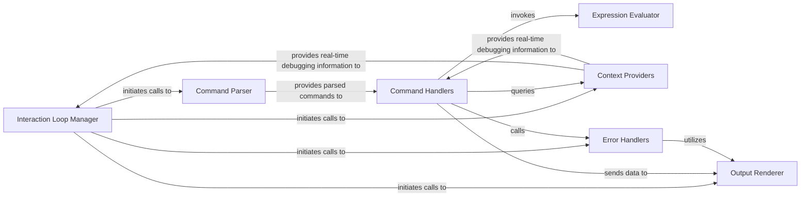

## Details

The WDB Web Client (UI) subsystem is primarily defined by the components within the client/wdb/ui directory. It represents the interactive, browser-based user interface. Its external boundary for communication is with the WDB Server Core, facilitated by server-side components like server.coffees.wdb.Wdb and server.coffees._websocket.Websocket, which handle the WebSocket communication channel.

### Interaction Loop Manager
Orchestrates the main interaction cycle of the UI, continuously fetching user input and updating the display. It acts as the central coordinator for client-side activities, embodying the real-time interaction aspect of the debugging tool.

**Related Classes/Methods**:

- <a href="https://github.com/Kozea/wdb/blob/master/client/wdb/ui.py#L214-L255" target="_blank" rel="noopener noreferrer">`client.wdb.ui.loop`:214-255</a>

### Command Parser
Parses raw user input received from the UI into structured commands that can be processed by the system. This component ensures a clear separation of concerns by isolating input interpretation.

**Related Classes/Methods**:

- <a href="https://github.com/Kozea/wdb/blob/master/client/wdb/ui.py#L257-L275" target="_blank" rel="noopener noreferrer">`client.wdb.ui.interact`:257-275</a>

### Output Renderer
Centralized function for displaying all forms of debugging output (e.g., variable values, messages, errors) to the user interface. It is crucial for presenting the real-time state of the debugging session to the user.

**Related Classes/Methods**:

- <a href="https://github.com/Kozea/wdb/blob/master/client/wdb/ui.py#L71-L73" target="_blank" rel="noopener noreferrer">`client.wdb.ui.dump`:71-73</a>

### Expression Evaluator
Executes Python code snippets or expressions provided by the user within the current debugging scope, typically by sending them to the server for evaluation. This is a core interactive feature of a debugging tool.

**Related Classes/Methods**:

- <a href="https://github.com/Kozea/wdb/blob/master/client/wdb/ui.py#L60-L61" target="_blank" rel="noopener noreferrer">`client.wdb.ui.eval_`:60-61</a>

### Context Providers
Provide the UI with real-time information about the execution state of the debugged program (e.g., current file, execution frame, local and global variables). This data is typically fetched from the WDB Server Core, supporting real-time interaction and centralized session management.

**Related Classes/Methods**:

- <a href="https://github.com/Kozea/wdb/blob/master/client/wdb/ui.py#L161-L163" target="_blank" rel="noopener noreferrer">`client.wdb.ui.current_file`:161-163</a>
- <a href="https://github.com/Kozea/wdb/blob/master/client/wdb/ui.py#L153-L155" target="_blank" rel="noopener noreferrer">`client.wdb.ui.current_frame`:153-155</a>
- <a href="https://github.com/Kozea/wdb/blob/master/client/wdb/ui.py#L157-L159" target="_blank" rel="noopener noreferrer">`client.wdb.ui.current_locals`:157-159</a>
- <a href="https://github.com/Kozea/wdb/blob/master/client/wdb/ui.py#L165-L181" target="_blank" rel="noopener noreferrer">`client.wdb.ui.get_globals`:165-181</a>

### Command Handlers
Each method implements the specific logic for a user command, translating UI actions into requests sent to the WDB Server Core and processing the responses. These handlers are the direct interface between user intent and the debugging backend, reflecting the client-server and event-driven architecture.

**Related Classes/Methods**:

- <a href="https://github.com/Kozea/wdb/blob/master/client/wdb/ui.py#L296-L334" target="_blank" rel="noopener noreferrer">`client.wdb.ui.do_start`:296-334</a>
- <a href="https://github.com/Kozea/wdb/blob/master/client/wdb/ui.py#L585-L634" target="_blank" rel="noopener noreferrer">`client.wdb.ui.do_break`:585-634</a>
- <a href="https://github.com/Kozea/wdb/blob/master/client/wdb/ui.py#L421-L550" target="_blank" rel="noopener noreferrer">`client.wdb.ui.do_eval`:421-550</a>
- <a href="https://github.com/Kozea/wdb/blob/master/client/wdb/ui.py#L555-L557" target="_blank" rel="noopener noreferrer">`client.wdb.ui.do_step`:555-557</a>
- <a href="https://github.com/Kozea/wdb/blob/master/client/wdb/ui.py#L658-L675" target="_blank" rel="noopener noreferrer">`client.wdb.ui.do_jump`:658-675</a>
- <a href="https://github.com/Kozea/wdb/blob/master/client/wdb/ui.py#L399-L416" target="_blank" rel="noopener noreferrer">`client.wdb.ui.do_dump`:399-416</a>
- <a href="https://github.com/Kozea/wdb/blob/master/client/wdb/ui.py#L786-L812" target="_blank" rel="noopener noreferrer">`client.wdb.ui.do_display`:786-812</a>
- <a href="https://github.com/Kozea/wdb/blob/master/client/wdb/ui.py#L835-L893" target="_blank" rel="noopener noreferrer">`client.wdb.ui.do_diff`:835-893</a>
- <a href="https://github.com/Kozea/wdb/blob/master/client/wdb/ui.py#L895-L934" target="_blank" rel="noopener noreferrer">`client.wdb.ui.do_find`:895-934</a>
- <a href="https://github.com/Kozea/wdb/blob/master/client/wdb/ui.py#L559-L561" target="_blank" rel="noopener noreferrer">`client.wdb.ui.do_next`:559-561</a>
- <a href="https://github.com/Kozea/wdb/blob/master/client/wdb/ui.py#L563-L566" target="_blank" rel="noopener noreferrer">`client.wdb.ui.do_continue`:563-566</a>
- <a href="https://github.com/Kozea/wdb/blob/master/client/wdb/ui.py#L351-L397" target="_blank" rel="noopener noreferrer">`client.wdb.ui.do_inspect`:351-397</a>

### Error Handlers
Ensure that errors and exceptions encountered within the UI are gracefully handled and communicated to the user. This is vital for a robust debugging tool, providing clear feedback during unexpected situations.

**Related Classes/Methods**:

- <a href="https://github.com/Kozea/wdb/blob/master/client/wdb/ui.py#L948-L957" target="_blank" rel="noopener noreferrer">`client.wdb.ui.fail`:948-957</a>
- <a href="https://github.com/Kozea/wdb/blob/master/client/wdb/ui.py#L936-L946" target="_blank" rel="noopener noreferrer">`client.wdb.ui.handle_exc`:936-946</a>

### [FAQ](https://github.com/CodeBoarding/GeneratedOnBoardings/tree/main?tab=readme-ov-file#faq)