```mermaid
graph LR
    Debugged_Application["Debugged Application"]
    Framework_Integration_Layer["Framework Integration Layer"]
    WDB_Debugging_Agent["WDB Debugging Agent"]
    WDB_Server_Core["WDB Server Core"]
    WDB_Web_Client_UI_["WDB Web Client (UI)"]
    Debugged_Application -- "is instrumented by" --> WDB_Debugging_Agent
    Debugged_Application -- "provides runtime data to" --> WDB_Debugging_Agent
    Framework_Integration_Layer -- "integrates WDB Debugging Agent into" --> Debugged_Application
    WDB_Debugging_Agent -- "sends debugging events to" --> WDB_Server_Core
    WDB_Debugging_Agent -- "receives commands from" --> WDB_Server_Core
    WDB_Server_Core -- "sends formatted data to" --> WDB_Web_Client_UI_
    WDB_Web_Client_UI_ -- "sends user commands to" --> WDB_Server_Core
    click Framework_Integration_Layer href "https://github.com/CodeBoarding/GeneratedOnBoardings/blob/main/wdb/Framework_Integration_Layer.md" "Details"
    click WDB_Server_Core href "https://github.com/CodeBoarding/GeneratedOnBoardings/blob/main/wdb/WDB_Server_Core.md" "Details"
    click WDB_Web_Client_UI_ href "https://github.com/CodeBoarding/GeneratedOnBoardings/blob/main/wdb/WDB_Web_Client_UI_.md" "Details"
```

## Details

The wdb project is designed as a distributed Python debugger, enabling real-time debugging of applications through a web-based interface. Its architecture is composed of several key components that interact to provide a comprehensive debugging experience. The Debugged Application is the external target, instrumented by the WDB Debugging Agent which resides within it. The Framework Integration Layer facilitates this instrumentation for various web and testing frameworks. All debugging data and commands are routed through the WDB Server Core, which acts as a central hub, communicating with both the agents and the WDB Web Client (UI). The UI provides the interactive interface for users to control and observe the debugging process.

### Debugged Application
The external application whose execution flow and runtime data are being monitored and controlled by wdb. This component does not have direct source code within the wdb project as it represents the user's application being debugged.

**Related Classes/Methods**: _None_

### Framework Integration Layer [[Expand]](./Framework_Integration_Layer.md)
Provides the necessary hooks and middleware to seamlessly integrate the WDB Debugging Agent into specific Python web frameworks (e.g., Flask, Django) or testing frameworks (e.g., Pytest).

**Related Classes/Methods**:

- <a href="https://github.com/Kozea/wdb/blob/master/pytest_wdb/pytest_wdb.py" target="_blank" rel="noopener noreferrer">`pytest_wdb.pytest_addoption`</a>
- <a href="https://github.com/Kozea/wdb/blob/master/pytest_wdb/pytest_wdb.py" target="_blank" rel="noopener noreferrer">`pytest_wdb.pytest_configure`</a>
- <a href="https://github.com/Kozea/wdb/blob/master/pytest_wdb/pytest_wdb.py" target="_blank" rel="noopener noreferrer">`pytest_wdb.Trace`</a>
- <a href="https://github.com/Kozea/wdb/blob/master/client/wdb/ext.py#L141-L234" target="_blank" rel="noopener noreferrer">`client.wdb.ext.WdbMiddleware`:141-234</a>
- <a href="https://github.com/Kozea/wdb/blob/master/client/wdb/ext.py#L237-L304" target="_blank" rel="noopener noreferrer">`client.wdb.ext.wdb_tornado`:237-304</a>

### WDB Debugging Agent
Resides within the Debugged Application, responsible for instrumenting code, controlling execution (breakpoints, stepping), collecting debugging data (variables, stack traces), and communicating with the WDB Server Core.

**Related Classes/Methods**:

- <a href="https://github.com/Kozea/wdb/blob/master/client/wdb/__init__.py" target="_blank" rel="noopener noreferrer">`client.wdb.Wdb`</a>
- <a href="https://github.com/Kozea/wdb/blob/master/client/wdb/breakpoint.py#L31-L68" target="_blank" rel="noopener noreferrer">`client.wdb.breakpoint.Breakpoint`:31-68</a>
- <a href="https://github.com/Kozea/wdb/blob/master/client/wdb/breakpoint.py#L71-L96" target="_blank" rel="noopener noreferrer">`client.wdb.breakpoint.LineBreakpoint`:71-96</a>
- <a href="https://github.com/Kozea/wdb/blob/master/client/wdb/breakpoint.py#L99-L132" target="_blank" rel="noopener noreferrer">`client.wdb.breakpoint.ConditionalBreakpoint`:99-132</a>
- <a href="https://github.com/Kozea/wdb/blob/master/client/wdb/breakpoint.py#L135-L164" target="_blank" rel="noopener noreferrer">`client.wdb.breakpoint.FunctionBreakpoint`:135-164</a>
- <a href="https://github.com/Kozea/wdb/blob/master/client/wdb/ui.py#L97-L957" target="_blank" rel="noopener noreferrer">`client.wdb.ui.Interaction`:97-957</a>
- <a href="https://github.com/Kozea/wdb/blob/master/client/wdb/state.py#L4-L18" target="_blank" rel="noopener noreferrer">`client.wdb.state.State`:4-18</a>
- <a href="https://github.com/Kozea/wdb/blob/master/client/wdb/state.py#L21-L25" target="_blank" rel="noopener noreferrer">`client.wdb.state.Running`:21-25</a>
- <a href="https://github.com/Kozea/wdb/blob/master/client/wdb/state.py#L28-L32" target="_blank" rel="noopener noreferrer">`client.wdb.state.Step`:28-32</a>
- <a href="https://github.com/Kozea/wdb/blob/master/client/wdb/state.py#L35-L39" target="_blank" rel="noopener noreferrer">`client.wdb.state.Next`:35-39</a>
- <a href="https://github.com/Kozea/wdb/blob/master/client/wdb/state.py#L42-L50" target="_blank" rel="noopener noreferrer">`client.wdb.state.Until`:42-50</a>
- <a href="https://github.com/Kozea/wdb/blob/master/client/wdb/state.py#L53-L57" target="_blank" rel="noopener noreferrer">`client.wdb.state.Return`:53-57</a>

### WDB Server Core [[Expand]](./WDB_Server_Core.md)
The central component managing multiple debugging sessions, routing real-time communication (via WebSockets) between WDB Debugging Agents and WDB Web Clients, and maintaining global debugging state.

**Related Classes/Methods**:

- <a href="https://github.com/Kozea/wdb/blob/master/server/wdb.server.py" target="_blank" rel="noopener noreferrer">`server.wdb_server.WdbServer`</a>

### WDB Web Client (UI) [[Expand]](./WDB_Web_Client_UI_.md)
The interactive, browser-based user interface that allows users to send commands, view debugging data, and control the debugging process in real-time. It communicates directly with the WDB Server Core.

**Related Classes/Methods**:

- <a href="https://github.com/Kozea/wdb/blob/master/server/coffees/wdb.coffee" target="_blank" rel="noopener noreferrer">`server.coffees.wdb.Wdb`</a>
- <a href="https://github.com/Kozea/wdb/blob/master/server/coffees/_websocket.coffee" target="_blank" rel="noopener noreferrer">`server.coffees._websocket.Websocket`</a>

### [FAQ](https://github.com/CodeBoarding/GeneratedOnBoardings/tree/main?tab=readme-ov-file#faq)