```mermaid
graph LR
    Configuration_Module["Configuration Module"]
    Main_Orchestrator_CLI_Module["Main Orchestrator/CLI Module"]
    Web_Driver_Browser_Automation_Module["Web Driver/Browser Automation Module"]
    Scraper_Crawler_Module["Scraper/Crawler Module"]
    Parser_Extractor_Module["Parser/Extractor Module"]
    Job_Filtering_Analysis_Module["Job Filtering & Analysis Module"]
    Data_Storage_Output_Module["Data Storage/Output Module"]
    Unclassified["Unclassified"]
    Configuration_Module -- "provides configuration to" --> Main_Orchestrator_CLI_Module
    Configuration_Module -- "provides keywords to" --> Job_Filtering_Analysis_Module
    Main_Orchestrator_CLI_Module -- "initiates" --> Scraper_Crawler_Module
    Scraper_Crawler_Module -- "provides raw HTML/job links to" --> Parser_Extractor_Module
    Parser_Extractor_Module -- "provides extracted job descriptions to" --> Job_Filtering_Analysis_Module
    Job_Filtering_Analysis_Module -- "provides filtered/scored job data to" --> Data_Storage_Output_Module
    Data_Storage_Output_Module -- "utilizes" --> Web_Driver_Browser_Automation_Module
```

## Details

The `webscraping` project is a Python script (`main.py`) designed to automate the process of scraping job listings from a specified website (Indeed in this case), filtering them based on user-defined keywords, and presenting the results. The system operates by first configuring scraping parameters, then iteratively fetching raw HTML content from job portal pages. This raw data is subsequently parsed to extract relevant job descriptions. A dedicated module then filters and scores these jobs against a set of required and preferred keywords. Finally, the processed job data is outputted, both by printing to the console and by automatically opening the filtered job links in a web browser. The architecture emphasizes a sequential data processing pipeline, with clear responsibilities for each component.

### Configuration Module
Manages application settings, including required and preferred keywords, and constructs URLs for scraping. It provides a centralized way to define and access operational parameters.

**Related Classes/Methods**:

- <a href="https://github.com/brovatten/webscraping/blob/master/main.py#L8-L11" target="_blank" rel="noopener noreferrer">`main.currentpageurl`:8-11</a>
- <a href="https://github.com/brovatten/webscraping/blob/master/main.py" target="_blank" rel="noopener noreferrer">`main.required_key_words`</a>
- <a href="https://github.com/brovatten/webscraping/blob/master/main.py" target="_blank" rel="noopener noreferrer">`main.preferred_key_words`</a>

### Main Orchestrator/CLI Module
Serves as the entry point for the CLI tool. It orchestrates the execution flow between all other modules, managing the overall scraping and processing pipeline.

**Related Classes/Methods**:

- <a href="https://github.com/brovatten/webscraping/blob/master/main.py#L102-L113" target="_blank" rel="noopener noreferrer">`main execution loop`:102-113</a>
- <a href="https://github.com/brovatten/webscraping/blob/master/main.py#L49-L58" target="_blank" rel="noopener noreferrer">`main.filtrateJobs_KeyWords`:49-58</a>
- <a href="https://github.com/brovatten/webscraping/blob/master/main.py#L90-L92" target="_blank" rel="noopener noreferrer">`main.printFilteredJobs`:90-92</a>
- <a href="https://github.com/brovatten/webscraping/blob/master/popupJobs.py#L8-L13" target="_blank" rel="noopener noreferrer">`popupJobs.startJobsSites`:8-13</a>

### Web Driver/Browser Automation Module
Initializes and manages the Selenium WebDriver to open filtered job links in a browser. It abstracts browser-specific interactions for the final output stage.

**Related Classes/Methods**:

- <a href="https://github.com/brovatten/webscraping/blob/master/popupJobs.py#L8-L13" target="_blank" rel="noopener noreferrer">`popupJobs.startJobsSites`:8-13</a>

### Scraper/Crawler Module
Fetches raw HTML content from specified URLs and extracts initial job portal links. It focuses on data acquisition from web pages using urllib and BeautifulSoup.

**Related Classes/Methods**:

- <a href="https://github.com/brovatten/webscraping/blob/master/main.py#L14-L19" target="_blank" rel="noopener noreferrer">`main.returnHTMLpage`:14-19</a>
- <a href="https://github.com/brovatten/webscraping/blob/master/main.py#L22-L26" target="_blank" rel="noopener noreferrer">`main.returnJobPortalApplications`:22-26</a>

### Parser/Extractor Module
Processes the raw HTML content obtained by the Scraper/Crawler Module to extract structured job information, specifically job descriptions. It transforms raw web data into a usable format.

**Related Classes/Methods**:

- <a href="https://github.com/brovatten/webscraping/blob/master/main.py#L49-L58" target="_blank" rel="noopener noreferrer">`main.filtrateJobs_KeyWords`:49-58</a>

### Job Filtering & Analysis Module
Analyzes extracted job descriptions against a predefined set of required and preferred keywords. It filters jobs based on suitability (presence of required keywords) and sorts them by a preference score (based on preferred keywords).

**Related Classes/Methods**:

- <a href="https://github.com/brovatten/webscraping/blob/master/main.py#L49-L58" target="_blank" rel="noopener noreferrer">`main.filtrateJobs_KeyWords`:49-58</a>
- <a href="https://github.com/brovatten/webscraping/blob/master/main.py#L61-L62" target="_blank" rel="noopener noreferrer">`main.sortDictbyPreferedKeys`:61-62</a>
- <a href="https://github.com/brovatten/webscraping/blob/master/main.py#L65-L73" target="_blank" rel="noopener noreferrer">`main.containsRequiredKeys`:65-73</a>
- <a href="https://github.com/brovatten/webscraping/blob/master/main.py#L76-L81" target="_blank" rel="noopener noreferrer">`main.preferedKeysCounter`:76-81</a>
- <a href="https://github.com/brovatten/webscraping/blob/master/main.py#L85-L88" target="_blank" rel="noopener noreferrer">`main.keywordAlgo`:85-88</a>

### Data Storage/Output Module
Takes the filtered and scored job data and presents it to the user, either by printing to the console or by initiating browser tabs for each job.

**Related Classes/Methods**:

- <a href="https://github.com/brovatten/webscraping/blob/master/main.py#L90-L92" target="_blank" rel="noopener noreferrer">`main.printFilteredJobs`:90-92</a>
- <a href="https://github.com/brovatten/webscraping/blob/master/popupJobs.py#L8-L13" target="_blank" rel="noopener noreferrer">`popupJobs.startJobsSites`:8-13</a>

### Unclassified
Component for all unclassified files and utility functions (Utility functions/External Libraries/Dependencies)

**Related Classes/Methods**: _None_

### [FAQ](https://github.com/CodeBoarding/GeneratedOnBoardings/tree/main?tab=readme-ov-file#faq)