```mermaid
graph LR
    Configuration_Driver_Setup["Configuration & Driver Setup"]
    Web_Navigation_HTML_Fetching["Web Navigation & HTML Fetching"]
    Job_Link_Extraction["Job Link Extraction"]
    Job_Details_Application_Extraction["Job Details & Application Extraction"]
    Job_Filtering_Analysis["Job Filtering & Analysis"]
    Results_Presentation["Results Presentation"]
    Unclassified["Unclassified"]
    Configuration_Driver_Setup -- "Provides WebDriver instance and initial URL." --> Web_Navigation_HTML_Fetching
    Configuration_Driver_Setup -- "Supplies required and preferred keywords." --> Job_Filtering_Analysis
    Web_Navigation_HTML_Fetching -- "Outputs raw HTML content." --> Job_Link_Extraction
    Job_Link_Extraction -- "Provides job portal application links." --> Job_Details_Application_Extraction
    Job_Details_Application_Extraction -- "Delivers job descriptions and application links." --> Job_Filtering_Analysis
    Job_Filtering_Analysis -- "Forwards filtered and sorted job data." --> Results_Presentation
    click Job_Filtering_Analysis href "https://github.com/CodeBoarding/GeneratedOnBoardings/blob/main/webscraping/Job_Filtering_Analysis.md" "Details"
```

## Details

The web scraping system is structured around a sequential data processing pipeline. It begins with a Configuration & Driver Setup component, which initializes the web browser driver and loads user-defined keywords for job filtering. This setup then feeds into the Web Navigation & HTML Fetching component, responsible for accessing job portals and retrieving their raw HTML content. Subsequently, the Job Link Extraction component parses this HTML to identify and collect individual job posting links. These links are then processed by the Job Details & Application Extraction component, which navigates to each job page to extract comprehensive descriptions and direct application URLs. The extracted job data is then passed to the Job Filtering & Analysis component, where it is evaluated against the predefined keywords, filtered, and ranked based on relevance. Finally, the Results Presentation component takes the refined list of job opportunities and presents them to the user, either through console output or by automatically opening the application links in a web browser.

### Configuration & Driver Setup
Initializes the Selenium WebDriver and loads scraping parameters, including required and preferred keywords.

**Related Classes/Methods**:

- <a href="https://github.com/brovatten/webscraping/blob/master/main.py" target="_blank" rel="noopener noreferrer">`main.my_url`</a>
- <a href="https://github.com/brovatten/webscraping/blob/master/main.py" target="_blank" rel="noopener noreferrer">`main.currentpage`</a>
- <a href="https://github.com/brovatten/webscraping/blob/master/main.py" target="_blank" rel="noopener noreferrer">`main.required_key_words`</a>
- <a href="https://github.com/brovatten/webscraping/blob/master/main.py" target="_blank" rel="noopener noreferrer">`main.preferred_key_words`</a>
- <a href="https://github.com/brovatten/webscraping/blob/master/popupJobs.py#L8-L13" target="_blank" rel="noopener noreferrer">`popupJobs.startJobsSites`:8-13</a>

### Web Navigation & HTML Fetching
Manages browser interaction, navigates to job portals, and retrieves the raw HTML content of web pages.

**Related Classes/Methods**:

- <a href="https://github.com/brovatten/webscraping/blob/master/main.py#L8-L11" target="_blank" rel="noopener noreferrer">`main.currentpageurl`:8-11</a>
- <a href="https://github.com/brovatten/webscraping/blob/master/main.py#L14-L19" target="_blank" rel="noopener noreferrer">`main.returnHTMLpage`:14-19</a>

### Job Link Extraction
Parses the fetched HTML to identify and extract links to individual job postings on the portal.

**Related Classes/Methods**:

- <a href="https://github.com/brovatten/webscraping/blob/master/main.py#L22-L26" target="_blank" rel="noopener noreferrer">`main.returnJobPortalApplications`:22-26</a>

### Job Details & Application Extraction
For each individual job posting link, this component fetches the specific job page, extracts the detailed job description, and identifies the direct application link.

**Related Classes/Methods**:

- <a href="https://github.com/brovatten/webscraping/blob/master/main.py#L29-L32" target="_blank" rel="noopener noreferrer">`main.iteratePortalLinks`:29-32</a>
- <a href="https://github.com/brovatten/webscraping/blob/master/main.py#L35-L41" target="_blank" rel="noopener noreferrer">`main.returnApplicationLink`:35-41</a>

### Job Filtering & Analysis [[Expand]](./Job_Filtering_Analysis.md)
Analyzes job descriptions against a predefined set of required and preferred keywords, filters jobs based on suitability, and sorts them by preference score.

**Related Classes/Methods**:

- <a href="https://github.com/brovatten/webscraping/blob/master/main.py#L49-L58" target="_blank" rel="noopener noreferrer">`main.filtrateJobs_KeyWords`:49-58</a>
- <a href="https://github.com/brovatten/webscraping/blob/master/main.py#L61-L62" target="_blank" rel="noopener noreferrer">`main.sortDictbyPreferedKeys`:61-62</a>
- <a href="https://github.com/brovatten/webscraping/blob/master/main.py#L65-L73" target="_blank" rel="noopener noreferrer">`main.containsRequiredKeys`:65-73</a>
- <a href="https://github.com/brovatten/webscraping/blob/master/main.py#L76-L81" target="_blank" rel="noopener noreferrer">`main.preferedKeysCounter`:76-81</a>
- <a href="https://github.com/brovatten/webscraping/blob/master/main.py#L85-L88" target="_blank" rel="noopener noreferrer">`main.keywordAlgo`:85-88</a>

### Results Presentation
Presents the filtered and sorted job opportunities to the user, either by printing to the console or by opening application links in a web browser.

**Related Classes/Methods**:

- <a href="https://github.com/brovatten/webscraping/blob/master/main.py#L90-L92" target="_blank" rel="noopener noreferrer">`main.printFilteredJobs`:90-92</a>
- <a href="https://github.com/brovatten/webscraping/blob/master/popupJobs.py#L8-L13" target="_blank" rel="noopener noreferrer">`popupJobs.startJobsSites`:8-13</a>

### Unclassified
Component for all unclassified files and utility functions (Utility functions/External Libraries/Dependencies)

**Related Classes/Methods**: _None_

### [FAQ](https://github.com/CodeBoarding/GeneratedOnBoardings/tree/main?tab=readme-ov-file#faq)