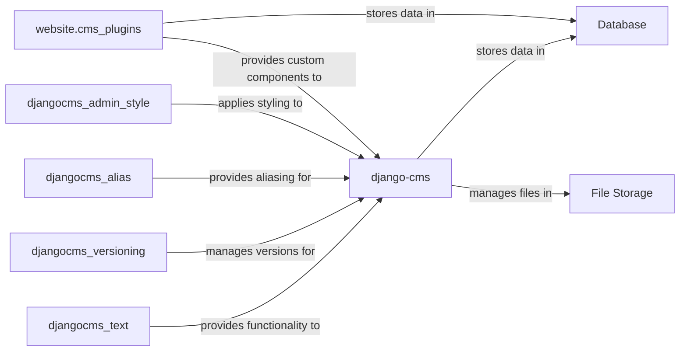

## Details

Abstract Components Overview

### django-cms
The foundational content management framework, responsible for page creation, structure, and overall content publishing workflows. It acts as the central hub for all CMS-related operations.

**Related Classes/Methods**:

- `cms.models.Page`

### djangocms_text
Provides rich text editing capabilities within the CMS, allowing users to format and manage textual content with various styling options.

**Related Classes/Methods**:

- `djangocms_text.cms_plugins.TextPlugin`

### djangocms_versioning
Manages content versions and publishing workflows, enabling content creators to track changes, revert to previous versions, and control content publication states.

**Related Classes/Methods**:

- `djangocms_versioning.models.Version`

### djangocms_alias
Enables content aliasing for reuse across different pages or sections of the website, promoting content consistency and reducing duplication.

**Related Classes/Methods**:

- `djangocms_alias.cms_plugins.AliasPlugin`

### djangocms_admin_style
Customizes the Django admin interface specifically for CMS functionalities, enhancing the user experience for content administrators.

**Related Classes/Methods**:

- `djangocms_admin_style.admin`

### website.cms_plugins
Implements custom content blocks and functionalities tailored to the project's unique requirements, leveraging the `django-cms` plugin API to extend content capabilities.

**Related Classes/Methods**:

- `website.cms_plugins.CustomPluginClass`

### Database
Stores page content, structures, and metadata, and data specific to custom plugin instances.

**Related Classes/Methods**:

- `Database`

### File Storage
Manages media files associated with content.

**Related Classes/Methods**:

- `File Storage`

### [FAQ](https://github.com/CodeBoarding/GeneratedOnBoardings/tree/main?tab=readme-ov-file#faq)