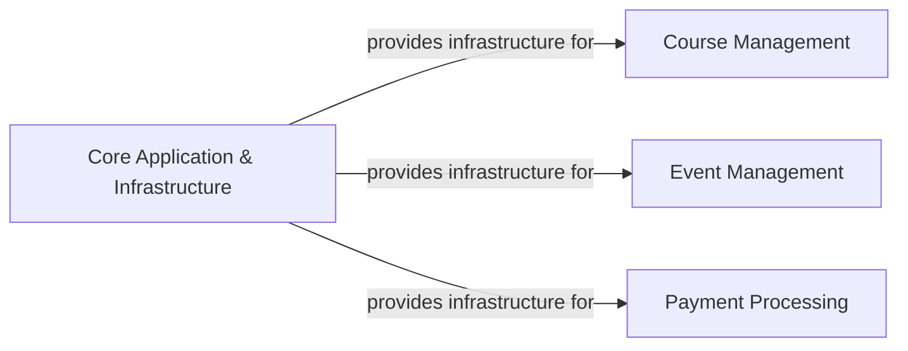

## Details

One paragraph explaining the functionality which is represented by this graph. What the main flow is and what is its purpose.

### Core Application & Infrastructure [[Expand]](./Core_Application_Infrastructure.md)
This component acts as the central nervous system of the Django monolithic application. It is responsible for defining global settings, managing URL routing, configuring custom storage backends, and orchestrating the integration of all other Django applications and external services. It provides the foundational configuration and infrastructure necessary for the entire system to operate.

**Related Classes/Methods**:

- <a href="https://github.com/tanzquotient/website/blob/develop/tq_website/settings.py" target="_blank" rel="noopener noreferrer">`tq_website.settings`</a>
- `tq_website.urls`
- <a href="https://github.com/tanzquotient/website/blob/develop/tq_website/__init__.py" target="_blank" rel="noopener noreferrer">`tq_website.__init__`</a>

### Course Management [[Expand]](./Course_Management.md)
This component is responsible for all functionalities related to the creation, organization, and management of courses within the application. This includes defining course structures, managing course content, and tracking student progress.

**Related Classes/Methods**: _None_

### Event Management [[Expand]](./Event_Management.md)
This component handles the creation, scheduling, and management of events. It includes functionalities for event registration, participant tracking, and event-related communications.

**Related Classes/Methods**: _None_

### Payment Processing [[Expand]](./Payment_Processing.md)
This component is responsible for handling all financial transactions within the application, including processing payments for courses and events, managing refunds, and integrating with external payment gateways.

**Related Classes/Methods**: _None_

### [FAQ](https://github.com/CodeBoarding/GeneratedOnBoardings/tree/main?tab=readme-ov-file#faq)