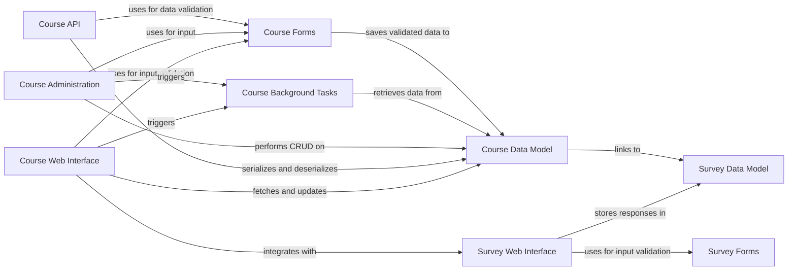

## Details

Abstract Components Overview of a Course Management System

### Course Data Model
Defines the database schema and business logic for all course-related entities, including Course, Lesson, Enrollment, Instructor, and Student relationships. It ensures data integrity and consistency.

**Related Classes/Methods**:

- `courses.models`

### Course Web Interface
Handles user-facing web requests related to courses. This includes displaying course listings, detailed course information, managing student enrollment, and rendering course-specific templates.

**Related Classes/Methods**:

- `courses.views`
- `courses.templates`

### Course Administration
Provides the administrative interface for privileged users to manage courses, instructors, enrollments, and other course-related data directly through the Django admin panel.

**Related Classes/Methods**:

- `courses.admin`
- `courses.admin_forms`
- `courses.admin_views`

### Course API
Exposes RESTful endpoints for external or internal programmatic access to course data and functionalities, enabling integration with other systems or a decoupled frontend if needed.

**Related Classes/Methods**:

- `courses.api.serializers`
- `courses.api.views`

### Course Forms
Manages the creation, validation, and processing of web forms used for various course-related operations, such as course creation, editing, and student enrollment.

**Related Classes/Methods**:

- `courses.forms`

### Course Background Tasks
Handles long-running or asynchronous operations related to courses, such as sending enrollment confirmation emails, generating reports, or processing bulk updates, leveraging Celery.

**Related Classes/Methods**:

- `courses.tasks`

### Survey Data Model
Defines the database schema for surveys, questions, and responses, enabling the collection of feedback for courses.

**Related Classes/Methods**:

- `survey.models`

### Survey Web Interface
Manages the display of survey forms to users and processes their submissions, linking feedback to specific courses.

**Related Classes/Methods**:

- <a href="https://github.com/tanzquotient/website/blob/develop/survey/models/survey.py#L1-L100" target="_blank" rel="noopener noreferrer">`survey.views` (1:100)</a>
- <a href="https://github.com/tanzquotient/website/blob/develop/survey/models/survey.py#L1-L100" target="_blank" rel="noopener noreferrer">`survey.templates` (1:100)</a>

### Survey Forms
Manages the creation, validation, and processing of web forms specifically for survey data input and submission.

**Related Classes/Methods**:

- <a href="https://github.com/tanzquotient/website/blob/develop/survey/models/survey.py#L1-L100" target="_blank" rel="noopener noreferrer">`survey.forms` (1:100)</a>

### [FAQ](https://github.com/CodeBoarding/GeneratedOnBoardings/tree/main?tab=readme-ov-file#faq)