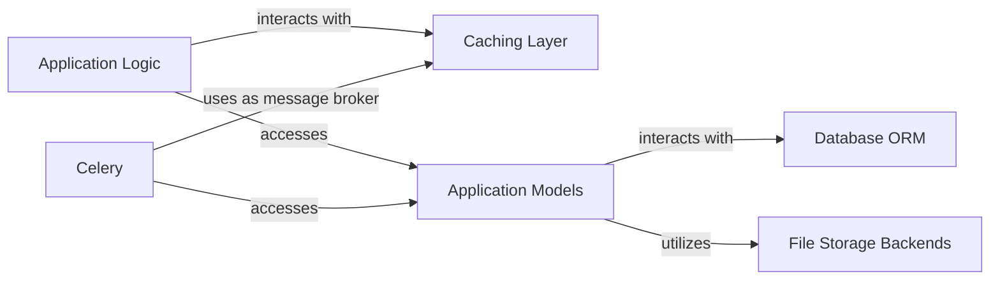

## Details

This subsystem is designed to provide robust and efficient data management, encompassing structured data storage, unstructured file storage, and performance-enhancing caching. It forms the backbone for all data operations within the `tq_website` monolithic web application.

### Database ORM
This foundational component provides an object-relational mapping (ORM) layer, abstracting direct interactions with the PostgreSQL database. It enables the application to define and manipulate data models as Python objects, facilitating seamless data persistence and retrieval for structured information.

**Related Classes/Methods**:

- `django.db.backends.postgresql_psycopg2`

### File Storage Backends
This component manages the storage and retrieval of static and media files, leveraging `django-storages` to interface with an S3-compatible object storage solution like Minio. It includes specialized storage classes to handle different types of files (e.g., general, media, static, finance).

**Related Classes/Methods**:

- `tq_website.storages`
- <a href="https://github.com/tanzquotient/website/blob/develop/tq_website/storages.py#L4-L32" target="_blank" rel="noopener noreferrer">`tq_website.storages.TqStorage` (4:32)</a>
- <a href="https://github.com/tanzquotient/website/blob/develop/tq_website/storages.py#L35-L48" target="_blank" rel="noopener noreferrer">`tq_website.storages.MediaStorage` (35:48)</a>
- <a href="https://github.com/tanzquotient/website/blob/develop/tq_website/storages.py#L51-L63" target="_blank" rel="noopener noreferrer">`tq_website.storages.StaticStorage` (51:63)</a>
- <a href="https://github.com/tanzquotient/website/blob/develop/tq_website/storages.py#L66-L78" target="_blank" rel="noopener noreferrer">`tq_website.storages.FinanceStorage` (66:78)</a>
- `django.db.models.FileField`
- `django.db.models.ImageField`

### Caching Layer [[Expand]](./Caching_Layer.md)
This component provides an in-memory data store (Redis) for caching frequently accessed data, database query results, or rendered template fragments. Its primary role is to reduce the load on the PostgreSQL database and significantly improve application response times.

**Related Classes/Methods**:

- `redis`

### Application Models
Represents the data schema and relationships defined across various Django applications (e.g., `courses`, `events`, `payment`). These models are the primary interface for the application's business logic to interact with the underlying data persistence mechanisms.

**Related Classes/Methods**:

- `django.db.models.Model`

### Application Logic
Encompasses the views, serializers, and service layers within the Django applications that process user requests, implement business rules, and orchestrate interactions with the data persistence and caching layers.

**Related Classes/Methods**:

- `django.views.View`
- `rest_framework.serializers.Serializer`

### Celery
An asynchronous task processing framework used for executing long-running or background tasks (e.g., sending emails, generating reports, complex data processing) outside the main request-response cycle. It relies on the Caching Layer (Redis) as its message broker.

**Related Classes/Methods**:

- `celery.Celery`

### [FAQ](https://github.com/CodeBoarding/GeneratedOnBoardings/tree/main?tab=readme-ov-file#faq)