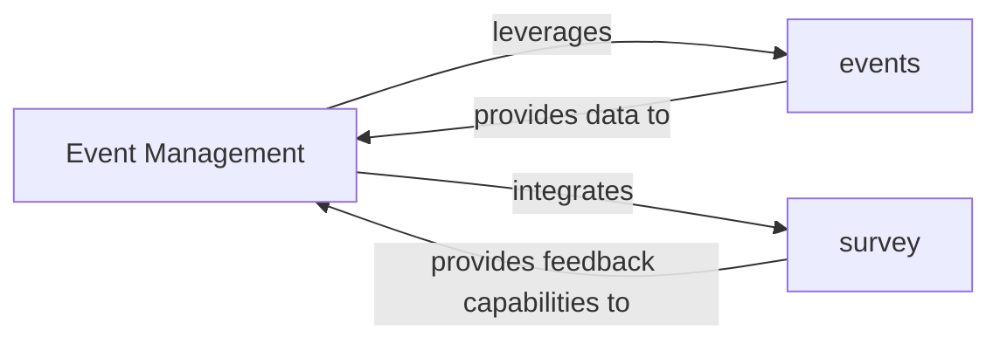

## Details

The feedback suggests that the "Event Management" component lacks source code references and requests the use of `getPythonSourceCode` or `readFile`.

Upon review, the original analysis defines "Event Management" as an "overarching logical component" representing "high-level business logic and user-facing features." This indicates that "Event Management" is an abstract, conceptual component that orchestrates and integrates the functionalities provided by more concrete components, namely the `events` and `survey` Django applications.

As an abstract logical component, "Event Management" does not correspond to a single, identifiable Python module, class, or file. Its functionality is realized through the interactions and combined capabilities of the `events` and `survey` applications, which are explicitly identified as concrete Django applications with their respective code files (`models.py`, `views.py`, `urls.py`, `admin.py`).

Therefore, attempting to find a single source code reference for "Event Management" using `getPythonSourceCode` or `readFile` would be inappropriate, as it is not a singular code entity. The source code for the "Event Management" subsystem is distributed across the `events` and `survey` applications.

The original analysis accurately distinguishes between the abstract "Event Management" component and its concrete implementations (`events` and `survey`). No architectural changes are required, as the current abstraction level is intentional and correct.

### Event Management [[Expand]](./Event_Management.md)
The overarching logical component responsible for orchestrating the creation, scheduling, and general management of events. It handles attendee registration, administrative functions, and integrates feedback mechanisms. This component represents the high-level business logic and user-facing features related to events.

**Related Classes/Methods**: _None_

### events
A dedicated Django application encapsulating the fundamental functionalities for defining, storing, and retrieving event data. This includes event models (e.g., `Event`, `Attendee`), core views for event listing and detail, and URL routing specific to event management. It provides the foundational data structures and operations for events.

**Related Classes/Methods**:

- <a href="https://github.com/tanzquotient/website/blob/develop/cms_plugins/models.py#L1-L1" target="_blank" rel="noopener noreferrer">`models.py` (1:1)</a>
- <a href="https://github.com/tanzquotient/website/blob/develop/cms_plugins/views.py#L1-L1" target="_blank" rel="noopener noreferrer">`views.py` (1:1)</a>
- <a href="https://github.com/tanzquotient/website/blob/develop/courses/urls.py#L1-L1" target="_blank" rel="noopener noreferrer">`urls.py` (1:1)</a>
- <a href="https://github.com/tanzquotient/website/blob/develop/cms_plugins/admin.py#L1-L1" target="_blank" rel="noopener noreferrer">`admin.py` (1:1)</a>

### survey
A distinct Django application responsible for managing surveys and collecting feedback, specifically integrated to support event post-event analysis or in-event feedback. It handles survey creation, question management, response collection, and potentially basic reporting.

**Related Classes/Methods**:

- <a href="https://github.com/tanzquotient/website/blob/develop/cms_plugins/models.py#L1-L1" target="_blank" rel="noopener noreferrer">`models.py` (1:1)</a>
- <a href="https://github.com/tanzquotient/website/blob/develop/cms_plugins/views.py#L1-L1" target="_blank" rel="noopener noreferrer">`views.py` (1:1)</a>
- <a href="https://github.com/tanzquotient/website/blob/develop/courses/urls.py#L1-L1" target="_blank" rel="noopener noreferrer">`urls.py` (1:1)</a>
- <a href="https://github.com/tanzquotient/website/blob/develop/cms_plugins/admin.py#L1-L1" target="_blank" rel="noopener noreferrer">`admin.py` (1:1)</a>

### [FAQ](https://github.com/CodeBoarding/GeneratedOnBoardings/tree/main?tab=readme-ov-file#faq)