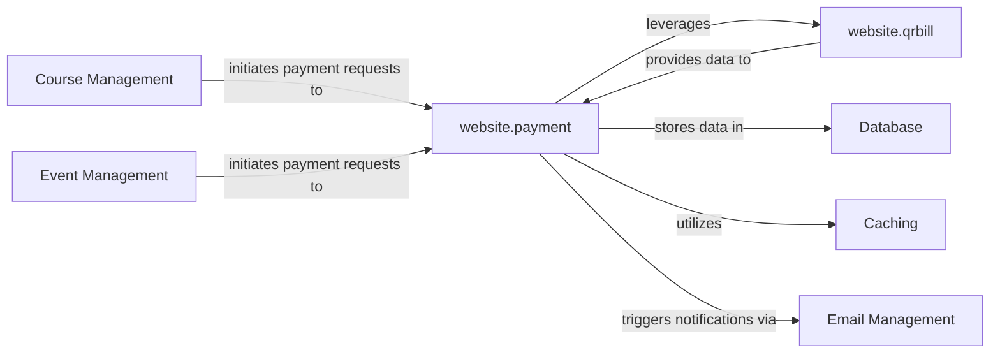

## Details

One paragraph explaining the functionality which is represented by this graph. What the main flow is and what is its purpose.

### website.payment
This is the primary component of the `Payment Processing` subsystem. It encapsulates the core business logic for initiating, processing, and confirming financial transactions. It manages payment states, handles different payment methods (e.g., credit card, bank transfer), and is responsible for generating and managing invoices. It acts as the central orchestrator for all payment-related workflows, including the storage of payment data originating from various sources like QR-bill processing.

**Related Classes/Methods**:

- `repos.website.payment` (1:1)

### website.qrbill
A specialized sub-component within the `Payment Processing` subsystem, specifically designed for the generation and processing of Swiss QR-bills. It handles the unique data formatting, validation, and rendering requirements for QR-bill payments. It integrates seamlessly with the main `website.payment` module by providing processed QR-bill data for further handling and storage.

**Related Classes/Methods**:

- `repos.website.qrbill` (1:1)

### Database
An abstract representation of the persistent storage system for all financial data related to payment processing, including transactions, invoices, payment methods, and user payment profiles. It ensures data integrity and availability for auditing and reporting. This component represents an external service and does not have direct source code within the `website` project.

**Related Classes/Methods**: _None_

### Caching
An abstract representation of a caching mechanism utilized by the `website.payment` module to cache frequently accessed payment-related data, such as payment method configurations or recent transaction statuses, to reduce database load and improve response times for payment operations. This component represents an external service and does not have direct source code within the `website` project.

**Related Classes/Methods**: _None_

### Email Management
An abstract representation of an external service responsible for sending automated transactional emails related to payment processes, such as payment confirmations, invoice notifications, or payment failure alerts. It integrates with the `website.payment` module to trigger these communications. This component represents an external service and does not have direct source code within the `website` project.

**Related Classes/Methods**: _None_

### Course Management [[Expand]](./Course_Management.md)
An external component that initiates payment requests for course enrollments. It interacts with the `website.payment` module to trigger the payment workflow once a user decides to purchase a course. This component is external to the `Payment Processing` subsystem and does not have direct source code within the `website` project.

**Related Classes/Methods**: _None_

### Event Management [[Expand]](./Event_Management.md)
An external component similar to `Course Management`, which initiates payment requests for event registrations. It communicates with the `website.payment` module to begin the payment process for event fees. This component is external to the `Payment Processing` subsystem and does not have direct source code within the `website` project.

**Related Classes/Methods**: _None_

### [FAQ](https://github.com/CodeBoarding/GeneratedOnBoardings/tree/main?tab=readme-ov-file#faq)