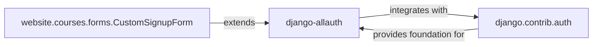

## Details

User & Authentication Management Subsystem

### django-allauth
Serves as the primary external library for comprehensive user authentication. It manages the entire authentication lifecycle, including user registration, login, logout, password management (reset, change), email verification, and social account integration. It provides the high-level API and views for these operations.

**Related Classes/Methods**:

- `allauth`

### django.contrib.auth
Django's foundational, built-in authentication framework. It provides the core user model (AbstractUser), permission system, and authentication backends. This component is responsible for the fundamental storage of user credentials, session management, and managing user permissions within the application. django-allauth builds upon and extends its capabilities.

**Related Classes/Methods**:

- `django.contrib.auth`

### website.courses.forms.CustomSignupForm
An application-specific customization of the user registration process. This component extends django-allauth's default signup form, allowing the application to collect additional user-specific information during registration or implement custom validation rules. It directly influences the user interface and data handling for new user sign-ups.

**Related Classes/Methods**:

- <a href="https://github.com/tanzquotient/website/blob/develop/courses/forms/custom_signup_form.py#L11-L14" target="_blank" rel="noopener noreferrer">`website.courses.forms.CustomSignupForm` (11:14)</a>

### [FAQ](https://github.com/CodeBoarding/GeneratedOnBoardings/tree/main?tab=readme-ov-file#faq)