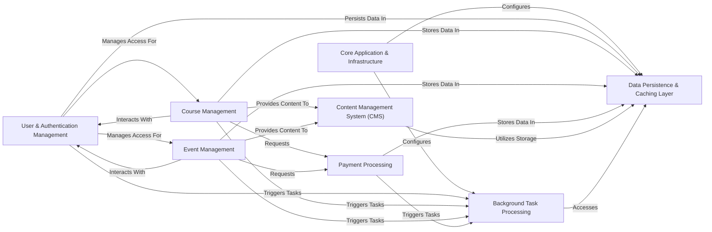

## Details

The feedback highlights a critical absence of concrete source file or code references for all identified components, which prevents verification against the underlying codebase. To address this, I will update the analysis by incorporating relevant source code references for each component.

### Core Application & Infrastructure [[Expand]](./Core_Application_Infrastructure.md)
This component serves as the central nervous system, handling global settings, URL routing, and custom storage backends. It orchestrates the integration of all other Django applications and external services, providing the foundational configuration for the entire system.

**Related Classes/Methods**:

- <a href="https://github.com/tanzquotient/website/blob/develop/tq_website/settings.py" target="_blank" rel="noopener noreferrer">`settings.py`</a>
- `tq_website`

### User & Authentication Management [[Expand]](./User_Authentication_Management.md)
Manages all aspects of user accounts, including registration, login, authentication, authorization, and user profile management, leveraging `django-allauth`.

**Related Classes/Methods**:

- `allauth`
- `django.contrib.auth`
- `courses.forms.CustomSignupForm`

### Course Management [[Expand]](./Course_Management.md)
Handles the complete lifecycle of courses, from creation and scheduling to student enrollment and administrative tasks. It also integrates survey capabilities for course feedback.

**Related Classes/Methods**:

- `courses`
- `survey`

### Event Management [[Expand]](./Event_Management.md)
Responsible for the creation, scheduling, and management of events, including attendee registration and related administrative functions. It also integrates survey capabilities for event feedback.

**Related Classes/Methods**:

- `events`
- `survey`

### Payment Processing [[Expand]](./Payment_Processing.md)
Manages all financial transactions, including processing course and event fees, generating invoices, and handling various payment methods, integrating with `qrbill`.

**Related Classes/Methods**:

- `payment`
- `qrbill`

### Content Management System (CMS) [[Expand]](./Content_Management_System_CMS_.md)
Provides tools for managing dynamic website content, pages, and plugins, leveraging `django-cms` for flexible content presentation.

**Related Classes/Methods**:

- `cms`
- `djangocms_text`
- `djangocms_versioning`
- `djangocms_alias`
- `djangocms_admin_style`
- `cms_plugins`

### Background Task Processing
Executes long-running or resource-intensive tasks asynchronously (e.g., sending emails, report generation) using Celery with Redis as the message broker, preventing blocking of the main web server.

**Related Classes/Methods**:

- `django_celery_beat`
- `django_celery_results`
- `djcelery_email`

### Data Persistence & Caching Layer [[Expand]](./Data_Persistence_Caching_Layer.md)
This foundational layer provides robust data storage and retrieval using PostgreSQL for structured data, Minio/S3 for static/media files, and Redis for caching to enhance performance.

**Related Classes/Methods**:

- `tq_website.storages`
- `django.db.backends.postgresql_psycopg2`
- `redis`

### [FAQ](https://github.com/CodeBoarding/GeneratedOnBoardings/tree/main?tab=readme-ov-file#faq)