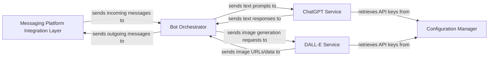

## Details

One paragraph explaining the functionality which is represented by this graph. What the main flow is and what is its purpose.

### Messaging Platform Integration Layer
This component is responsible for all interactions with the WhatsApp messaging platform. It handles receiving incoming messages from users, managing WhatsApp Web sessions (likely via Puppeteer), and sending responses back to users. It acts as the primary interface between the bot's internal logic and the external messaging environment.

**Related Classes/Methods**:

- `src/handlers/message.ts` (1:1)

### Bot Orchestrator
The central intelligence and control hub of the bot. It receives messages from the Messaging Platform Integration Layer, analyzes their content (e.g., text vs. image request), determines the appropriate AI service to invoke (GPT for text, DALL-E for images), orchestrates the calls to these services, manages conversation context, and formats the final responses before sending them back via the Messaging Layer.

**Related Classes/Methods**:

- `src/index.ts` (1:1)
- `src/handlers/message.ts` (1:1)

### ChatGPT Service
Dedicated to handling text-based interactions with the OpenAI GPT API. It is responsible for formatting user prompts into API-compatible requests, making secure API calls to OpenAI, and parsing the text-based responses received from the GPT model.

**Related Classes/Methods**:

- `src/handlers/gpt.ts` (1:1)
- `src/providers/openai.ts` (1:1)

### DALL-E Service
Specializes in image generation through the OpenAI DALL-E 2 API. This component takes image generation prompts, constructs the necessary API requests, sends them to the DALL-E service, and processes the returned image URLs or data.

**Related Classes/Methods**:

- `src/handlers/dalle.ts` (1:1)
- `src/providers/openai.ts` (1:1)

### Configuration Manager
Manages and provides access to critical application settings, such as API keys (e.g., OpenAI API keys), bot settings, and other environment-specific configurations. It ensures that sensitive information is handled securely and consistently across the application.

**Related Classes/Methods**:

- `src/config.ts` (1:1)

### [FAQ](https://github.com/CodeBoarding/GeneratedOnBoardings/tree/main?tab=readme-ov-file#faq)