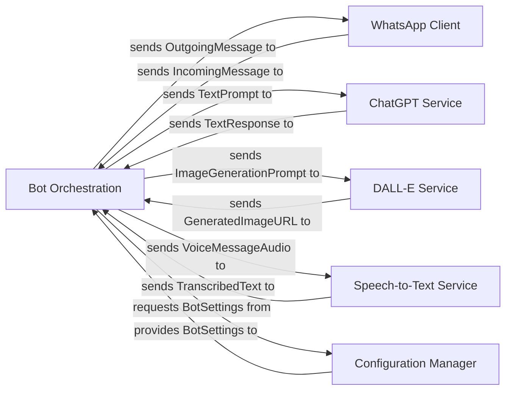

## Details

One paragraph explaining the functionality which is represented by this graph. What the main flow is and what is its purpose.

### Bot Orchestration [[Expand]](./Bot_Orchestration.md)
This is the core intelligence unit. It receives processed messages, analyzes user intent, manages conversation context, and dispatches requests to appropriate AI or speech processing components. It also formats AI-generated content into user-friendly responses.

**Related Classes/Methods**:

- `src/handlers/message.ts`
- `src/index.ts`

### WhatsApp Client
This component is responsible for all interactions with the WhatsApp messaging platform, including receiving incoming messages, sending outgoing responses, and managing the WhatsApp session.

**Related Classes/Methods**:

- `whatsapp-web.js`
- `Puppeteer`
- `src/index.ts`

### ChatGPT Service
This component provides an interface to the ChatGPT AI model, handling requests for text generation based on user prompts and returning the AI's textual responses.

**Related Classes/Methods**:

- `chatgpt-api`
- `src/handlers/gpt.ts`
- `src/providers/openai.ts`

### DALL-E Service
This component manages communication with the DALL-E AI model, facilitating image generation requests from text prompts and returning URLs to the generated images.

**Related Classes/Methods**:

- `OpenAI API`
- `src/handlers/dalle.ts`
- `src/types/dalle-config.ts`

### Speech-to-Text Service
This component is responsible for converting spoken language (e.g., from voice messages) into text, which can then be processed by the `Bot Orchestration` and AI services.

**Related Classes/Methods**:

- `speech-rest-api`
- `src/providers/speech.ts`
- `src/providers/whisper-local.ts`
- `src/types/transcription-mode.ts`

### Configuration Manager
This component centralizes the management and provision of all bot-related configuration settings, such as API keys and operational parameters, ensuring secure and consistent access.

**Related Classes/Methods**:

- `src/config.ts`

### [FAQ](https://github.com/CodeBoarding/GeneratedOnBoardings/tree/main?tab=readme-ov-file#faq)