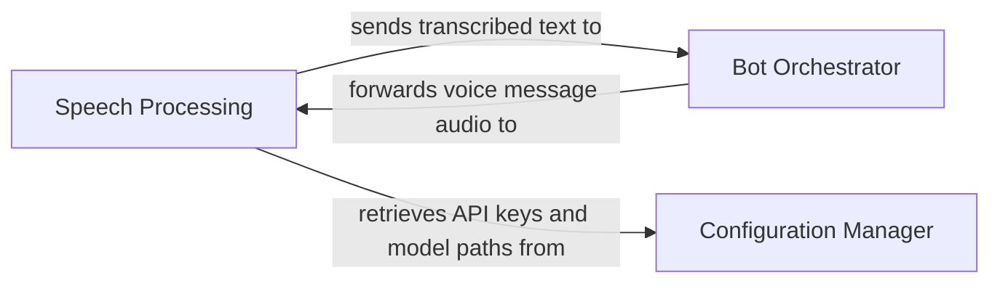

## Details

One paragraph explaining the functionality which is represented by this graph. What the main flow is and what is its purpose.

### Speech Processing [[Expand]](./Speech_Processing.md)
This component is dedicated to handling voice messages by transcribing spoken language into text (speech-to-text). It acts as an abstraction layer for various speech-to-text providers, capable of utilizing either an external `speech-rest-api` for cloud-based transcription or a local Whisper model for on-device processing. This design ensures flexibility and resilience in voice message handling, allowing the bot to process audio input and convert it into a format consumable by the core bot logic.

**Related Classes/Methods**: _None_

### Bot Orchestrator

**Related Classes/Methods**: _None_

### Configuration Manager

**Related Classes/Methods**: _None_

### [FAQ](https://github.com/CodeBoarding/GeneratedOnBoardings/tree/main?tab=readme-ov-file#faq)