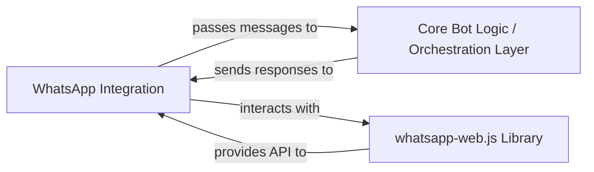

## Details

One paragraph explaining the functionality which is represented by this graph. What the main flow is and what is its purpose.

### WhatsApp Integration [[Expand]](./WhatsApp_Integration.md)
This is the concrete implementation responsible for managing the WhatsApp Web client. It handles the reception of all incoming messages (text, voice, media) from WhatsApp users and is solely responsible for sending outgoing responses back to them. It acts as the primary interface between the bot's internal logic and the WhatsApp platform.

**Related Classes/Methods**:

- `index.ts` (1:1)
- `message.ts` (1:1)

### Core Bot Logic / Orchestration Layer
This component represents the central intelligence of the bot. It receives processed messages from the `WhatsApp Integration` component, determines the appropriate AI service to use (e.g., GPT for text, DALL-E for images), orchestrates calls to other AI service integration layers (not detailed here but implied), manages conversation context, and formats the final responses before sending them back to the `WhatsApp Integration` for delivery.

**Related Classes/Methods**:

- `ai-config.ts` (1:1)
- `dalle.ts` (1:1)
- `gpt.ts` (1:1)
- `message.ts` (1:1)
- `openai.ts` (1:1)
- `speech.ts` (1:1)
- `whisper-local.ts` (1:1)

### whatsapp-web.js Library
An external, third-party JavaScript library that provides an API to interact with the WhatsApp Web client. It handles the low-level browser automation (via Puppeteer) required to connect to WhatsApp, send, and receive messages. As an external library, its source code is not part of this project.

**Related Classes/Methods**: _None_

### [FAQ](https://github.com/CodeBoarding/GeneratedOnBoardings/tree/main?tab=readme-ov-file#faq)