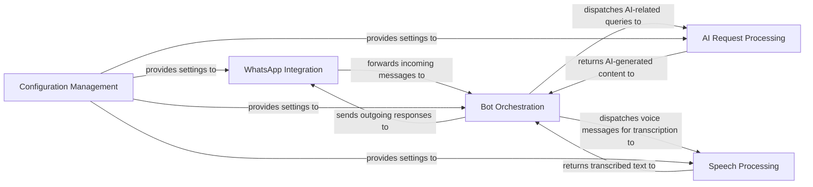

## Details

One paragraph explaining the functionality which is represented by this graph. What the main flow is and what is its purpose.

### WhatsApp Integration [[Expand]](./WhatsApp_Integration.md)
Manages the WhatsApp Web client, handles the reception of incoming messages (text, voice, media), and sends outgoing responses back to users. It acts as the primary interface between the bot's internal logic and the WhatsApp platform.

**Related Classes/Methods**:

- `src/index.ts`
- `src/handlers/message.ts`

### Bot Orchestration [[Expand]](./Bot_Orchestration.md)
This is the central intelligence and control hub of the bot. It receives processed messages, analyzes user intent, manages conversation context, and orchestrates the flow of information by dispatching requests to the appropriate AI or Speech processing components, and formats the final AI-generated content into user-friendly responses.

**Related Classes/Methods**:

- `src/handlers/message.ts`
- `src/index.ts`

### AI Request Processing [[Expand]](./AI_Request_Processing.md)
Encapsulates the logic for interacting with external Artificial Intelligence services, specifically OpenAI's GPT (for text) and DALL-E 2 (for images). It handles request formatting, API calls, and parsing of AI-generated responses.

**Related Classes/Methods**:

- `src/handlers/gpt.ts`
- `src/handlers/dalle.ts`
- `src/providers/openai.ts`

### Speech Processing [[Expand]](./Speech_Processing.md)
Dedicated to handling voice messages, this component is responsible for transcribing spoken language into text (speech-to-text) using either an external `speech-rest-api` or a local Whisper model.

**Related Classes/Methods**:

- `src/providers/speech.ts`
- `src/providers/whisper-local.ts`

### Configuration Management
Provides a centralized and secure mechanism for managing all application settings, environment variables, and sensitive information such as API keys, ensuring other components can access necessary configurations without hardcoding.

**Related Classes/Methods**:

- `src/config.ts`

### [FAQ](https://github.com/CodeBoarding/GeneratedOnBoardings/tree/main?tab=readme-ov-file#faq)