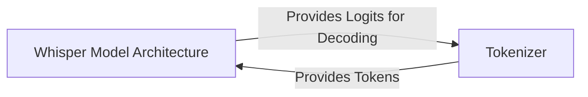

## Details

One paragraph explaining the functionality which is represented by this graph. What the main flow is and what is its purpose.

### Whisper Model Architecture
A composite component representing the complete encoder-decoder transformer model. It includes the audio encoder, which processes spectrograms, and the text decoder, which generates token sequences. The `Whisper` class acts as the primary facade, orchestrating the interactions between the internal modules like attention blocks and feed-forward networks.

**Related Classes/Methods**:

- `whisper.model`

### Tokenizer [[Expand]](./Tokenizer.md)
A specialized component responsible for converting text into a sequence of integer tokens and vice-versa. It encapsulates the vocabulary and the specific encoding rules (based on `tiktoken`) that the `Whisper Model Architecture` was trained on, including the management of special tokens for timestamps, languages, and tasks.

**Related Classes/Methods**:

- `whisper.tokenizer`

### [FAQ](https://github.com/CodeBoarding/GeneratedOnBoardings/tree/main?tab=readme-ov-file#faq)