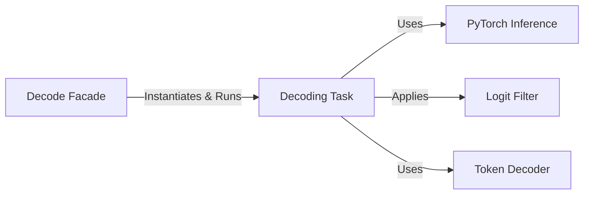

## Details

The selected components represent the most architecturally significant elements of the decoding process, emphasizing key design patterns. `DecodingTask` is the central orchestrator, acting as a controller. `PyTorchInference` encapsulates the core model interaction. The `TokenDecoder` and `LogitFilter` components represent the **Strategy Pattern**, allowing for flexible and interchangeable algorithms for sequence generation and output control, which is a cornerstone of this subsystem's design. Finally, the `decode` function serves as a **Facade**, simplifying the interface for external clients. Data structures like `DecodingOptions` and `DecodingResult` are treated as part of the interaction flow rather than standalone components to focus on the active, logical units.

### Decode Facade
The primary user-facing entry point (`decode` function) that simplifies the transcription process. It hides the complexity of creating and managing the decoding task, options, and model.

**Related Classes/Methods**:

- <a href="https://github.com/openai/whisper/blob/main/whisper/decoding.py#L792-L825" target="_blank" rel="noopener noreferrer">`whisper.decoding.decode` (792:825)</a>

### Decoding Task
The central orchestrator that manages the entire decoding workflow. It initializes the model, runs the main decoding loop, detects language, applies filters, and uses a token decoder to generate the final result.

**Related Classes/Methods**:

- <a href="https://github.com/openai/whisper/blob/main/whisper/decoding.py#L507-L788" target="_blank" rel="noopener noreferrer">`whisper.decoding.DecodingTask` (507:788)</a>

### PyTorch Inference
A concrete implementation that wraps the PyTorch model. Its sole responsibility is to execute the forward pass of the model, taking audio features and returning raw logits (model predictions).

**Related Classes/Methods**:

- <a href="https://github.com/openai/whisper/blob/main/whisper/decoding.py#L143-L175" target="_blank" rel="noopener noreferrer">`whisper.decoding.PyTorchInference` (143:175)</a>

### Token Decoder
An abstraction for sequence generation algorithms. This component defines the interface for different decoding strategies, with concrete implementations like `GreedyDecoder` and `BeamSearchDecoder`.

**Related Classes/Methods**:

- <a href="https://github.com/openai/whisper/blob/main/whisper/decoding.py#L215-L268" target="_blank" rel="noopener noreferrer">`whisper.decoding.TokenDecoder` (215:268)</a>

### Logit Filter
An abstraction for components that modify or inspect the model's logits before they are passed to the `TokenDecoder`. This allows for fine-grained control over the output, such as suppressing specific tokens or applying timestamp rules.

**Related Classes/Methods**:

- <a href="https://github.com/openai/whisper/blob/main/whisper/decoding.py#L406-L419" target="_blank" rel="noopener noreferrer">`whisper.decoding.LogitFilter` (406:419)</a>

### [FAQ](https://github.com/CodeBoarding/GeneratedOnBoardings/tree/main?tab=readme-ov-file#faq)