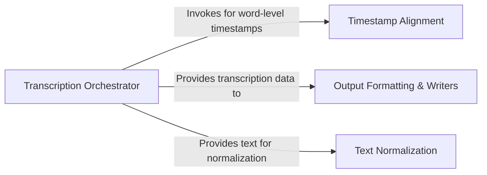

## Details

One paragraph explaining the functionality which is represented by this graph. What the main flow is and what is its purpose.

### Transcription Orchestrator
This is the central component that manages the entire audio transcription process. It takes the audio input and model, and orchestrates the workflow, including audio processing (Mel spectrogram), language detection, decoding, and optional timestamp alignment. It produces a structured result containing the transcribed text and segment-level details.

**Related Classes/Methods**:

- <a href="https://github.com/openai/whisper/blob/main/whisper/transcribe.py#L37-L513" target="_blank" rel="noopener noreferrer">`whisper.transcribe:transcribe` (37:513)</a>

### Timestamp Alignment
This component is responsible for generating precise word-level timestamps. When enabled by the orchestrator, it aligns the model's output tokens with the audio signal using cross-attention patterns and Dynamic Time Warping (DTW). This process is crucial for creating accurate subtitles.

**Related Classes/Methods**:

- <a href="https://github.com/openai/whisper/blob/main/whisper/timing.py#L278-L387" target="_blank" rel="noopener noreferrer">`whisper.timing:add_word_timestamps` (278:387)</a>

### Text Normalization
This component refines the raw text output from the model. It applies a series of language-specific rules to standardize casing, punctuation, and the representation of numbers and acronyms. It is designed as a collection of normalizer classes that can be applied to the final transcription text.

**Related Classes/Methods**:

- `whisper.normalizers` (1:1)

### Output Formatting & Writers
This component formats the processed transcription data (text and timestamps) into final output files. It uses a class-based writer pattern, with a generic `ResultWriter` defining a common interface and concrete implementations (e.g., `SubtitlesWriter`) handling specific formats like SRT and VTT.

**Related Classes/Methods**:

- <a href="https://github.com/openai/whisper/blob/main/whisper/utils.py#L84-L105" target="_blank" rel="noopener noreferrer">`whisper.utils.ResultWriter` (84:105)</a>
- <a href="https://github.com/openai/whisper/blob/main/whisper/utils.py#L118-L234" target="_blank" rel="noopener noreferrer">`whisper.utils.SubtitlesWriter` (118:234)</a>

### [FAQ](https://github.com/CodeBoarding/GeneratedOnBoardings/tree/main?tab=readme-ov-file#faq)