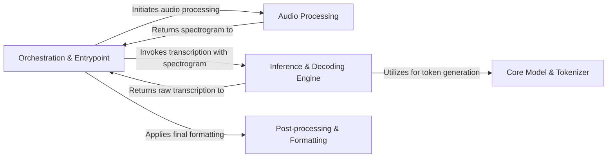

## Details

The whisper library is built on a component-based architecture that separates the user interface from the core machine learning workflow. The process begins at the Orchestration & Entrypoint layer, which manages the entire transcription pipeline. It first calls the Audio Processing component to load an audio file and convert it into a standardized spectrogram. This spectrogram is then passed to the Inference & Decoding Engine, which uses the Core Model & Tokenizer to perform the actual transcription and language detection. Finally, the raw output is sent to the Post-processing & Formatting component to normalize the text, add timestamps, and generate user-friendly output files like SRT or VTT, completing the flow.

### Orchestration & Entrypoint
Provides high-level API and CLI entry points. It coordinates the entire transcription pipeline, from loading audio to formatting the final output.

**Related Classes/Methods**:

- <a href="https://github.com/openai/whisper/blob/main/whisper/transcribe.py#L1-L1" target="_blank" rel="noopener noreferrer">`whisper/transcribe.py` (1:1)</a>
- <a href="https://github.com/openai/whisper/blob/main/whisper/__init__.py#L1-L1" target="_blank" rel="noopener noreferrer">`whisper/__init__.py` (1:1)</a>
- <a href="https://github.com/openai/whisper/blob/main/whisper/__main__.py#L1-L1" target="_blank" rel="noopener noreferrer">`whisper/__main__.py` (1:1)</a>

### Audio Processing
Handles loading audio from files, resampling, and converting it into a log-Mel spectrogram, the standardized input format required by the model.

**Related Classes/Methods**:

- <a href="https://github.com/openai/whisper/blob/main/whisper/audio.py#L1-L1" target="_blank" rel="noopener noreferrer">`whisper/audio.py` (1:1)</a>

### Core Model & Tokenizer [[Expand]](./Core_Model_Tokenizer.md)
Contains the essential AI assets: the Whisper neural network architecture (Encoder-Decoder) and the tokenizer for converting text to and from tokens.

**Related Classes/Methods**:

- <a href="https://github.com/openai/whisper/blob/main/whisper/model.py#L1-L1" target="_blank" rel="noopener noreferrer">`whisper/model.py` (1:1)</a>
- <a href="https://github.com/openai/whisper/blob/main/whisper/tokenizer.py#L1-L1" target="_blank" rel="noopener noreferrer">`whisper/tokenizer.py` (1:1)</a>

### Inference & Decoding Engine [[Expand]](./Inference_Decoding_Engine.md)
Manages the core transcription task. It runs the decoding loop, performs language detection, and applies strategies like beam search, using the Core Model to generate text from audio.

**Related Classes/Methods**:

- <a href="https://github.com/openai/whisper/blob/main/whisper/decoding.py#L1-L1" target="_blank" rel="noopener noreferrer">`whisper/decoding.py` (1:1)</a>

### Post-processing & Formatting [[Expand]](./Post_processing_Formatting.md)
A suite of tools to refine the raw model output. It handles text normalization, word-level timestamp alignment, and formats the final results into SRT/VTT files.

**Related Classes/Methods**:

- `whisper/normalizers/` (1:1)
- <a href="https://github.com/openai/whisper/blob/main/whisper/timing.py#L1-L1" target="_blank" rel="noopener noreferrer">`whisper/timing.py` (1:1)</a>
- <a href="https://github.com/openai/whisper/blob/main/whisper/utils.py#L1-L1" target="_blank" rel="noopener noreferrer">`whisper/utils.py` (1:1)</a>

### [FAQ](https://github.com/CodeBoarding/GeneratedOnBoardings/tree/main?tab=readme-ov-file#faq)