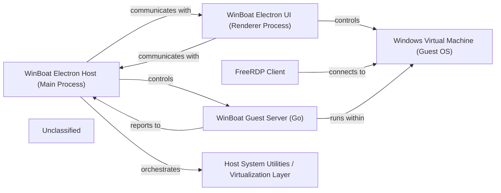

## Details

The WinBoat application is an Electron-based desktop application designed to manage and interact with a Windows Virtual Machine (VM) running on a Linux host. The main Electron process (`WinBoat Electron Host`) handles application lifecycle, system-level interactions, and orchestrates virtualization components. A separate Electron renderer process (`WinBoat Electron UI`) provides the user interface, displaying the VM's output and handling user input. A `WinBoat Guest Server` (Go) runs within the Windows VM for communication and command execution. The `FreeRDP Client` streams the VM's graphical output to the UI, and `Host System Utilities / Virtualization Layer` provides the underlying VM management infrastructure. Data flows via IPC between Electron Host and UI, and via network protocols (QMP, RDP, custom API) between Electron Host/UI and the VM/Guest Server.

### WinBoat Electron Host (Main Process)
The central control plane of the WinBoat application. Manages the Electron lifecycle, orchestrates virtualization and containerization, handles Inter-Process Communication (IPC), and communicates with host system utilities. It acts as the primary coordinator for starting, stopping, and managing the virtual machine and its associated services.

**Related Classes/Methods**:

- <a href="https://github.com/TibixDev/winboat/blob/main/src/main/main.ts" target="_blank" rel="noopener noreferrer">`main.ts`</a>

### WinBoat Electron UI (Renderer Process)
The user-facing interface, built with Vue.js. Renders the UI, processes user input, displays the virtualized environment's status, and integrates the remote display stream. It directly interacts with the QEMU Monitor Protocol (QMP) for VM control and communicates with the main process for system-level operations.

**Related Classes/Methods**:

- <a href="https://github.com/TibixDev/winboat/blob/main/src/renderer/main.ts" target="_blank" rel="noopener noreferrer">`main.ts`</a>
- <a href="https://github.com/TibixDev/winboat/blob/main/src/renderer/App.vue" target="_blank" rel="noopener noreferrer">`App.vue`</a>
- <a href="https://github.com/TibixDev/winboat/blob/main/src/renderer/lib/winboat.ts" target="_blank" rel="noopener noreferrer">`src/renderer/lib/winboat.Winboat`</a>
- <a href="https://github.com/TibixDev/winboat/blob/main/src/renderer/lib/qmp.ts" target="_blank" rel="noopener noreferrer">`src/renderer/lib/qmp.QMPManager`</a>

### WinBoat Guest Server (Go)
A lightweight server running within the Windows Virtual Machine. It executes commands received from the Electron Host, manages guest resources, and reports status and data back to the host. This server enables fine-grained control and monitoring of the guest operating system.

**Related Classes/Methods**:

- <a href="https://github.com/TibixDev/winboat/blob/main/guest_server/main.go" target="_blank" rel="noopener noreferrer">`main.go`</a>

### Windows Virtual Machine (Guest OS)
The isolated virtualized environment running a Windows operating system. It hosts the WinBoat Guest Server and user applications, and provides the remote display output that is streamed back to the Electron UI. This component is an external entity controlled by the application.

**Related Classes/Methods**: _None_

### FreeRDP Client
Establishes an RDP connection to the Windows VM, capturing and streaming its graphical output to the Electron UI for display. This component is crucial for providing the interactive visual experience of the virtual machine to the user.

**Related Classes/Methods**:

- <a href="https://github.com/TibixDev/winboat/blob/main/src/renderer/utils/getFreeRDP.ts" target="_blank" rel="noopener noreferrer">`src/renderer/utils/getFreeRDP.getFreeRDP`</a>

### Host System Utilities / Virtualization Layer
The underlying Linux host components responsible for virtualization (KVM), containerization (Docker), and network configuration (`iptables`/`nftables`). These utilities are orchestrated by the Electron Host to provide the necessary environment for the Windows Virtual Machine.

**Related Classes/Methods**:

- <a href="https://github.com/TibixDev/winboat/blob/main/src/main/main.ts" target="_blank" rel="noopener noreferrer">`main.ts`</a>

### Unclassified
Component for all unclassified files and utility functions (Utility functions/External Libraries/Dependencies)

**Related Classes/Methods**: _None_

### [FAQ](https://github.com/CodeBoarding/GeneratedOnBoardings/tree/main?tab=readme-ov-file#faq)