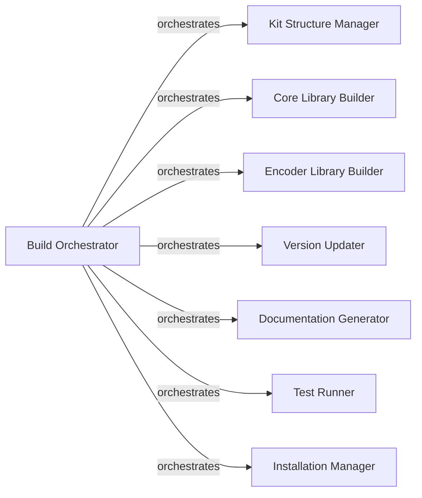

## Details

The `Build & Project Management System` subsystem is primarily encapsulated within the `xed_mbuild.py` file, serving as the central control for the XED library's entire build and project lifecycle. The subsystem's core functionality is defined by the `xed_mbuild.py` module, which orchestrates data ingestion, code generation, compilation, linking, and deployment for the XED library.

### Build Orchestrator
The central coordinating component that manages the entire build lifecycle from start to finish. It acts as the primary delegator for all build-related tasks, including initial environment setup.

**Related Classes/Methods**:

- <a href="https://github.com/intelxed/xed/blob/main/xed_mbuild.py#L2856-L2923" target="_blank" rel="noopener noreferrer">`xed_mbuild.work`:2856-2923</a>
- <a href="https://github.com/intelxed/xed/blob/main/xed_mbuild.py#L2929-L2937" target="_blank" rel="noopener noreferrer">`xed_mbuild.execute`:2929-2937</a>

### Kit Structure Manager
Prepares the necessary directory layout and initial file setup required for the build output and intermediate artifacts.

**Related Classes/Methods**:

- <a href="https://github.com/intelxed/xed/blob/main/xed_mbuild.py#L2408-L2499" target="_blank" rel="noopener noreferrer">`xed_mbuild.create_working_kit_structure`:2408-2499</a>

### Core Library Builder
Responsible for compiling and linking the primary XED library, including its core source files, extensions, and necessary header generation.

**Related Classes/Methods**:

- <a href="https://github.com/intelxed/xed/blob/main/xed_mbuild.py#L1782-L1939" target="_blank" rel="noopener noreferrer">`xed_mbuild.build_libxed`:1782-1939</a>

### Encoder Library Builder
A specialized component dedicated to building the XED encoder library, reflecting the modular and potentially separate compilation needs within a low-level library.

**Related Classes/Methods**:

- <a href="https://github.com/intelxed/xed/blob/main/xed_mbuild.py#L1941-L2015" target="_blank" rel="noopener noreferrer">`xed_mbuild.build_libxedenc2`:1941-2015</a>

### Version Updater
Manages and applies version information to the built artifacts and source code, critical for release management and tracking in a low-level library.

**Related Classes/Methods**:

- <a href="https://github.com/intelxed/xed/blob/main/xed_mbuild.py#L2641-L2644" target="_blank" rel="noopener noreferrer">`xed_mbuild.update_version`:2641-2644</a>

### Documentation Generator
Creates API documentation and other user-facing documentation, which is essential for library consumers to understand and utilize the XED library effectively.

**Related Classes/Methods**:

- <a href="https://github.com/intelxed/xed/blob/main/xed_mbuild.py#L521-L544" target="_blank" rel="noopener noreferrer">`xed_mbuild.make_doxygen_build`:521-544</a>
- <a href="https://github.com/intelxed/xed/blob/main/xed_mbuild.py#L546-L556" target="_blank" rel="noopener noreferrer">`xed_mbuild.create_doxygen_api_documentation`:546-556</a>

### Test Runner
Executes various tests to ensure the correctness, stability, and performance of the built components and the overall XED library.

**Related Classes/Methods**:

- <a href="https://github.com/intelxed/xed/blob/main/xed_mbuild.py#L2761-L2776" target="_blank" rel="noopener noreferrer">`xed_mbuild.run_tests`:2761-2776</a>

### Installation Manager
Manages the final deployment of built artifacts, including placing files in target directories and setting appropriate permissions.

**Related Classes/Methods**:

- <a href="https://github.com/intelxed/xed/blob/main/xed_mbuild.py#L2318-L2363" target="_blank" rel="noopener noreferrer">`xed_mbuild.system_install`:2318-2363</a>

### [FAQ](https://github.com/CodeBoarding/GeneratedOnBoardings/tree/main?tab=readme-ov-file#faq)