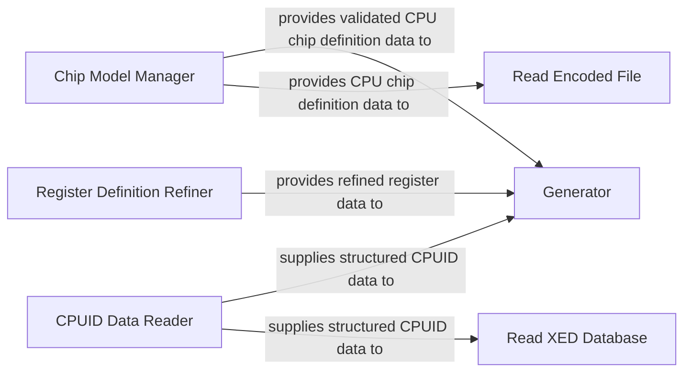

## Details

The core of this subsystem revolves around the processing and generation of CPU-related data. The `Chip Model Manager` serves as the central authority for CPU chip definitions, validating and expanding this data. The `CPUID Data Reader` specializes in extracting and structuring raw CPUID information, while the `Register Definition Refiner` standardizes register definitions. These three components (`Chip Model Manager`, `CPUID Data Reader`, and `Register Definition Refiner`) act as primary data providers, feeding their processed information to the `Generator`. The `Generator` then synthesizes this diverse input into various output formats, such as instruction tables and enumerations. Additionally, the `Chip Model Manager` supplies CPU chip definition data to `Read Encoded File` for instruction parsing, and the `CPUID Data Reader` provides structured CPUID data to `Read XED Database` for comprehensive instruction set information. This architecture ensures a clear flow from raw data acquisition and refinement to the generation of structured, usable output for further system operations.

### Chip Model Manager
Acts as the authoritative source for CPU capabilities. It parses, expands, and validates CPU chip definitions from external sources, managing feature indices and ensuring consistency across instruction sets. This component is crucial for defining the target CPU's supported features.

**Related Classes/Methods**:

- <a href="https://github.com/intelxed/xed/blob/main/pysrc/chipmodel.py" target="_blank" rel="noopener noreferrer">`Chip Model Manager`</a>

### CPUID Data Reader
Specializes in loading, parsing, and providing programmatic access to raw CPUID records and group information. It transforms unstructured CPUID strings into a structured, queryable format, making CPU feature detection efficient.

**Related Classes/Methods**:

- <a href="https://github.com/intelxed/xed/blob/main/pysrc/cpuid_rdr.py" target="_blank" rel="noopener noreferrer">`CPUID Data Reader`</a>

### Register Definition Refiner
Focuses on processing and refining raw register definitions. It organizes and standardizes register information into a usable format, abstracting away low-level representation details for other components.

**Related Classes/Methods**:

- <a href="https://github.com/intelxed/xed/blob/main/pysrc/refine_regs.py" target="_blank" rel="noopener noreferrer">`Register Definition Refiner`</a>

### Generator
Responsible for generating various output files, including instruction tables, enumerations, and other derived data structures, based on the processed CPU and register definitions. It acts as the final stage in data transformation for consumption by other parts of the system or external tools.

**Related Classes/Methods**:

- <a href="https://github.com/intelxed/xed/blob/main/pysrc/classifier.py" target="_blank" rel="noopener noreferrer">`Generator`</a>

### Read Encoded File
Handles the parsing and interpretation of encoded instruction files. It reads and decodes the raw instruction data, making it available for further processing and validation within the system.

**Related Classes/Methods**:

- <a href="https://github.com/intelxed/xed/blob/main/pysrc/read-encfile.py" target="_blank" rel="noopener noreferrer">`Read Encoded File`</a>

### Read XED Database
Manages the loading and access to the XED (X86 Encoder Decoder) instruction database. It provides structured access to the comprehensive instruction set information, which is critical for accurate instruction decoding and encoding.

**Related Classes/Methods**:

- <a href="https://github.com/intelxed/xed/blob/main/pysrc/read_xed_db.py" target="_blank" rel="noopener noreferrer">`Read XED Database`</a>

### [FAQ](https://github.com/CodeBoarding/GeneratedOnBoardings/tree/main?tab=readme-ov-file#faq)