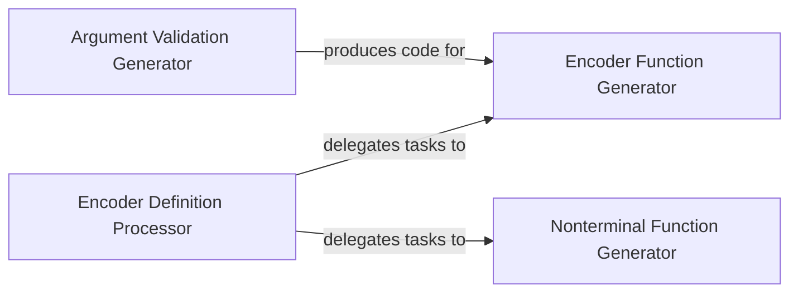

## Details

The `Encoder Logic Generation` subsystem is responsible for transforming high-level instruction definitions into low-level C/C++ code for the XED instruction encoder. It focuses on generating encoding functions, implementing argument validation, and creating reusable nonterminal patterns.

### Encoder Definition Processor
Parses high-level encoder/decoder definition files, manages encoding rules, and orchestrates the overall code generation process. It acts as the primary data input and control flow component for the subsystem.

**Related Classes/Methods**:

- <a href="https://github.com/intelxed/xed/blob/main/pysrc/read-encfile.py" target="_blank" rel="noopener noreferrer">`read-encfile`</a>

### Encoder Function Generator
Generates the specific C/C++ code for individual instruction encoding functions. This includes handling operand types, prefixes, opcode emission, and integrating validation logic.

**Related Classes/Methods**:

- <a href="https://github.com/intelxed/xed/blob/main/pysrc/enc2gen.py" target="_blank" rel="noopener noreferrer">`enc2gen`</a>

### Nonterminal Function Generator
Creates C/C++ functions that represent reusable nonterminal patterns or decision points within the overall encoding logic. These functions encapsulate common encoding sequences or logic branches, promoting code reuse.

**Related Classes/Methods**:

- <a href="https://github.com/intelxed/xed/blob/main/pysrc/nt_func_gen.py" target="_blank" rel="noopener noreferrer">`nt_func_gen`</a>

### Argument Validation Generator
Generates C/C++ functions specifically for validating arguments during the instruction encoding process. This ensures that input operands conform to expected types and constraints, enhancing the robustness of the generated encoder.

**Related Classes/Methods**:

- <a href="https://github.com/intelxed/xed/blob/main/pysrc/enc2argcheck.py" target="_blank" rel="noopener noreferrer">`enc2argcheck`</a>

### [FAQ](https://github.com/CodeBoarding/GeneratedOnBoardings/tree/main?tab=readme-ov-file#faq)