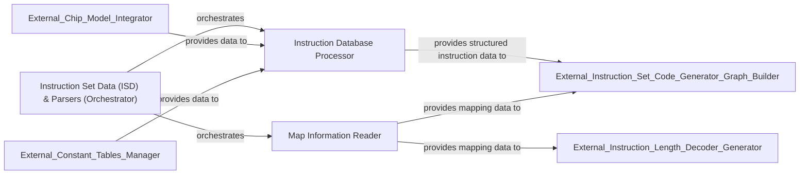

## Details

The Instruction Set Data Processing Subsystem is responsible for the comprehensive ingestion, parsing, and structuring of raw instruction set definition data. Orchestrated by the Instruction Set Data (ISD) & Parsers (Orchestrator), this subsystem processes diverse input sources to produce a unified, machine-consumable format. The Instruction Database Processor handles the detailed parsing and refinement of instruction definitions, incorporating data from external sources like the Chip Model Integrator and Constant Tables Manager. Concurrently, the Map Information Reader extracts and provides essential opcode encoding and instruction form mapping data. The structured instruction data and mapping information are then made available to external downstream components, such as the Instruction Set Code Generator & Graph Builder and the Instruction Length Decoder Generator, enabling the generation of code and decoders based on the processed instruction set.

### Instruction Set Data (ISD) & Parsers (Orchestrator)
This component serves as the high-level orchestrator and facade for the instruction set data processing subsystem. It coordinates the overall process of reading, parsing, and structuring raw instruction set definition data from various input sources, ensuring the output is a unified, machine-consumable format. It represents the primary interface for other parts of the system to access the processed instruction data.

**Related Classes/Methods**:

### Instruction Database Processor
This specialized component is responsible for the detailed ingestion and parsing of raw instruction definitions. It performs critical tasks such as refining operand widths, computing memory operand properties, and expanding compound values. Its primary output is a highly structured representation of the core instruction set data, ready for further processing by external components.

**Related Classes/Methods**:

### Map Information Reader
This component is dedicated to parsing and providing essential mapping data. This includes critical information related to opcode encoding spaces and instruction forms, which is vital for understanding how instructions are encoded and decoded within the instruction set architecture. This data is consumed by external components that generate decoders or code.

**Related Classes/Methods**:

### [FAQ](https://github.com/CodeBoarding/GeneratedOnBoardings/tree/main?tab=readme-ov-file#faq)