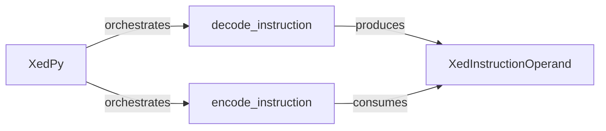

## Details

The `Public API & Examples (Python Bindings)` subsystem provides the Python interface for the XED library, enabling high-level interaction with its decoding and encoding capabilities. It acts as a bridge between Python applications and the underlying C library, abstracting the low-level CFFI details.

### XedPy
The main Python class serving as the high-level entry point for the XED library. It manages the library's state and orchestrates both decoding and encoding operations, providing a simplified API for Python consumers.

**Related Classes/Methods**:

- <a href="https://github.com/intelxed/xed/blob/main/pyext/examples/xedpy_ex_cffi.py" target="_blank" rel="noopener noreferrer">`XedPy:decode_instruction`</a>
- <a href="https://github.com/intelxed/xed/blob/main/pyext/examples/xedpy_ex_cffi.py" target="_blank" rel="noopener noreferrer">`XedPy:encode_instruction`</a>

### decode_instruction
A core function within XedPy (or closely associated) responsible for interfacing with the XED C library via CFFI. It takes raw instruction bytes and decodes them into a structured XED instruction object, handling the necessary CFFI calls and data conversions.

**Related Classes/Methods**:

- <a href="https://github.com/intelxed/xed/blob/main/pyext/examples/xedpy_ex_cffi.py#L234-L237" target="_blank" rel="noopener noreferrer">`init_xedd`:234-237</a>
- <a href="https://github.com/intelxed/xed/blob/main/pyext/examples/xedpy_ex_cffi.py#L172-L174" target="_blank" rel="noopener noreferrer">`cstr_to_str`:172-174</a>
- <a href="https://github.com/intelxed/xed/blob/main/pyext/examples/xedpy_ex_cffi.py#L71-L139" target="_blank" rel="noopener noreferrer">`XedInstructionOperand`:71-139</a>

### encode_instruction
A core function within XedPy (or closely associated) that interfaces with the XED C library via CFFI to encode instruction details (e.g., mnemonic, operands) into raw instruction bytes. It manages the setup of encoding requests and marshaling data to the C library.

**Related Classes/Methods**:

- <a href="https://github.com/intelxed/xed/blob/main/pyext/examples/xedpy_ex_cffi.py#L71-L139" target="_blank" rel="noopener noreferrer">`XedInstructionOperand`:71-139</a>
- <a href="https://github.com/intelxed/xed/blob/main/pyext/examples/xedpy_ex_cffi.py#L202-L232" target="_blank" rel="noopener noreferrer">`_set_encode_request`:202-232</a>

### XedInstructionOperand
A Python data structure representing a single operand of an XED instruction. It encapsulates operand type and value, serving as a crucial data transfer object for both the output of decoding operations and the input for encoding requests.

**Related Classes/Methods**:

- <a href="https://github.com/intelxed/xed/blob/main/pyext/examples/xedpy_ex_cffi.py#L370-L462" target="_blank" rel="noopener noreferrer">`get_operands`:370-462</a>
- <a href="https://github.com/intelxed/xed/blob/main/pyext/examples/xedpy_ex_cffi.py#L202-L232" target="_blank" rel="noopener noreferrer">`_set_encode_request`:202-232</a>

### [FAQ](https://github.com/CodeBoarding/GeneratedOnBoardings/tree/main?tab=readme-ov-file#faq)