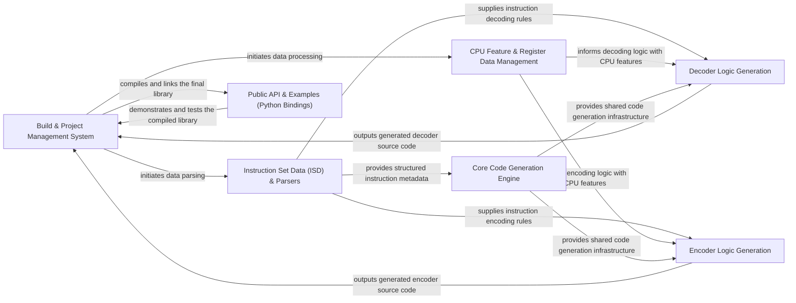

## Details

The XED project's architecture is centered around a robust `Build & Project Management System` that orchestrates the entire instruction set database generation process. This system initiates the data flow by interacting with the `Instruction Set Data (ISD) & Parsers` and `CPU Feature & Register Data Management` components. The `ISD & Parsers` component is responsible for ingesting and structuring raw instruction definitions, while the `CPU Feature & Register Data Management` component handles CPU-specific data. Both provide crucial input to the `Core Code Generation Engine`, which offers shared infrastructure for generating C/C++ code.

Building upon this core, the `Decoder Logic Generation` and `Encoder Logic Generation` components specialize in producing the respective decoder and encoder source code, leveraging the structured data from the parsers and the shared generation utilities. Once the decoder and encoder logic are generated, they are fed back to the `Build & Project Management System` for compilation and linking into the final XED library. Finally, the `Public API & Examples (Python Bindings)` component provides a high-level interface for external applications to interact with the generated library, completing the development and deployment cycle. This modular design ensures clear separation of concerns and facilitates maintainability and extensibility.

### Build & Project Management System [[Expand]](./Build_Project_Management_System.md)
Orchestrates the entire project lifecycle, from data ingestion and code generation to compilation and linking. It acts as the central control for the XED library's build process.

**Related Classes/Methods**:

- <a href="https://github.com/intelxed/xed/blob/main/xed_mbuild.py" target="_blank" rel="noopener noreferrer">`xed_mbuild.py`</a>

### Instruction Set Data (ISD) & Parsers [[Expand]](./Instruction_Set_Data_ISD_Parsers.md)
Responsible for reading, parsing, and structuring raw instruction set definition data from various input files. This component transforms human-readable specifications into a machine-consumable format.

**Related Classes/Methods**:

- <a href="https://github.com/intelxed/xed/blob/main/pysrc/read_xed_db.py" target="_blank" rel="noopener noreferrer">`pysrc/read_xed_db.py`</a>
- <a href="https://github.com/intelxed/xed/blob/main/pysrc/generator.py" target="_blank" rel="noopener noreferrer">`pysrc/generator.py`</a>
- <a href="https://github.com/intelxed/xed/blob/main/pysrc/map_info_rdr.py" target="_blank" rel="noopener noreferrer">`pysrc/map_info_rdr.py`</a>
- <a href="https://github.com/intelxed/xed/blob/main/pysrc/ild.py" target="_blank" rel="noopener noreferrer">`pysrc/ild.py`</a>

### CPU Feature & Register Data Management [[Expand]](./CPU_Feature_Register_Data_Management.md)
Manages and processes data related to CPU features (CPUID) and register definitions, providing essential context for accurate instruction set interpretation and code generation.

**Related Classes/Methods**:

- <a href="https://github.com/intelxed/xed/blob/main/pysrc/chipmodel.py" target="_blank" rel="noopener noreferrer">`pysrc/chipmodel.py`</a>
- <a href="https://github.com/intelxed/xed/blob/main/pysrc/cpuid_rdr.py" target="_blank" rel="noopener noreferrer">`pysrc/cpuid_rdr.py`</a>
- <a href="https://github.com/intelxed/xed/blob/main/pysrc/refine_regs.py" target="_blank" rel="noopener noreferrer">`pysrc/refine_regs.py`</a>

### Core Code Generation Engine [[Expand]](./Core_Code_Generation_Engine.md)
Provides the fundamental infrastructure and shared utilities for generating C/C++ source code, including common functions, header management, and lookup table creation, used by both decoder and encoder generation.

**Related Classes/Methods**:

- <a href="https://github.com/intelxed/xed/blob/main/pysrc/codegen.py" target="_blank" rel="noopener noreferrer">`pysrc/codegen.py`</a>
- <a href="https://github.com/intelxed/xed/blob/main/pysrc/enumer.py" target="_blank" rel="noopener noreferrer">`pysrc/enumer.py`</a>

### Decoder Logic Generation
Specializes in generating the C/C++ code for the XED instruction decoder, including complex logic for Instruction Length Decoding (ILD), dynamic decoding, and operand accessor functions.

**Related Classes/Methods**:

- <a href="https://github.com/intelxed/xed/blob/main/pysrc/ild_codegen.py" target="_blank" rel="noopener noreferrer">`pysrc/ild_codegen.py`</a>
- <a href="https://github.com/intelxed/xed/blob/main/pysrc/dec_dyn.py" target="_blank" rel="noopener noreferrer">`pysrc/dec_dyn.py`</a>
- <a href="https://github.com/intelxed/xed/blob/main/pysrc/operand_storage.py" target="_blank" rel="noopener noreferrer">`pysrc/operand_storage.py`</a>

### Encoder Logic Generation [[Expand]](./Encoder_Logic_Generation.md)
Focuses on generating the C/C++ code for the XED instruction encoder, creating encoding functions for various instruction formats and implementing argument validation logic.

**Related Classes/Methods**:

- <a href="https://github.com/intelxed/xed/blob/main/pysrc/enc2gen.py" target="_blank" rel="noopener noreferrer">`pysrc/enc2gen.py`</a>
- <a href="https://github.com/intelxed/xed/blob/main/pysrc/read-encfile.py" target="_blank" rel="noopener noreferrer">`pysrc/read-encfile.py`</a>
- <a href="https://github.com/intelxed/xed/blob/main/pysrc/enc2argcheck.py" target="_blank" rel="noopener noreferrer">`pysrc/enc2argcheck.py`</a>
- <a href="https://github.com/intelxed/xed/blob/main/pysrc/nt_func_gen.py" target="_blank" rel="noopener noreferrer">`pysrc/nt_func_gen.py`</a>

### Public API & Examples (Python Bindings) [[Expand]](./Public_API_Examples_Python_Bindings_.md)
Provides the Python bindings for the generated XED library, enabling external applications to interact with the decoder and encoder, and includes example usage for demonstration.

**Related Classes/Methods**:

- <a href="https://github.com/intelxed/xed/blob/main/pyext/examples/xedpy_ex_cffi.py" target="_blank" rel="noopener noreferrer">`pyext/examples/xedpy_ex_cffi.py`</a>

### [FAQ](https://github.com/CodeBoarding/GeneratedOnBoardings/tree/main?tab=readme-ov-file#faq)