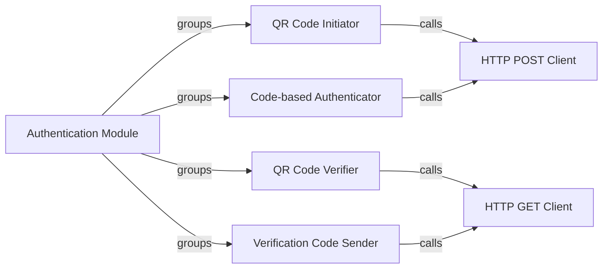

## Details

The Authentication Module subsystem is responsible for managing all user login processes and session authentication within the xhs project. It encapsulates the logic for QR code-based and verification code-based authentication flows, ensuring secure access to XHS functionalities. Its core functionality is concentrated within the xhs.core module.

### Authentication Module [[Expand]](./Authentication_Module.md)
The primary orchestrator for user authentication, providing a unified interface for initiating login sessions and verifying user identity. It coordinates the various sub-components to facilitate secure access.

**Related Classes/Methods**:

- <a href="https://github.com/ReaJason/xhs/blob/master/xhs/core.py#L648-L656" target="_blank" rel="noopener noreferrer">`xhs.core.get_qrcode`:648-656</a>
- <a href="https://github.com/ReaJason/xhs/blob/master/xhs/core.py#L658-L661" target="_blank" rel="noopener noreferrer">`xhs.core.check_qrcode`:658-661</a>
- <a href="https://github.com/ReaJason/xhs/blob/master/xhs/core.py#L667-L670" target="_blank" rel="noopener noreferrer">`xhs.core.send_code`:667-670</a>
- <a href="https://github.com/ReaJason/xhs/blob/master/xhs/core.py#L677-L680" target="_blank" rel="noopener noreferrer">`xhs.core.login_code`:677-680</a>

### QR Code Initiator
Handles the initial step of QR code-based login by obtaining a unique QR code from the XHS server. This QR code is then presented to the user for scanning.

**Related Classes/Methods**:

- <a href="https://github.com/ReaJason/xhs/blob/master/xhs/core.py#L648-L656" target="_blank" rel="noopener noreferrer">`xhs.core.get_qrcode`:648-656</a>

### QR Code Verifier
Continuously monitors and checks the authentication status associated with a generated QR code. It determines if the QR code has been scanned, confirmed, or if its validity has expired.

**Related Classes/Methods**:

- <a href="https://github.com/ReaJason/xhs/blob/master/xhs/core.py#L658-L661" target="_blank" rel="noopener noreferrer">`xhs.core.check_qrcode`:658-661</a>

### Verification Code Sender
Manages the request to dispatch a verification code to a user's registered contact method (e.g., phone number, email) for code-based login.

**Related Classes/Methods**:

- <a href="https://github.com/ReaJason/xhs/blob/master/xhs/core.py#L667-L670" target="_blank" rel="noopener noreferrer">`xhs.core.send_code`:667-670</a>

### Code-based Authenticator
Processes the user-provided verification code by submitting it to the XHS API to complete the authentication process and establish a user session.

**Related Classes/Methods**:

- <a href="https://github.com/ReaJason/xhs/blob/master/xhs/core.py#L677-L680" target="_blank" rel="noopener noreferrer">`xhs.core.login_code`:677-680</a>

### HTTP POST Client
A shared utility component responsible for executing HTTP POST requests to external services, used by various authentication sub-components for sending data (e.g., login credentials, QR code status updates).

**Related Classes/Methods**:

- <a href="https://github.com/ReaJason/xhs/blob/master/xhs/core.py#L190-L204" target="_blank" rel="noopener noreferrer">`xhs.core.post`:190-204</a>

### HTTP GET Client
A shared utility component for performing HTTP GET requests, utilized by authentication sub-components to retrieve information (e.g., QR code status, initial authentication data).

**Related Classes/Methods**:

- <a href="https://github.com/ReaJason/xhs/blob/master/xhs/core.py#L177-L188" target="_blank" rel="noopener noreferrer">`xhs.core.get`:177-188</a>

### [FAQ](https://github.com/CodeBoarding/GeneratedOnBoardings/tree/main?tab=readme-ov-file#faq)