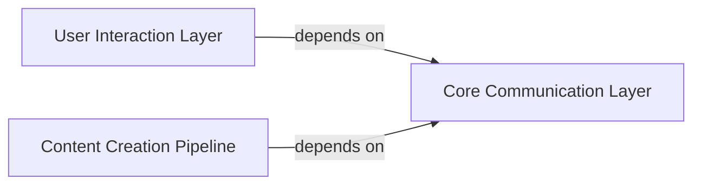

## Details

The `Content Management Module` subsystem is primarily responsible for handling user interactions with content and other users, as well as orchestrating the creation and uploading of new content. Its boundaries are defined by the `xhs.core` module, specifically encompassing methods related to content manipulation and user engagement.

### User Interaction Layer
This component serves as a Data Access Object (DAO) layer, abstracting direct user actions on content and other users. It provides a high-level interface for common interactions such as commenting on notes, following users, liking notes, and collecting notes. It simplifies the interaction logic by encapsulating the underlying communication details.

**Related Classes/Methods**:

- <a href="https://github.com/ReaJason/xhs/blob/master/xhs/core.py#L577-L584" target="_blank" rel="noopener noreferrer">`comment_note`:577-584</a>
- <a href="https://github.com/ReaJason/xhs/blob/master/xhs/core.py#L608-L611" target="_blank" rel="noopener noreferrer">`follow_user`:608-611</a>
- <a href="https://github.com/ReaJason/xhs/blob/master/xhs/core.py#L628-L631" target="_blank" rel="noopener noreferrer">`like_note`:628-631</a>
- <a href="https://github.com/ReaJason/xhs/blob/master/xhs/core.py#L618-L621" target="_blank" rel="noopener noreferrer">`collect_note`:618-621</a>

### Content Creation Pipeline
This component orchestrates the multi-stage process of creating and uploading new content, including associated media files (images, videos) and note metadata. It embodies a clear Pipeline pattern, managing the sequence from acquiring upload permissions to the final registration of the note. This includes handling file uploads, potentially in slices, and then creating different types of notes (image, video).

**Related Classes/Methods**:

- <a href="https://github.com/ReaJason/xhs/blob/master/xhs/core.py#L781-L800" target="_blank" rel="noopener noreferrer">`get_upload_files_permit`:781-800</a>
- <a href="https://github.com/ReaJason/xhs/blob/master/xhs/core.py#L871-L895" target="_blank" rel="noopener noreferrer">`upload_file`:871-895</a>
- <a href="https://github.com/ReaJason/xhs/blob/master/xhs/core.py#L830-L869" target="_blank" rel="noopener noreferrer">`upload_file_with_slice`:830-869</a>
- <a href="https://github.com/ReaJason/xhs/blob/master/xhs/core.py#L925-L965" target="_blank" rel="noopener noreferrer">`create_note`:925-965</a>
- <a href="https://github.com/ReaJason/xhs/blob/master/xhs/core.py#L967-L1007" target="_blank" rel="noopener noreferrer">`create_image_note`:967-1007</a>
- <a href="https://github.com/ReaJason/xhs/blob/master/xhs/core.py#L1030-L1097" target="_blank" rel="noopener noreferrer">`create_video_note`:1030-1097</a>

### Core Communication Layer
This foundational component centralizes and abstracts all network requests within the subsystem. It handles common concerns like preparing HTTP headers (`_pre_headers`) and executing fundamental HTTP `GET` and `POST` requests (`request`). This layer is crucial for the 'Scraper/Crawler' aspect of the project, providing the means for other components to interact with external APIs.

**Related Classes/Methods**:

- <a href="https://github.com/ReaJason/xhs/blob/master/xhs/core.py#L190-L204" target="_blank" rel="noopener noreferrer">`post`:190-204</a>
- <a href="https://github.com/ReaJason/xhs/blob/master/xhs/core.py#L177-L188" target="_blank" rel="noopener noreferrer">`get`:177-188</a>
- <a href="https://github.com/ReaJason/xhs/blob/master/xhs/core.py#L135-L149" target="_blank" rel="noopener noreferrer">`_pre_headers`:135-149</a>
- <a href="https://github.com/ReaJason/xhs/blob/master/xhs/core.py#L151-L175" target="_blank" rel="noopener noreferrer">`request`:151-175</a>

### [FAQ](https://github.com/CodeBoarding/GeneratedOnBoardings/tree/main?tab=readme-ov-file#faq)