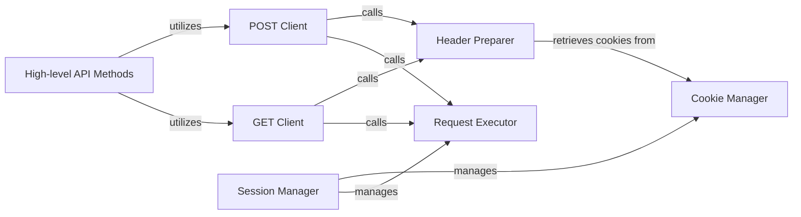

## Details

The `xhs` project's network layer is centered around the `XhsClient` class, which orchestrates HTTP communication. The `Request Executor` forms the core, handling raw HTTP requests and error responses. It is supported by the `Session Manager` for persistent session handling and the `Cookie Manager` for cookie management. High-level `GET Client` and `POST Client` components abstract the request initiation, both relying on the `Header Preparer` to construct necessary HTTP headers, which in turn interacts with the `Cookie Manager`. Finally, `High-level API Methods` consume these clients to perform specific application-level interactions.

### Request Executor
The lowest-level component responsible for executing raw HTTP requests (GET, POST, etc.) using an underlying HTTP client library. It handles the actual transmission and reception of data over the network and processes basic error responses.

**Related Classes/Methods**:

- <a href="https://github.com/ReaJason/xhs/blob/master/xhs/core.py#L151-L175" target="_blank" rel="noopener noreferrer">`xhs.core.XhsClient.request`:151-175</a>

### GET Client
Provides a high-level interface for initiating HTTP GET requests. It orchestrates the preparation of request parameters and delegates the actual execution to the Request Executor.

**Related Classes/Methods**:

- <a href="https://github.com/ReaJason/xhs/blob/master/xhs/core.py#L177-L188" target="_blank" rel="noopener noreferrer">`xhs.core.XhsClient.get`:177-188</a>

### POST Client
Provides a high-level interface for initiating HTTP POST requests. Similar to the GET Client, it prepares request parameters and delegates execution to the Request Executor.

**Related Classes/Methods**:

- <a href="https://github.com/ReaJason/xhs/blob/master/xhs/core.py#L190-L204" target="_blank" rel="noopener noreferrer">`xhs.core.XhsClient.post`:190-204</a>

### Header Preparer
Responsible for dynamically constructing and attaching necessary HTTP headers to outgoing requests, including user-agent, content-type, and XHS-specific authentication or session headers.

**Related Classes/Methods**:

- <a href="https://github.com/ReaJason/xhs/blob/master/xhs/core.py#L135-L149" target="_blank" rel="noopener noreferrer">`xhs.core.XhsClient._pre_headers`:135-149</a>

### Session Manager
Manages the persistent HTTP session (`requests.Session` object), maintaining stateful information such as connection pooling and automatic cookie handling across multiple requests to optimize performance and maintain continuity.

**Related Classes/Methods**:

- <a href="https://github.com/ReaJason/xhs/blob/master/xhs/core.py#L131-L133" target="_blank" rel="noopener noreferrer">`xhs.core.XhsClient.session`:131-133</a>
- <a href="https://github.com/ReaJason/xhs/blob/master/xhs/core.py" target="_blank" rel="noopener noreferrer">`xhs.core.XhsClient.__init__`</a>

### Cookie Manager
Manages and provides access to session-specific cookies, ensuring they are correctly stored, retrieved, and included in outgoing requests. It interacts directly with the underlying session's cookie jar.

**Related Classes/Methods**:

- <a href="https://github.com/ReaJason/xhs/blob/master/xhs/core.py#L127-L129" target="_blank" rel="noopener noreferrer">`xhs.core.XhsClient.cookie_dict`:127-129</a>
- <a href="https://github.com/ReaJason/xhs/blob/master/xhs/core.py#L120-L125" target="_blank" rel="noopener noreferrer">`xhs.core.XhsClient.cookie`:120-125</a>

### High-level API Methods
Represents the higher-level API methods within the `xhs` project that consume the network layer's functionality to perform specific actions (e.g., fetching user data, posting content, reporting metrics). This component acts as the primary interface for other parts of the application to interact with the network layer.

**Related Classes/Methods**:

- <a href="https://github.com/ReaJason/xhs/blob/master/xhs/core.py#L206-L222" target="_blank" rel="noopener noreferrer">`xhs.core.XhsClient.get_note_by_id`:206-222</a>
- <a href="https://github.com/ReaJason/xhs/blob/master/xhs/core.py#L224-L264" target="_blank" rel="noopener noreferrer">`xhs.core.XhsClient.get_note_by_id_from_html`:224-264</a>
- <a href="https://github.com/ReaJason/xhs/blob/master/xhs/core.py#L266-L300" target="_blank" rel="noopener noreferrer">`xhs.core.XhsClient.report_note_metrics`:266-300</a>

### [FAQ](https://github.com/CodeBoarding/GeneratedOnBoardings/tree/main?tab=readme-ov-file#faq)