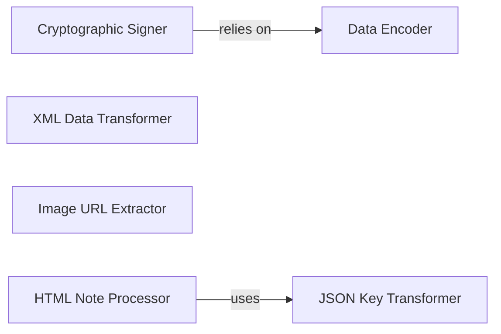

## Details

The `Utility & Security Module` subsystem is primarily defined by functionalities within `xhs.help` and `xhs.core` modules, focusing on data preparation, transformation, and secure processing.

### Cryptographic Signer
Manages the generation of cryptographic signatures for requests, ensuring data integrity and authenticity. It encapsulates the complex signing logic.

**Related Classes/Methods**:

- <a href="https://github.com/ReaJason/xhs/blob/master/xhs/help.py" target="_blank" rel="noopener noreferrer">`xhs.help.sign`</a>
- <a href="https://github.com/ReaJason/xhs/blob/master/xhs/help.py#L155-L210" target="_blank" rel="noopener noreferrer">`xhs.help.mrc`:155-210</a>
- <a href="https://github.com/ReaJason/xhs/blob/master/xhs/help.py#L203-L206" target="_blank" rel="noopener noreferrer">`xhs.help.right_without_sign`:203-206</a>

### Data Encoder
Provides fundamental data encoding services, including Base64 and UTF-8 conversions, essential for preparing data for transmission or storage.

**Related Classes/Methods**:

- <a href="https://github.com/ReaJason/xhs/blob/master/xhs/help.py#L296-L312" target="_blank" rel="noopener noreferrer">`xhs.help.b64Encode`:296-312</a>
- <a href="https://github.com/ReaJason/xhs/blob/master/xhs/help.py#L315-L329" target="_blank" rel="noopener noreferrer">`xhs.help.encodeUtf8`:315-329</a>
- <a href="https://github.com/ReaJason/xhs/blob/master/xhs/help.py#L287-L293" target="_blank" rel="noopener noreferrer">`xhs.help.encodeChunk`:287-293</a>

### XML Data Transformer
Facilitates the conversion of XML formatted data into more manageable Python dictionary structures, enabling easier data manipulation.

**Related Classes/Methods**:

- <a href="https://github.com/ReaJason/xhs/blob/master/xhs/help.py#L358-L372" target="_blank" rel="noopener noreferrer">`xhs.help.xml_to_dict`:358-372</a>
- <a href="https://github.com/ReaJason/xhs/blob/master/xhs/help.py#L375-L377" target="_blank" rel="noopener noreferrer">`xhs.help.parse_xml`:375-377</a>

### JSON Key Transformer
Standardizes JSON-like data by transforming keys (e.g., from camelCase to snake_case), ensuring consistency across the application's data models.

**Related Classes/Methods**:

- <a href="https://github.com/ReaJason/xhs/blob/master/xhs/core.py#L235-L253" target="_blank" rel="noopener noreferrer">`xhs.core.transform_json_keys`:235-253</a>
- <a href="https://github.com/ReaJason/xhs/blob/master/xhs/core.py#L232-L233" target="_blank" rel="noopener noreferrer">`xhs.core.camel_to_underscore`:232-233</a>

### Image URL Extractor
Specializes in extracting image URLs from specific note data structures, often involving a multi-step process of ID retrieval and URL resolution.

**Related Classes/Methods**:

- <a href="https://github.com/ReaJason/xhs/blob/master/xhs/help.py#L104-L109" target="_blank" rel="noopener noreferrer">`xhs.help.get_imgs_url_from_note`:104-109</a>
- <a href="https://github.com/ReaJason/xhs/blob/master/xhs/help.py#L97-L101" target="_blank" rel="noopener noreferrer">`xhs.help.get_trace_id`:97-101</a>
- <a href="https://github.com/ReaJason/xhs/blob/master/xhs/help.py#L89-L90" target="_blank" rel="noopener noreferrer">`xhs.help.get_img_url_by_trace_id`:89-90</a>

### HTML Note Processor
Processes raw HTML content related to notes, often involving the application of data transformation rules to structure the extracted information.

**Related Classes/Methods**:

- <a href="https://github.com/ReaJason/xhs/blob/master/xhs/core.py#L224-L264" target="_blank" rel="noopener noreferrer">`xhs.core.get_note_by_id_from_html`:224-264</a>

### [FAQ](https://github.com/CodeBoarding/GeneratedOnBoardings/tree/main?tab=readme-ov-file#faq)