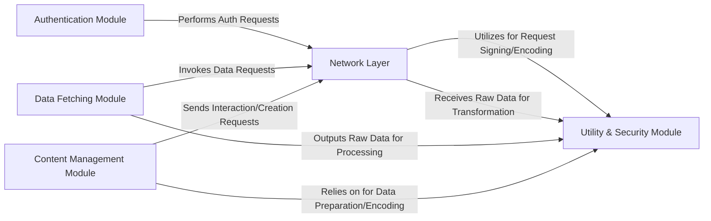

## Details

The `xhs` project implements a robust web scraping and interaction library, structured around a core `Network Layer` that manages all external HTTP communications. This layer serves as the conduit for specialized modules: the `Authentication Module` handles secure user sessions, the `Data Fetching Module` retrieves diverse content, and the `Content Management Module` facilitates user interactions and content creation. All these operational modules heavily depend on the `Utility & Security Module` for critical functions such as cryptographic signing, data encoding, and transformation, ensuring data integrity and secure communication. This architecture forms a clear, sequential data pipeline, where requests are prepared, sent, and responses are processed, making it highly suitable for visual representation as a data flow diagram emphasizing the distinct stages of data acquisition, manipulation, and interaction with the XHS platform.

### Network Layer [[Expand]](./Network_Layer.md)
The foundational component handling all low-level HTTP GET and POST requests, session management, and header preparation. It is the primary interface for external network interactions with the XHS platform.

**Related Classes/Methods**:

- <a href="https://github.com/ReaJason/xhs/blob/master/xhs/core.py#L177-L188" target="_blank" rel="noopener noreferrer">`xhs.core.get`:177-188</a>
- <a href="https://github.com/ReaJason/xhs/blob/master/xhs/core.py#L190-L204" target="_blank" rel="noopener noreferrer">`xhs.core.post`:190-204</a>
- <a href="https://github.com/ReaJason/xhs/blob/master/xhs/core.py#L151-L175" target="_blank" rel="noopener noreferrer">`xhs.core.request`:151-175</a>
- <a href="https://github.com/ReaJason/xhs/blob/master/xhs/core.py#L135-L149" target="_blank" rel="noopener noreferrer">`xhs.core._pre_headers`:135-149</a>

### Authentication Module [[Expand]](./Authentication_Module.md)
Manages user login processes and session authentication, including QR code and verification code flows, ensuring secure access to XHS functionalities.

**Related Classes/Methods**:

- <a href="https://github.com/ReaJason/xhs/blob/master/xhs/core.py#L648-L656" target="_blank" rel="noopener noreferrer">`xhs.core.get_qrcode`:648-656</a>
- <a href="https://github.com/ReaJason/xhs/blob/master/xhs/core.py#L658-L661" target="_blank" rel="noopener noreferrer">`xhs.core.check_qrcode`:658-661</a>
- <a href="https://github.com/ReaJason/xhs/blob/master/xhs/core.py#L667-L670" target="_blank" rel="noopener noreferrer">`xhs.core.send_code`:667-670</a>
- <a href="https://github.com/ReaJason/xhs/blob/master/xhs/core.py#L677-L680" target="_blank" rel="noopener noreferrer">`xhs.core.login_code`:677-680</a>

### Data Fetching Module
Specializes in acquiring various data entities from the XHS platform, such as notes, user information, home feeds, and comments, by orchestrating specific API calls.

**Related Classes/Methods**:

- <a href="https://github.com/ReaJason/xhs/blob/master/xhs/core.py#L206-L222" target="_blank" rel="noopener noreferrer">`xhs.core.get_note_by_id`:206-222</a>
- <a href="https://github.com/ReaJason/xhs/blob/master/xhs/core.py#L367-L375" target="_blank" rel="noopener noreferrer">`xhs.core.get_user_info`:367-375</a>
- <a href="https://github.com/ReaJason/xhs/blob/master/xhs/core.py#L381-L401" target="_blank" rel="noopener noreferrer">`xhs.core.get_home_feed`:381-401</a>
- <a href="https://github.com/ReaJason/xhs/blob/master/xhs/core.py#L504-L515" target="_blank" rel="noopener noreferrer">`xhs.core.get_note_comments`:504-515</a>
- <a href="https://github.com/ReaJason/xhs/blob/master/xhs/core.py#L442-L454" target="_blank" rel="noopener noreferrer">`xhs.core.get_user_notes`:442-454</a>

### Content Management Module [[Expand]](./Content_Management_Module.md)
Handles user actions on content (liking, commenting, collecting) and other users (following), and orchestrates the creation and uploading of new content, including media files and note metadata.

**Related Classes/Methods**:

- <a href="https://github.com/ReaJason/xhs/blob/master/xhs/core.py#L577-L584" target="_blank" rel="noopener noreferrer">`xhs.core.comment_note`:577-584</a>
- <a href="https://github.com/ReaJason/xhs/blob/master/xhs/core.py#L608-L611" target="_blank" rel="noopener noreferrer">`xhs.core.follow_user`:608-611</a>
- <a href="https://github.com/ReaJason/xhs/blob/master/xhs/core.py#L628-L631" target="_blank" rel="noopener noreferrer">`xhs.core.like_note`:628-631</a>
- <a href="https://github.com/ReaJason/xhs/blob/master/xhs/core.py#L618-L621" target="_blank" rel="noopener noreferrer">`xhs.core.collect_note`:618-621</a>
- <a href="https://github.com/ReaJason/xhs/blob/master/xhs/core.py#L871-L895" target="_blank" rel="noopener noreferrer">`xhs.core.upload_file`:871-895</a>
- <a href="https://github.com/ReaJason/xhs/blob/master/xhs/core.py#L781-L800" target="_blank" rel="noopener noreferrer">`xhs.core.get_upload_files_permit`:781-800</a>
- <a href="https://github.com/ReaJason/xhs/blob/master/xhs/core.py#L830-L869" target="_blank" rel="noopener noreferrer">`xhs.core.upload_file_with_slice`:830-869</a>
- <a href="https://github.com/ReaJason/xhs/blob/master/xhs/core.py#L925-L965" target="_blank" rel="noopener noreferrer">`xhs.core.create_note`:925-965</a>
- <a href="https://github.com/ReaJason/xhs/blob/master/xhs/core.py#L967-L1007" target="_blank" rel="noopener noreferrer">`xhs.core.create_image_note`:967-1007</a>
- <a href="https://github.com/ReaJason/xhs/blob/master/xhs/core.py#L1030-L1097" target="_blank" rel="noopener noreferrer">`xhs.core.create_video_note`:1030-1097</a>

### Utility & Security Module [[Expand]](./Utility_Security_Module.md)
Provides essential cryptographic signing, various data encoding/decoding functionalities, and data transformation utilities (e.g., XML parsing, JSON key conversion), crucial for preparing requests and processing responses securely and efficiently.

**Related Classes/Methods**:

- <a href="https://github.com/ReaJason/xhs/blob/master/xhs/help.py" target="_blank" rel="noopener noreferrer">`xhs.help.sign`</a>
- <a href="https://github.com/ReaJason/xhs/blob/master/xhs/help.py#L296-L312" target="_blank" rel="noopener noreferrer">`xhs.help.b64Encode`:296-312</a>
- <a href="https://github.com/ReaJason/xhs/blob/master/xhs/help.py#L315-L329" target="_blank" rel="noopener noreferrer">`xhs.help.encodeUtf8`:315-329</a>
- <a href="https://github.com/ReaJason/xhs/blob/master/xhs/help.py#L155-L210" target="_blank" rel="noopener noreferrer">`xhs.help.mrc`:155-210</a>
- <a href="https://github.com/ReaJason/xhs/blob/master/xhs/help.py#L358-L372" target="_blank" rel="noopener noreferrer">`xhs.help.xml_to_dict`:358-372</a>
- <a href="https://github.com/ReaJason/xhs/blob/master/xhs/help.py#L375-L377" target="_blank" rel="noopener noreferrer">`xhs.help.parse_xml`:375-377</a>
- <a href="https://github.com/ReaJason/xhs/blob/master/xhs/help.py#L104-L109" target="_blank" rel="noopener noreferrer">`xhs.help.get_imgs_url_from_note`:104-109</a>
- <a href="https://github.com/ReaJason/xhs/blob/master/xhs/core.py#L235-L253" target="_blank" rel="noopener noreferrer">`xhs.core.transform_json_keys`:235-253</a>

### [FAQ](https://github.com/CodeBoarding/GeneratedOnBoardings/tree/main?tab=readme-ov-file#faq)