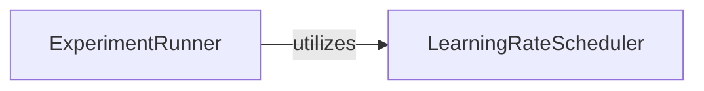

## Details

The `Experiment Management System` subsystem is primarily defined by the `experiments` package, specifically encompassing the functionalities implemented in `experiments/main.py` and `experiments/lr_scheduler.py`. This subsystem is responsible for orchestrating the training and evaluation lifecycle of machine learning models within the xLSTM project.

### ExperimentRunner
This component orchestrates the entire lifecycle of a single experiment run. It handles the initialization of the model, data loaders, optimizers, and the training loop. It also manages evaluation, logging, and checkpointing.

**Related Classes/Methods**:

- <a href="https://github.com/NX-AI/xlstm/blob/main/experiments/main.py" target="_blank" rel="noopener noreferrer">`experiments/main.py`</a>

### LearningRateScheduler
This component provides mechanisms for dynamically adjusting the learning rate of an optimizer during the training process. It encapsulates various scheduling strategies.

**Related Classes/Methods**:

- <a href="https://github.com/NX-AI/xlstm/blob/main/experiments/lr_scheduler.py" target="_blank" rel="noopener noreferrer">`experiments/lr_scheduler.py`</a>

### [FAQ](https://github.com/CodeBoarding/GeneratedOnBoardings/tree/main?tab=readme-ov-file#faq)