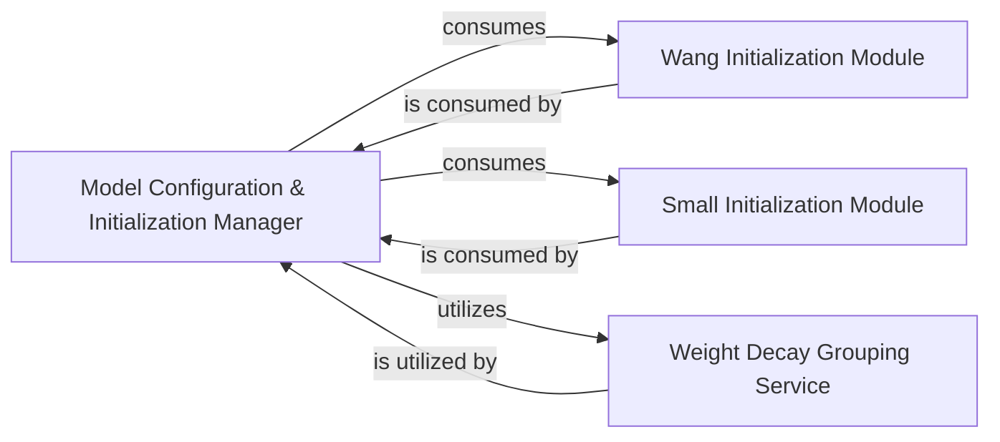

## Details

The xLSTM model's configuration and initialization subsystem is orchestrated by a conceptual Model Configuration & Initialization Manager. This manager is responsible for setting up model parameters and configuring the optimization process by leveraging specialized initialization algorithms and weight decay grouping utilities. It directly interacts with the Wang Initialization Module and the Small Initialization Module, which provide distinct strategies for setting initial parameter values for neural network layers. Furthermore, the manager utilizes the Weight Decay Grouping Service to organize model parameters into specific groups, enabling selective application of weight decay during optimization. This modular design ensures flexibility in applying various initialization schemes and fine-tuning the optimization process.

### Model Configuration & Initialization Manager
This central conceptual component orchestrates the overall setup of model parameters and the configuration of the optimization process. It acts as the primary interface for applying various initialization strategies and integrating weight decay grouping utilities during the model's construction and preparation for training.

**Related Classes/Methods**:

- <a href="https://github.com/NX-AI/xlstm/blob/main/xlstm/components/init.py#L8-L15" target="_blank" rel="noopener noreferrer">`xlstm.components.init.bias_linspace_init_`:8-15</a>
- <a href="https://github.com/NX-AI/xlstm/blob/main/xlstm/components/init.py#L18-L25" target="_blank" rel="noopener noreferrer">`xlstm.components.init.small_init_init_`:18-25</a>
- <a href="https://github.com/NX-AI/xlstm/blob/main/xlstm/components/init.py#L28-L32" target="_blank" rel="noopener noreferrer">`xlstm.components.init.wang_init_`:28-32</a>
- <a href="https://github.com/NX-AI/xlstm/blob/main/xlstm/utils.py#L36-L59" target="_blank" rel="noopener noreferrer">`xlstm.utils.get_weight_decay_optim_groups`:36-59</a>

### Weight Decay Grouping Service
Manages the fundamental logic for identifying and structuring model parameters into groups, enabling selective weight decay application during the optimization process. It provides the necessary parameter structures for PyTorch optimizers.

**Related Classes/Methods**:

- <a href="https://github.com/NX-AI/xlstm/blob/main/xlstm/utils.py#L36-L59" target="_blank" rel="noopener noreferrer">`xlstm.utils.get_weight_decay_optim_groups`:36-59</a>
- <a href="https://github.com/NX-AI/xlstm/blob/main/xlstm/utils.py#L77-L95" target="_blank" rel="noopener noreferrer">`xlstm.utils._create_weight_decay_optim_groups`:77-95</a>
- <a href="https://github.com/NX-AI/xlstm/blob/main/xlstm/utils.py#L61-L75" target="_blank" rel="noopener noreferrer">`xlstm.utils.get_weight_decay_optim_group_param_names`:61-75</a>
- <a href="https://github.com/NX-AI/xlstm/blob/main/xlstm/utils.py#L97-L105" target="_blank" rel="noopener noreferrer">`xlstm.utils._get_weight_decay_optim_groups_for_modules`:97-105</a>

### Wang Initialization Module
Implements the "Wang" specific weight initialization algorithm, tailored for certain neural network layers or the overall xLSTM architecture to set initial parameter values.

**Related Classes/Methods**:

- <a href="https://github.com/NX-AI/xlstm/blob/main/xlstm/components/init.py#L28-L32" target="_blank" rel="noopener noreferrer">`xlstm.components.init.wang_init_`:28-32</a>

### Small Initialization Module
Provides another distinct weight initialization algorithm, offering an alternative or complementary strategy to `wang_init_` for parameter setup.

**Related Classes/Methods**:

- <a href="https://github.com/NX-AI/xlstm/blob/main/xlstm/components/init.py#L18-L25" target="_blank" rel="noopener noreferrer">`xlstm.components.init.small_init_init_`:18-25</a>

### [FAQ](https://github.com/CodeBoarding/GeneratedOnBoardings/tree/main?tab=readme-ov-file#faq)