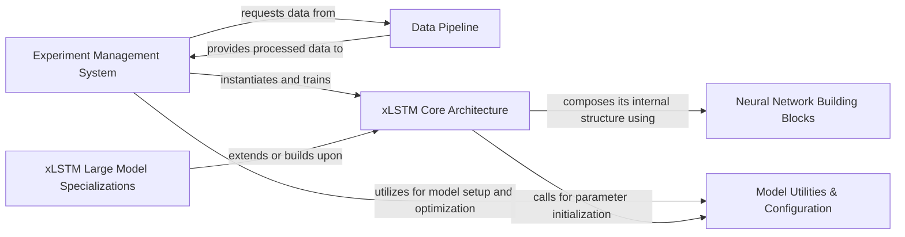

## Details

The `xlstm` project is structured as a modular machine learning toolkit, designed for developing and experimenting with the xLSTM architecture. At its highest level, the **Experiment Management System** orchestrates the entire training and evaluation workflow, interacting with the **Data Pipeline** for data provision and the **xLSTM Core Architecture** for model training. The **xLSTM Core Architecture** itself is constructed from fundamental **Neural Network Building Blocks**, while **Model Utilities & Configuration** provide essential services for parameter initialization and optimization across the system. For large-scale deployments, **xLSTM Large Model Specializations** offer tailored components, demonstrating a clear separation of concerns and a flexible architecture suitable for research and development in deep learning.

### Experiment Management System [[Expand]](./Experiment_Management_System.md)
Orchestrates the entire training and evaluation lifecycle, including experiment initialization, data flow management, model training coordination, and dynamic learning rate adjustment.

**Related Classes/Methods**:

- <a href="https://github.com/NX-AI/xlstm/blob/main/experiments/main.py" target="_blank" rel="noopener noreferrer">`experiments/main.py`</a>
- <a href="https://github.com/NX-AI/xlstm/blob/main/experiments/lr_scheduler.py" target="_blank" rel="noopener noreferrer">`experiments/lr_scheduler.py`</a>

### Data Pipeline [[Expand]](./Data_Pipeline.md)
Manages all aspects of data handling, from generation and loading to preprocessing, ensuring data integrity and efficient access for training.

**Related Classes/Methods**:

- <a href="https://github.com/NX-AI/xlstm/blob/main/experiments/data/utils.py" target="_blank" rel="noopener noreferrer">`experiments/data/utils.py`</a>
- <a href="https://github.com/NX-AI/xlstm/blob/main/experiments/data/formal_language/formal_language_dataset.py" target="_blank" rel="noopener noreferrer">`experiments/data/formal_language/formal_language_dataset.py`</a>
- <a href="https://github.com/NX-AI/xlstm/blob/main/experiments/data/formal_language/online_generate.py" target="_blank" rel="noopener noreferrer">`experiments/data/formal_language/online_generate.py`</a>

### xLSTM Core Architecture [[Expand]](./xLSTM_Core_Architecture.md)
Encapsulates the fundamental xLSTM architecture, including the hierarchical stacking of xLSTM blocks (mLSTM and sLSTM), defining the core model's forward and backward passes.

**Related Classes/Methods**:

- <a href="https://github.com/NX-AI/xlstm/blob/main/xlstm/xlstm_block_stack.py" target="_blank" rel="noopener noreferrer">`xlstm/xlstm_block_stack.py`</a>
- <a href="https://github.com/NX-AI/xlstm/blob/main/xlstm/blocks/mlstm/block.py" target="_blank" rel="noopener noreferrer">`xlstm/blocks/mlstm/block.py`</a>
- <a href="https://github.com/NX-AI/xlstm/blob/main/xlstm/blocks/mlstm/cell.py" target="_blank" rel="noopener noreferrer">`xlstm/blocks/mlstm/cell.py`</a>
- <a href="https://github.com/NX-AI/xlstm/blob/main/xlstm/blocks/slstm/cell.py" target="_blank" rel="noopener noreferrer">`xlstm/blocks/slstm/cell.py`</a>

### Neural Network Building Blocks
Provides foundational neural network layers and operations (e.g., feedforward, convolutional, normalization) that serve as reusable components for the xLSTM model.

**Related Classes/Methods**:

- <a href="https://github.com/NX-AI/xlstm/blob/main/xlstm/components/feedforward.py" target="_blank" rel="noopener noreferrer">`xlstm/components/feedforward.py`</a>
- <a href="https://github.com/NX-AI/xlstm/blob/main/xlstm/components/conv.py" target="_blank" rel="noopener noreferrer">`xlstm/components/conv.py`</a>
- <a href="https://github.com/NX-AI/xlstm/blob/main/xlstm/components/ln.py" target="_blank" rel="noopener noreferrer">`xlstm/components/ln.py`</a>
- <a href="https://github.com/NX-AI/xlstm/blob/main/xlstm/components/linear_headwise.py" target="_blank" rel="noopener noreferrer">`xlstm/components/linear_headwise.py`</a>

### Model Utilities & Configuration [[Expand]](./Model_Utilities_Configuration.md)
Handles the setup of model parameters and the configuration of the optimization process, including weight initialization schemes and regularization utilities.

**Related Classes/Methods**:

- <a href="https://github.com/NX-AI/xlstm/blob/main/xlstm/components/init.py" target="_blank" rel="noopener noreferrer">`xlstm/components/init.py`</a>
- <a href="https://github.com/NX-AI/xlstm/blob/main/xlstm/utils.py" target="_blank" rel="noopener noreferrer">`xlstm/utils.py`</a>

### xLSTM Large Model Specializations [[Expand]](./xLSTM_Large_Model_Specializations.md)
Contains specialized implementations and utilities tailored for the large-scale xLSTM model, addressing specific architectural and optimization considerations for very large models.

**Related Classes/Methods**:

- <a href="https://github.com/NX-AI/xlstm/blob/main/xlstm/xlstm_large/model.py" target="_blank" rel="noopener noreferrer">`xlstm/xlstm_large/model.py`</a>
- <a href="https://github.com/NX-AI/xlstm/blob/main/xlstm/xlstm_large/components.py" target="_blank" rel="noopener noreferrer">`xlstm/xlstm_large/components.py`</a>
- <a href="https://github.com/NX-AI/xlstm/blob/main/xlstm/xlstm_large/utils.py" target="_blank" rel="noopener noreferrer">`xlstm/xlstm_large/utils.py`</a>

### [FAQ](https://github.com/CodeBoarding/GeneratedOnBoardings/tree/main?tab=readme-ov-file#faq)