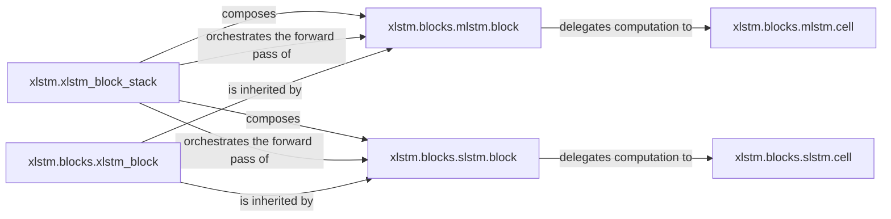

## Details

The `xlstm` subsystem is primarily orchestrated by the `xlstm.xlstm_block_stack` component, which serves as the top-level manager for the entire xLSTM model. This component is responsible for composing and orchestrating the forward pass of both `xlstm.blocks.mlstm.block` and `xlstm.blocks.slstm.block` instances, which represent the core building blocks of the xLSTM architecture. Both `mlstm.block` and `slstm.block` inherit common functionalities and structure from the abstract `xlstm.blocks.xlstm_block` base class, promoting code reuse and consistency. Each concrete block, `mlstm.block` and `slstm.block`, delegates its core computational logic to its respective cell component: `xlstm.blocks.mlstm.cell` and `xlstm.blocks.slstm.cell`. These cell components encapsulate the granular recurrent computations and state updates, with the blocks utilizing these cells to perform their specific operations. This hierarchical structure ensures a clear separation of concerns, with the stack managing the overall flow, blocks defining specific architectures, and cells handling the fundamental computations.

### xlstm.xlstm_block_stack
The top-level orchestrator for the xLSTM model. It manages the hierarchical stacking and composition of individual xLSTM blocks (mLSTM and sLSTM), defining the overall forward and backward passes of the core model. This component is crucial as it represents the complete xLSTM model structure.

**Related Classes/Methods**:

- <a href="https://github.com/NX-AI/xlstm/blob/main/xlstm/xlstm_block_stack.py" target="_blank" rel="noopener noreferrer">`xlstm.xlstm_block_stack`</a>

### xlstm.blocks.xlstm_block
The abstract base for all xLSTM block types. It serves as an abstract base class, providing a common interface, foundational structure, and shared initialization logic (e.g., `reset_parameters`) for all concrete xLSTM block implementations. This promotes code reuse and consistency across different block types, which is a key pattern in ML libraries.

**Related Classes/Methods**:

- <a href="https://github.com/NX-AI/xlstm/blob/main/xlstm/blocks/xlstm_block.py" target="_blank" rel="noopener noreferrer">`xlstm.blocks.xlstm_block`</a>

### xlstm.blocks.mlstm.block
The concrete implementation of an mLSTM block. It encapsulates the specific architecture and behavior of an mLSTM block, inheriting common properties from `xlstm.blocks.xlstm_block` and integrating the core mLSTM cell logic. This component represents a distinct, reusable building block of the xLSTM architecture.

**Related Classes/Methods**:

- <a href="https://github.com/NX-AI/xlstm/blob/main/xlstm/blocks/mlstm/block.py" target="_blank" rel="noopener noreferrer">`xlstm.blocks.mlstm.block`</a>

### xlstm.blocks.mlstm.cell
The core computational unit for mLSTM. It implements the fundamental recurrent computations, state updates, and parameter initialization specific to the mLSTM cell. This component forms the granular processing logic for mLSTM blocks, essential for the model's functionality.

**Related Classes/Methods**:

- <a href="https://github.com/NX-AI/xlstm/blob/main/xlstm/blocks/mlstm/cell.py" target="_blank" rel="noopener noreferrer">`xlstm.blocks.mlstm.cell`</a>

### xlstm.blocks.slstm.block
The concrete implementation of an sLSTM block. It encapsulates the specific architecture and behavior of an sLSTM block, inheriting common properties from `xlstm.blocks.xlstm_block` and integrating the core sLSTM cell logic. Similar to mLSTM, this represents another distinct, reusable building block.

**Related Classes/Methods**:

- <a href="https://github.com/NX-AI/xlstm/blob/main/xlstm/blocks/slstm/block.py" target="_blank" rel="noopener noreferrer">`xlstm.blocks.slstm.block`</a>

### xlstm.blocks.slstm.cell
The core computational unit for sLSTM. It implements the complex recurrent computations, state transformations, and dynamic kernel/bias management specific to the sLSTM cell. This includes handling input/output permutations and potentially selecting optimized implementations (e.g., CUDA kernels), forming the granular processing logic for sLSTM blocks.

**Related Classes/Methods**:

- <a href="https://github.com/NX-AI/xlstm/blob/main/xlstm/blocks/slstm/cell.py" target="_blank" rel="noopener noreferrer">`xlstm.blocks.slstm.cell`</a>

### [FAQ](https://github.com/CodeBoarding/GeneratedOnBoardings/tree/main?tab=readme-ov-file#faq)