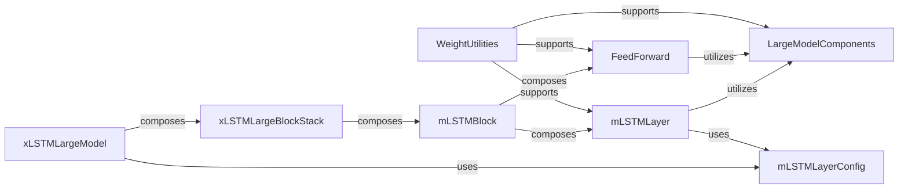

## Details

The xLSTM large model architecture is orchestrated by `xLSTMLargeModel`, which primarily composes an `xLSTMLargeBlockStack`. This stack is responsible for managing a sequence of `mLSTMBlock` instances, forming the core layered structure of the model. Each `mLSTMBlock` further encapsulates an `mLSTMLayer` for recurrent computations and a `FeedForward` network for non-linear transformations. Auxiliary components like `LargeModelComponents` provide fundamental operations such as normalization, while `WeightUtilities` handle efficient weight management. `mLSTMLayerConfig` defines the configurable parameters for the mLSTM layers, ensuring flexible model construction. This nested composition ensures a modular and scalable design for the large xLSTM model.

### xLSTMLargeModel
Acts as the primary orchestrator for the large xLSTM model, managing its construction, forward pass, and generation. It composes `xLSTMLargeBlockStack` to form the complete model architecture. This is the top-level entry point for users to interact with the large xLSTM model.

**Related Classes/Methods**:

- <a href="https://github.com/NX-AI/xlstm/blob/main/xlstm/xlstm_large/model.py" target="_blank" rel="noopener noreferrer">`xlstm/xlstm_large/model.py:xLSTMLargeModel`</a>

### xLSTMLargeBlockStack
Manages a sequential stack of xLSTM blocks, representing the layered structure of the large model. It orchestrates the flow of data through multiple computational layers by composing `mLSTMBlock` instances.

**Related Classes/Methods**:

- <a href="https://github.com/NX-AI/xlstm/blob/main/xlstm/xlstm_large/model.py" target="_blank" rel="noopener noreferrer">`xlstm/xlstm_large/model.py:xLSTMLargeBlockStack`</a>

### mLSTMLayer
Implements the computational logic for a single mLSTM layer, a fundamental building block of the xLSTM architecture. This is where the core mLSTM operations are performed, often utilizing `LargeModelComponents` for optimized operations.

**Related Classes/Methods**:

- <a href="https://github.com/NX-AI/xlstm/blob/main/xlstm/xlstm_large/model.py" target="_blank" rel="noopener noreferrer">`xlstm/xlstm_large/model.py:mLSTMLayer`</a>

### mLSTMBlock
Represents a core computational block within the mLSTM architecture, encapsulating an `mLSTMLayer` and a `FeedForward` component to form a complete processing unit.

**Related Classes/Methods**:

- <a href="https://github.com/NX-AI/xlstm/blob/main/xlstm/xlstm_large/model.py" target="_blank" rel="noopener noreferrer">`xlstm/xlstm_large/model.py:mLSTMBlock`</a>

### FeedForward
Implements a standard feed-forward network component, commonly used in neural network architectures for transforming data between layers and adding non-linearity.

**Related Classes/Methods**:

- <a href="https://github.com/NX-AI/xlstm/blob/main/xlstm/xlstm_large/model.py" target="_blank" rel="noopener noreferrer">`xlstm/xlstm_large/model.py:FeedForward`</a>

### LargeModelComponents
Implements core operational primitives for large models, specifically focusing on normalization techniques (RMS normalization, Layer normalization) and the application of weights and biases. These are low-level, performance-critical operations tailored for large-scale efficiency.

**Related Classes/Methods**:

- <a href="https://github.com/NX-AI/xlstm/blob/main/xlstm/xlstm_large/components.py" target="_blank" rel="noopener noreferrer">`xlstm/xlstm_large/components.py:LargeModelComponents`</a>

### WeightUtilities
Manages and optimizes model weights, including converting single weights to fused weights and concatenating weights and biases for efficient processing. This component is crucial for handling the scale and performance requirements of large models.

**Related Classes/Methods**:

- <a href="https://github.com/NX-AI/xlstm/blob/main/xlstm/xlstm_large/utils.py" target="_blank" rel="noopener noreferrer">`WeightUtilities:convert_feedforward_weights`</a>
- <a href="https://github.com/NX-AI/xlstm/blob/main/xlstm/xlstm_large/utils.py" target="_blank" rel="noopener noreferrer">`WeightUtilities:convert_mlstm_layer_weights_`</a>
- <a href="https://github.com/NX-AI/xlstm/blob/main/xlstm/xlstm_large/utils.py" target="_blank" rel="noopener noreferrer">`WeightUtilities:concat_weights_and_biases`</a>
- <a href="https://github.com/NX-AI/xlstm/blob/main/xlstm/xlstm_large/utils.py" target="_blank" rel="noopener noreferrer">`xlstm/xlstm_large/utils.py:WeightUtilities`</a>

### mLSTMLayerConfig
Defines and holds configuration parameters specific to mLSTM layers, allowing for flexible and configurable model construction and experimentation.

**Related Classes/Methods**:

- <a href="https://github.com/NX-AI/xlstm/blob/main/xlstm/xlstm_large/model.py" target="_blank" rel="noopener noreferrer">`xlstm/xlstm_large/model.py:mLSTMLayerConfig`</a>

### [FAQ](https://github.com/CodeBoarding/GeneratedOnBoardings/tree/main?tab=readme-ov-file#faq)