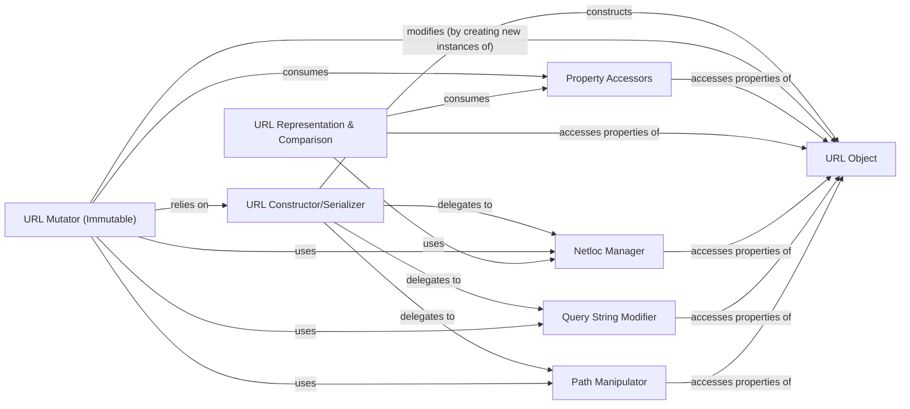

## Details

The `URL Core` subsystem is the heart of the `yarl` library, responsible for the robust and immutable handling of URL objects. It adheres to a Module-Based/Library Pattern, where the `URL Object` acts as the central immutable data structure, and other components provide specialized functionalities for its construction, manipulation, and representation. The subsystem is primarily defined by the `yarl._url.py` file, with the `yarl._url.URL` class serving as its central entity.

### URL Object
The immutable central data structure (`yarl._url.URL`) that encapsulates all parsed and unparsed components of a URL (scheme, authority, path, query, fragment). It acts as the single source of truth for a URL's state, ensuring consistency across operations.

**Related Classes/Methods**:

- <a href="https://github.com/aio-libs/yarl/blob/master/yarl/_url.py" target="_blank" rel="noopener noreferrer">`yarl._url.URL`</a>

### URL Constructor/Serializer
Manages the creation of new `URL` instances from various inputs (e.g., string, parts) and the serialization of `URL` objects back into their string representation. It handles initial parsing and final encoding processes.

**Related Classes/Methods**:

- <a href="https://github.com/aio-libs/yarl/blob/master/yarl/_url.py" target="_blank" rel="noopener noreferrer">`yarl._url.URL`</a>

### Netloc Manager
Specializes in handling the network location (netloc) components of a URL (user, password, host, port). It manages IDNA encoding/decoding for internationalized domain names and provides access to raw and decoded netloc parts.

**Related Classes/Methods**:

- <a href="https://github.com/aio-libs/yarl/blob/master/yarl/_url.py" target="_blank" rel="noopener noreferrer">`yarl._url.URL`</a>

### Query String Modifier
Provides immutable methods for manipulating the query string of a URL. It enables adding, updating, extending, or removing query parameters, always returning a new `URL` instance.

**Related Classes/Methods**:

- <a href="https://github.com/aio-libs/yarl/blob/master/yarl/_url.py" target="_blank" rel="noopener noreferrer">`yarl._url.URL`</a>

### Path Manipulator
Manages the path segment of the URL, including joining paths and extracting file-like components (name, suffix).

**Related Classes/Methods**:

- <a href="https://github.com/aio-libs/yarl/blob/master/yarl/_url.py" target="_blank" rel="noopener noreferrer">`yarl._url.URL`</a>

### URL Mutator (Immutable)
Provides a set of `with_` methods (e.g., `with_user`, `with_host`, `with_port`, `with_path`, `with_fragment`) that return *new* `URL` instances with specified components modified, strictly adhering to the immutability principle of `URL` objects.

**Related Classes/Methods**:

- <a href="https://github.com/aio-libs/yarl/blob/master/yarl/_url.py" target="_blank" rel="noopener noreferrer">`yarl._url.URL`</a>

### URL Representation & Comparison
Handles the string representation of `URL` objects (e.g., `__str__`, `human_repr`) and defines their comparison logic (`__le__`, `__lt__`, etc.).

**Related Classes/Methods**:

- <a href="https://github.com/aio-libs/yarl/blob/master/yarl/_url.py" target="_blank" rel="noopener noreferrer">`yarl._url.URL`</a>

### Property Accessors
Offers read-only access to various derived properties and sub-components of the URL, such as `authority`, `origin`, `is_absolute`, `is_default_port`, and individual raw components (e.g., `raw_scheme`, `raw_path`).

**Related Classes/Methods**:

- <a href="https://github.com/aio-libs/yarl/blob/master/yarl/_url.py" target="_blank" rel="noopener noreferrer">`yarl._url.URL`</a>

### [FAQ](https://github.com/CodeBoarding/GeneratedOnBoardings/tree/main?tab=readme-ov-file#faq)