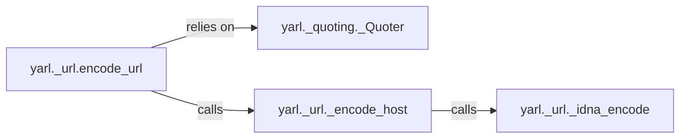

## Details

The URL Encoding/Quoting subsystem within yarl is designed as a self-contained, low-level utility for robust URL manipulation. Its architecture emphasizes clear separation of concerns, with specialized components handling distinct aspects of encoding and decoding.

### yarl._quoting._Quoter
This is the foundational component responsible for the low-level percent-encoding and decoding of individual URL segments, query parameters, and other arbitrary strings. It adheres to RFC specifications for character escaping and unescaping. Its implementation can be in pure Python or optimized C, demonstrating a common pattern in Python libraries for performance.

**Related Classes/Methods**:

- <a href="https://github.com/aio-libs/yarl/blob/master/yarl/_quoting.py" target="_blank" rel="noopener noreferrer">`yarl._quoting._Quoter`</a>

### yarl._url.encode_url
Serves as the primary public interface for encoding a complete URL or its various components. It orchestrates the encoding process by delegating specific encoding tasks to other specialized functions within the subsystem. This component acts as an aggregator, ensuring all parts of a URL are correctly encoded.

**Related Classes/Methods**:

- <a href="https://github.com/aio-libs/yarl/blob/master/yarl/_url.py#L144-L205" target="_blank" rel="noopener noreferrer">`yarl._url.encode_url`:144-205</a>

### yarl._url._encode_host
Specifically handles the encoding of the hostname portion of a URL. This includes managing special characters and, crucially, delegating to IDNA encoding when the hostname is an internationalized domain name.

**Related Classes/Methods**:

- <a href="https://github.com/aio-libs/yarl/blob/master/yarl/_url.py#L1486-L1541" target="_blank" rel="noopener noreferrer">`yarl._url._encode_host`:1486-1541</a>

### yarl._url._idna_encode
Responsible for converting internationalized domain names (IDNs) into their ASCII-compatible encoding (Punycode) as defined by the IDNA standard. This ensures that non-ASCII characters in domain names are correctly represented in URLs.

**Related Classes/Methods**:

- <a href="https://github.com/aio-libs/yarl/blob/master/yarl/_url.py#L1478-L1483" target="_blank" rel="noopener noreferrer">`yarl._url._idna_encode`:1478-1483</a>

### [FAQ](https://github.com/CodeBoarding/GeneratedOnBoardings/tree/main?tab=readme-ov-file#faq)