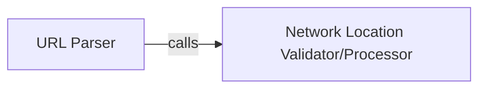

## Details

The `URL Parsing Engine` subsystem is dedicated to the comprehensive parsing of raw URL strings, breaking them down into their constituent parts such as scheme, host, path, query, and fragment. Its boundaries are defined by the core functionality of URL deconstruction and validation, primarily encapsulated within the `yarl._parse.py` module.

### URL Parser
This component serves as the primary public-facing entry point for the URL parsing subsystem. Its core responsibility is to orchestrate the complete parsing of a raw URL string, delegating specific sub-tasks to internal helper components. It acts as the main API for consumers of the URL parsing functionality.

**Related Classes/Methods**:

- <a href="https://github.com/aio-libs/yarl/blob/master/yarl/_parse.py#L25-L83" target="_blank" rel="noopener noreferrer">`yarl._parse.split_url`:25-83</a>

### Network Location Validator/Processor
This internal helper component is dedicated to processing and validating the "netloc" (network location) part of the URL. This includes extracting and ensuring the correctness of elements such as username, password, host, and port according to URL standards. Its design, indicated by the leading underscore in its name (`_check_netloc`), suggests it's an internal utility not intended for direct external consumption, aligning with the "Module-Based/Library Pattern" for internal modularity.

**Related Classes/Methods**:

- <a href="https://github.com/aio-libs/yarl/blob/master/yarl/_parse.py#L86-L105" target="_blank" rel="noopener noreferrer">`yarl._parse._check_netloc`:86-105</a>

### [FAQ](https://github.com/CodeBoarding/GeneratedOnBoardings/tree/main?tab=readme-ov-file#faq)