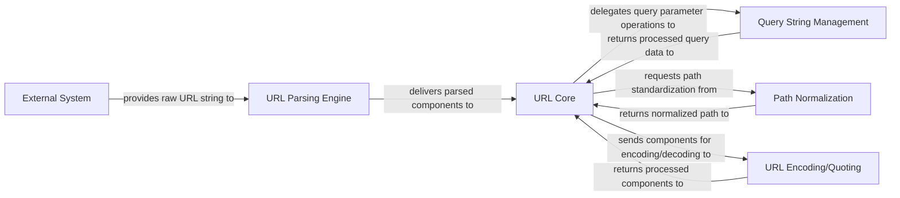

## Details

The `yarl` library's architecture is centered around the `URL Core` component, which acts as the primary orchestrator for URL manipulation. An `External System` initiates the process by providing a raw URL string to the `URL Parsing Engine`. The `URL Parsing Engine` then breaks down this string into its fundamental components, delivering them to the `URL Core`. The `URL Core` subsequently delegates specialized tasks to dedicated components: `Query String Management` handles the serialization and deserialization of URL query parameters, `Path Normalization` ensures consistent and clean URL paths, and `URL Encoding/Quoting` manages the proper encoding and decoding of URL parts. Each of these specialized components returns processed data back to the `URL Core`, which then consolidates and maintains the complete URL object. This modular design ensures clear separation of concerns and efficient processing of URL data.

### External System
Represents any external entity or application that provides raw URL strings as input to the `yarl` library for parsing and manipulation.

**Related Classes/Methods**: _None_

### URL Core [[Expand]](./URL_Core.md)
The central component representing a URL object, responsible for orchestrating its construction, manipulation, and delegation of specialized tasks.

**Related Classes/Methods**:

- <a href="https://github.com/aio-libs/yarl/blob/master/yarl/_url.py" target="_blank" rel="noopener noreferrer">`URL Core`</a>

### URL Parsing Engine [[Expand]](./URL_Parsing_Engine.md)
Dedicated to parsing raw URL strings, breaking them down into their constituent parts (scheme, host, path, query, fragment, etc.).

**Related Classes/Methods**:

- <a href="https://github.com/aio-libs/yarl/blob/master/yarl/_parse.py" target="_blank" rel="noopener noreferrer">`URL Parsing Engine`</a>

### Query String Management
Handles the serialization of query parameters into a URL-encoded string and deserialization of query strings back into structured data.

**Related Classes/Methods**:

- <a href="https://github.com/aio-libs/yarl/blob/master/yarl/_query.py" target="_blank" rel="noopener noreferrer">`Query String Management`</a>

### Path Normalization
Focuses on standardizing and cleaning URL paths, resolving relative paths, and ensuring consistent path representation.

**Related Classes/Methods**:

- <a href="https://github.com/aio-libs/yarl/blob/master/yarl/_path.py" target="_blank" rel="noopener noreferrer">`Path Normalization`</a>

### URL Encoding/Quoting [[Expand]](./URL_Encoding_Quoting.md)
Manages the encoding and decoding of individual URL components (e.g., path segments, query parameters) according to relevant RFCs to ensure valid URL formation.

**Related Classes/Methods**:

- <a href="https://github.com/aio-libs/yarl/blob/master/yarl/_quoting.py" target="_blank" rel="noopener noreferrer">`URL Encoding/Quoting`</a>

### [FAQ](https://github.com/CodeBoarding/GeneratedOnBoardings/tree/main?tab=readme-ov-file#faq)