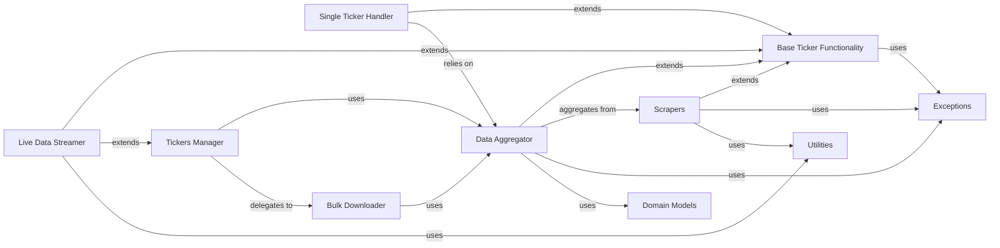

## Component Details

The `Base Ticker Functionality` component, primarily embodied by the `yfinance.base.TickerBase` class, serves as the foundational abstract layer for all operations related to a single stock ticker within the `yfinance` library. Its core purpose is to establish a consistent interface and provide common attributes and methods that are shared across various components dealing with ticker-specific data. This ensures reusability, reduces redundancy, and promotes a standardized approach to session management, data handling, and basic interactions with financial instruments. It acts as the bedrock upon which more specialized ticker functionalities are built.

These components were chosen because they represent the core functional areas and architectural layers of the `yfinance` library, particularly in relation to handling stock ticker data. They are fundamental for the following reasons:

*   `Base Ticker Functionality`: It's the **abstract foundation**. Without a common base, the entire system would lack consistency and reusability for ticker-specific operations. It centralizes shared logic, making development and maintenance more efficient.
*   `Single Ticker Handler`: This is the **primary user interface** for individual tickers. It's fundamental because most users will interact with the library at this level to get data for a specific stock.
*   `Data Aggregator`: This component is the **data orchestrator**. It's crucial because it abstracts the complexity of data fetching from various sources (scrapers) and presents a unified data model to higher-level components.
*   `Scrapers`: These are the **data acquisition specialists**. They are fundamental as they directly interact with the external data source (Yahoo Finance) to extract raw information. Without them, no data could be retrieved.
*   `Tickers Manager`: This is the **multi-ticker coordinator**. It's essential for users who need to manage and retrieve data for multiple stocks efficiently, providing a higher-level abstraction for bulk operations.
*   `Live Data Streamer`: This component addresses the critical need for **real-time data**. In financial applications, live updates are often paramount, making this component indispensable for dynamic data consumption.
*   `Exceptions`: This component is vital for **system robustness and error handling**. Standardized exceptions ensure that errors are caught, reported, and handled consistently, improving the reliability and debuggability of the library.
*   `Utilities`: These are the **cross-cutting concerns**. They provide essential helper functions and common services (like logging) that are used throughout the codebase, promoting code reusability and maintaining a clean, modular design.
*   `Domain Models`: These components provide **structured data representation**. By defining clear models for financial concepts, they ensure data consistency and facilitate easier processing and analysis across different parts of the system.
*   `Bulk Downloader`: This component is crucial for **performance optimization**. When dealing with large volumes of historical data for multiple tickers, an optimized downloader significantly improves efficiency and user experience.

Together, these components form a cohesive architecture that allows `yfinance` to effectively retrieve, process, and present financial data, with `Base Ticker Functionality` serving as the unifying abstract layer for all ticker-centric operations.

### Base Ticker Functionality
The abstract base class providing common attributes and methods for handling a single stock ticker, such as session management and basic data handling. It is the fundamental building block for all ticker-related operations.

**Related Classes/Methods**:

- <a href="https://github.com/ranaroussi/yfinance/blob/master/yfinance/base.py#L49-L805" target="_blank" rel="noopener noreferrer">`yfinance.base.TickerBase` (49:805)</a>

### Single Ticker Handler
Represents a single financial instrument and provides methods to access its specific data (e.g., news, historical prices, financial statements). It is the primary interface for individual ticker interactions.

**Related Classes/Methods**:

- <a href="https://github.com/ranaroussi/yfinance/blob/master/yfinance/ticker.py#L0-L0" target="_blank" rel="noopener noreferrer">`yfinance/ticker.py` (0:0)</a>

### Data Aggregator
Responsible for fetching, processing, and aggregating various types of financial data (analysis, fundamentals, quotes) from different sources. It acts as a central hub for data consolidation.

**Related Classes/Methods**:

- <a href="https://github.com/ranaroussi/yfinance/blob/master/yfinance/data.py#L0-L0" target="_blank" rel="noopener noreferrer">`yfinance/data.py` (0:0)</a>

### Scrapers
A collection of specialized modules responsible for the actual extraction and parsing of specific types of financial data from Yahoo Finance (e.g., analysis, fundamentals, history, quotes).

**Related Classes/Methods**:

- `yfinance/scrapers/*.py` (0:0)

### Tickers Manager
The primary entry point for users to interact with multiple stock tickers, orchestrating bulk operations and data retrieval for a collection of tickers.

**Related Classes/Methods**:

- <a href="https://github.com/ranaroussi/yfinance/blob/master/yfinance/tickers.py#L0-L0" target="_blank" rel="noopener noreferrer">`yfinance/tickers.py` (0:0)</a>

### Live Data Streamer
Manages real-time data streaming through WebSocket connections, enabling subscriptions and live financial data updates.

**Related Classes/Methods**:

- <a href="https://github.com/ranaroussi/yfinance/blob/master/yfinance/live.py#L0-L0" target="_blank" rel="noopener noreferrer">`yfinance/live.py` (0:0)</a>

### Exceptions
Defines custom exception classes for handling specific errors (e.g., missing data, invalid periods, rate limits) that can occur during data retrieval or processing.

**Related Classes/Methods**:

- <a href="https://github.com/ranaroussi/yfinance/blob/master/yfinance/exceptions.py#L0-L0" target="_blank" rel="noopener noreferrer">`yfinance/exceptions.py` (0:0)</a>

### Utilities
Contains various utility functions and helper classes used across the project for common tasks like logging, data manipulation, or specific calculations.

**Related Classes/Methods**:

- <a href="https://github.com/ranaroussi/yfinance/blob/master/yfinance/utils.py#L0-L0" target="_blank" rel="noopener noreferrer">`yfinance/utils.py` (0:0)</a>

### Domain Models
Provides data structures and classes to represent financial concepts (e.g., Industry, Sector) used across various components to categorize and organize financial data.

**Related Classes/Methods**:

- `yfinance/domain/*.py` (0:0)

### Bulk Downloader
Provides functionality for efficiently downloading historical data for multiple tickers, often in an optimized or parallel manner.

**Related Classes/Methods**:

- <a href="https://github.com/ranaroussi/yfinance/blob/master/yfinance/multi.py#L0-L0" target="_blank" rel="noopener noreferrer">`yfinance/multi.py` (0:0)</a>

### [FAQ](https://github.com/CodeBoarding/GeneratedOnBoardings/tree/main?tab=readme-ov-file#faq)