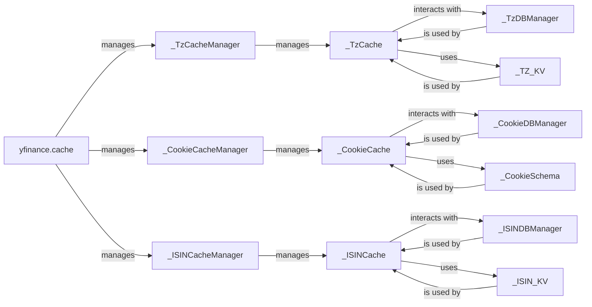

## Component Details

The `Caching System` in `yfinance` is fundamental for optimizing performance by reducing redundant external API calls. It achieves this through a well-structured design that separates concerns into distinct components, each with a specific role in managing and interacting with cached data.

### yfinance.cache
This is the top-level module that encapsulates the entire caching system. It serves as the entry point for all caching functionalities, providing a unified interface for managing different types of cached data (timezone, cookies, and ISINs).

**Related Classes/Methods**:

- <a href="https://github.com/ranaroussi/yfinance/blob/master/yfinance/cache.py#L0-L0" target="_blank" rel="noopener noreferrer">`yfinance.cache` (0:0)</a>

### _TzCacheManager
This class is responsible for managing the singleton instance of the timezone cache. It ensures that only one instance of `_TzCache` exists and provides a method to retrieve it, promoting efficient resource utilization.

**Related Classes/Methods**:

- <a href="https://github.com/ranaroussi/yfinance/blob/master/yfinance/cache.py#L36-L48" target="_blank" rel="noopener noreferrer">`yfinance.cache._TzCacheManager` (36:48)</a>

### _TzCache
This class implements the core logic for storing and retrieving timezone data. It interacts with the underlying database manager (`_TzDBManager`) and the Peewee ORM model (`_TZ_KV`) to perform data operations.

**Related Classes/Methods**:

- <a href="https://github.com/ranaroussi/yfinance/blob/master/yfinance/cache.py#L118-L201" target="_blank" rel="noopener noreferrer">`yfinance.cache._TzCache` (118:201)</a>

### _TzDBManager
This class manages the SQLite database connection specifically for the timezone cache. It handles the creation and management of the database, ensuring persistent storage for timezone data.

**Related Classes/Methods**:

- <a href="https://github.com/ranaroussi/yfinance/blob/master/yfinance/cache.py#L51-L102" target="_blank" rel="noopener noreferrer">`yfinance.cache._TzDBManager` (51:102)</a>

### _TZ_KV
This is a Peewee ORM model that defines the schema for key-value storage of timezone data within the SQLite database. It provides an abstraction layer for database interactions.

**Related Classes/Methods**:

- <a href="https://github.com/ranaroussi/yfinance/blob/master/yfinance/cache.py#L109-L115" target="_blank" rel="noopener noreferrer">`yfinance.cache._TZ_KV` (109:115)</a>

### _CookieCacheManager
Similar to `_TzCacheManager`, this class manages the singleton instance of the cookie cache, ensuring efficient access to cookie data.

**Related Classes/Methods**:

- <a href="https://github.com/ranaroussi/yfinance/blob/master/yfinance/cache.py#L231-L243" target="_blank" rel="noopener noreferrer">`yfinance.cache._CookieCacheManager` (231:243)</a>

### _CookieCache
This class handles the storage and retrieval of cookie data, interacting with `_CookieDBManager` and `_CookieSchema` for database operations.

**Related Classes/Methods**:

- <a href="https://github.com/ranaroussi/yfinance/blob/master/yfinance/cache.py#L324-L404" target="_blank" rel="noopener noreferrer">`yfinance.cache._CookieCache` (324:404)</a>

### _CookieDBManager
This class manages the SQLite database connection for the cookie cache, providing persistent storage for cookie data.

**Related Classes/Methods**:

- <a href="https://github.com/ranaroussi/yfinance/blob/master/yfinance/cache.py#L246-L293" target="_blank" rel="noopener noreferrer">`yfinance.cache._CookieDBManager` (246:293)</a>

### _CookieSchema
This Peewee ORM model defines the schema for cookie data, including the `ISODateTimeField` for timestamping.

**Related Classes/Methods**:

- <a href="https://github.com/ranaroussi/yfinance/blob/master/yfinance/cache.py#L312-L321" target="_blank" rel="noopener noreferrer">`yfinance.cache._CookieSchema` (312:321)</a>

### _ISINCacheManager
This class manages the singleton instance of the ISIN cache, providing a controlled access point for ISIN data.

**Related Classes/Methods**:

- <a href="https://github.com/ranaroussi/yfinance/blob/master/yfinance/cache.py#L441-L453" target="_blank" rel="noopener noreferrer">`yfinance.cache._ISINCacheManager` (441:453)</a>

### _ISINCache
This class encapsulates the core logic for storing and retrieval of ISIN data.

**Related Classes/Methods**:

- <a href="https://github.com/ranaroussi/yfinance/blob/master/yfinance/cache.py#L520-L613" target="_blank" rel="noopener noreferrer">`yfinance.cache._ISINCache` (520:613)</a>

### _ISINDBManager
This class manages the SQLite database connection specifically for the ISIN cache, providing persistent storage for ISIN data.

**Related Classes/Methods**:

- <a href="https://github.com/ranaroussi/yfinance/blob/master/yfinance/cache.py#L456-L503" target="_blank" rel="noopener noreferrer">`yfinance.cache._ISINDBManager` (456:503)</a>

### _ISIN_KV
This is a Peewee ORM model that defines the schema for key-value storage of ISIN data within the SQLite database.

**Related Classes/Methods**:

- <a href="https://github.com/ranaroussi/yfinance/blob/master/yfinance/cache.py#L510-L517" target="_blank" rel="noopener noreferrer">`yfinance.cache._ISIN_KV` (510:517)</a>

### [FAQ](https://github.com/CodeBoarding/GeneratedOnBoardings/tree/main?tab=readme-ov-file#faq)