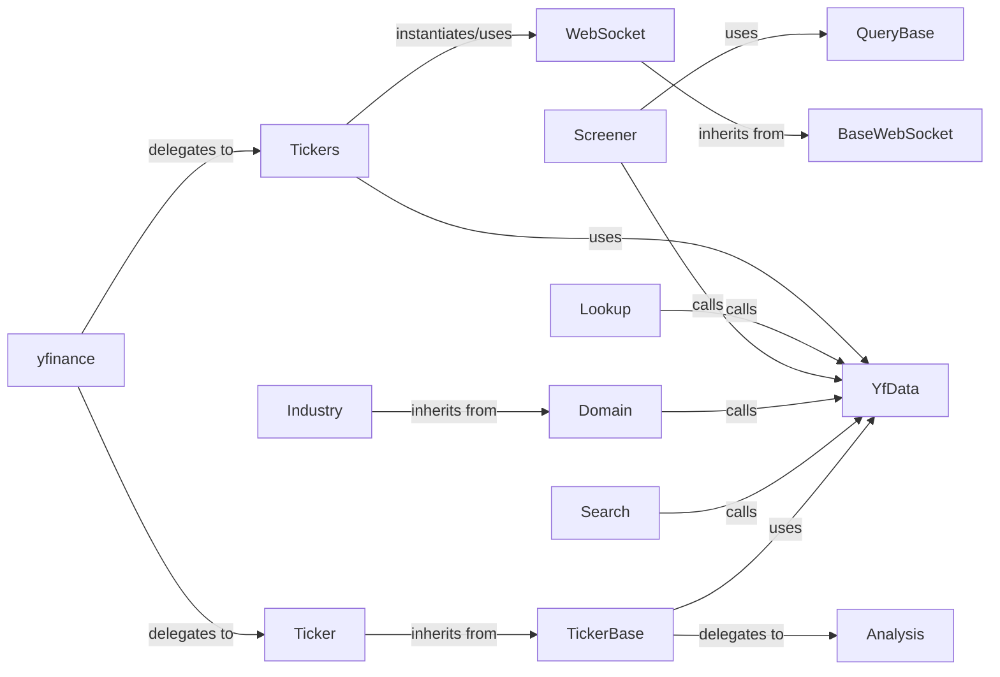

## Component Details

One paragraph explaining the functionality which is represented by this graph. What the main flow is and what is its purpose.

### yfinance
The top-level package that exposes the primary functions and classes for user interaction. It acts as the main orchestrator, directing user requests to the appropriate specialized components.

**Related Classes/Methods**:

- <a href="https://github.com/ranaroussi/yfinance/blob/master/yfinance/__init__.py#L1-L1" target="_blank" rel="noopener noreferrer">`yfinance.__init__.py` (1:1)</a>

### Ticker
The core class for interacting with individual financial instruments (e.g., stocks, ETFs). It provides methods to access a wide range of data, including historical prices, dividends, splits, financial statements, and analyst recommendations for a single ticker.

**Related Classes/Methods**:

- <a href="https://github.com/ranaroussi/yfinance/blob/master/yfinance/ticker.py#L33-L327" target="_blank" rel="noopener noreferrer">`Ticker` (33:327)</a>

### Tickers
Designed to handle operations involving multiple financial instruments efficiently. It allows for bulk downloading of historical data and other multi-ticker functionalities, optimizing requests for a collection of symbols.

**Related Classes/Methods**:

- <a href="https://github.com/ranaroussi/yfinance/blob/master/yfinance/tickers.py#L31-L114" target="_blank" rel="noopener noreferrer">`Tickers` (31:114)</a>

### Lookup
Provides functionality to search for financial instruments (e.g., stocks, mutual funds, ETFs) based on keywords or partial names, returning relevant ticker symbols and basic identifying information.

**Related Classes/Methods**:

- <a href="https://github.com/ranaroussi/yfinance/blob/master/yfinance/lookup.py#L33-L223" target="_blank" rel="noopener noreferrer">`Lookup` (33:223)</a>

### Screener
Enables users to filter and discover financial instruments based on specific criteria using predefined or custom queries. It leverages `QueryBase` and its concrete implementations (`EquityQuery`, `FundQuery`) to construct complex filters and retrieve matching instruments via the `screen` function.

**Related Classes/Methods**:

- `screen` (1:1)
- `EquityQuery` (1:1)
- `FundQuery` (1:1)

### Domain
Represents different market domains (e.g., sectors, industries) and provides structured access to data related to these domains, such as lists of companies, ETFs, or mutual funds within them. `Industry` and `Sector` are concrete implementations.

**Related Classes/Methods**:

- <a href="https://github.com/ranaroussi/yfinance/blob/master/yfinance/domain/domain.py#L11-L198" target="_blank" rel="noopener noreferrer">`Domain` (11:198)</a>

### Search
Offers a general-purpose search mechanism within the Yahoo Finance ecosystem, allowing users to find various financial data points or instruments beyond just tickers.

**Related Classes/Methods**:

- <a href="https://github.com/ranaroussi/yfinance/blob/master/yfinance/search.py#L29-L161" target="_blank" rel="noopener noreferrer">`Search` (29:161)</a>

### WebSocket
Manages real-time data streaming from Yahoo Finance. It allows users to subscribe to live updates for specific tickers. It inherits from `BaseWebSocket`, which provides the foundational WebSocket communication logic.

**Related Classes/Methods**:

- `WebSocket` (209:335)

### TickerBase
An abstract base class that encapsulates common logic and methods for fetching various types of financial data for a single ticker. It serves as a foundational layer for `Ticker` and `WebSocket`, abstracting away the details of data retrieval from the scraping layer.

**Related Classes/Methods**:

- `TickerBase` (1:1)

### YfData
Acts as the central data provider and low-level HTTP client. It is responsible for making direct HTTP requests to Yahoo Finance, handling responses, and serving as the primary interface to the raw data. It is a critical internal dependency for almost all data-fetching components.

**Related Classes/Methods**:

- `YfData` (1:1)

### QueryBase
An abstract base class that defines the structure and validation logic for constructing queries used in the screener functionality. Concrete implementations like `EquityQuery` and `FundQuery` extend this class to provide specific query capabilities for different financial instrument types.

**Related Classes/Methods**:

- `QueryBase` (12:135)

### BaseWebSocket
An abstract base class providing the fundamental WebSocket connection and message decoding logic for real-time data streaming. `WebSocket` inherits from this class to build upon its core functionalities.

**Related Classes/Methods**:

- `BaseWebSocket` (14:36)

### Analysis
A component responsible for fetching and processing various analyst-related data, such as earnings estimates, revenue estimates, EPS trends, and analyst price targets. It interacts with `YfData` to retrieve raw financial data.

**Related Classes/Methods**:

- <a href="https://github.com/ranaroussi/yfinance/blob/master/yfinance/scrapers/analysis.py#L10-L191" target="_blank" rel="noopener noreferrer">`Analysis` (10:191)</a>

### [FAQ](https://github.com/CodeBoarding/GeneratedOnBoardings/tree/main?tab=readme-ov-file#faq)