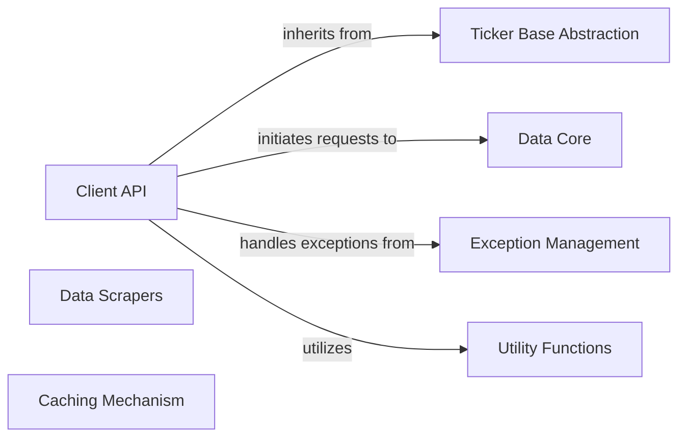

## Component Details

This section provides a detailed overview of the `Client Interface & Discovery` component within the `yfinance` library, outlining its structure, purpose, and interactions with other core components.

### Client API
This component serves as the primary entry point for users to interact with the `yfinance` library. It provides high-level abstractions for fetching financial data for individual or multiple tickers, discovering financial instruments (lookup), filtering them based on criteria (screener), and accessing broader market/domain-specific information. It orchestrates user requests and delegates the actual data retrieval and processing to lower-level data handling and scraping components.

**Related Classes/Methods**:

- <a href="https://github.com/ranaroussi/yfinance/blob/master/yfinance/ticker.py#L1-L1" target="_blank" rel="noopener noreferrer">`yfinance.ticker` (1:1)</a>
- <a href="https://github.com/ranaroussi/yfinance/blob/master/yfinance/tickers.py#L1-L1" target="_blank" rel="noopener noreferrer">`yfinance.tickers` (1:1)</a>
- <a href="https://github.com/ranaroussi/yfinance/blob/master/yfinance/lookup.py#L1-L1" target="_blank" rel="noopener noreferrer">`yfinance.lookup` (1:1)</a>
- `yfinance.screener` (1:1)
- <a href="https://github.com/ranaroussi/yfinance/blob/master/yfinance/screener/query.py#L1-L1" target="_blank" rel="noopener noreferrer">`yfinance.screener.query` (1:1)</a>
- <a href="https://github.com/ranaroussi/yfinance/blob/master/yfinance/domain/domain.py#L1-L1" target="_blank" rel="noopener noreferrer">`yfinance.domain.domain` (1:1)</a>
- <a href="https://github.com/ranaroussi/yfinance/blob/master/yfinance/domain/industry.py#L1-L1" target="_blank" rel="noopener noreferrer">`yfinance.domain.industry` (1:1)</a>
- <a href="https://github.com/ranaroussi/yfinance/blob/master/yfinance/domain/sector.py#L1-L1" target="_blank" rel="noopener noreferrer">`yfinance.domain.sector` (1:1)</a>
- <a href="https://github.com/ranaroussi/yfinance/blob/master/yfinance/search.py#L1-L1" target="_blank" rel="noopener noreferrer">`yfinance.search` (1:1)</a>
- <a href="https://github.com/ranaroussi/yfinance/blob/master/yfinance/multi.py#L1-L1" target="_blank" rel="noopener noreferrer">`yfinance.multi` (1:1)</a>

### Ticker Base Abstraction
This component defines the fundamental structure and common functionalities for handling individual ticker data. It provides an abstract base (`TickerBase`) for various data scraping modules and concrete ticker implementations, offering a unified interface for accessing different types of financial information related to a single ticker.

**Related Classes/Methods**:

- <a href="https://github.com/ranaroussi/yfinance/blob/master/yfinance/base.py#L1-L1" target="_blank" rel="noopener noreferrer">`yfinance.base` (1:1)</a>

### Data Core
This component is responsible for the fundamental mechanisms of data retrieval, including session management, proxy handling, authentication (cookies and crumbs), and executing HTTP requests. It also serves as a central hub for orchestrating and aggregating data from various scraping modules, effectively acting as the core data provider for the `yfinance` library.

**Related Classes/Methods**:

- <a href="https://github.com/ranaroussi/yfinance/blob/master/yfinance/data.py#L1-L1" target="_blank" rel="noopener noreferrer">`yfinance.data` (1:1)</a>

### Data Scrapers
This component comprises specialized modules dedicated to parsing and extracting specific types of financial data (e.g., analysis, fundamentals, price history, holders, quotes) from the raw responses obtained by the `Data Core`. Each scraper focuses on a particular data domain, transforming raw web content into structured, usable financial information.

**Related Classes/Methods**:

- <a href="https://github.com/ranaroussi/yfinance/blob/master/yfinance/scrapers/analysis.py#L1-L1" target="_blank" rel="noopener noreferrer">`yfinance.scrapers.analysis` (1:1)</a>
- <a href="https://github.com/ranaroussi/yfinance/blob/master/yfinance/scrapers/fundamentals.py#L1-L1" target="_blank" rel="noopener noreferrer">`yfinance.scrapers.fundamentals` (1:1)</a>
- <a href="https://github.com/ranaroussi/yfinance/blob/master/yfinance/scrapers/funds.py#L1-L1" target="_blank" rel="noopener noreferrer">`yfinance.scrapers.funds` (1:1)</a>
- <a href="https://github.com/ranaroussi/yfinance/blob/master/yfinance/scrapers/history.py#L1-L1" target="_blank" rel="noopener noreferrer">`yfinance.scrapers.history` (1:1)</a>
- <a href="https://github.com/ranaroussi/yfinance/blob/master/yfinance/scrapers/holders.py#L1-L1" target="_blank" rel="noopener noreferrer">`yfinance.scrapers.holders` (1:1)</a>
- <a href="https://github.com/ranaroussi/yfinance/blob/master/yfinance/scrapers/quote.py#L1-L1" target="_blank" rel="noopener noreferrer">`yfinance.scrapers.quote` (1:1)</a>

### Exception Management
This component provides a structured way to handle various errors that can occur during data retrieval or processing, such as rate limiting, invalid periods, or missing data. Its custom exceptions allow for more precise error management and clearer communication of problems to the user or calling application.

**Related Classes/Methods**:

- <a href="https://github.com/ranaroussi/yfinance/blob/master/yfinance/exceptions.py#L1-L1" target="_blank" rel="noopener noreferrer">`yfinance.exceptions` (1:1)</a>

### Utility Functions
This component offers common utility functions, most notably for logging, which are extensively used across the library for debugging, operational insights, and general support tasks. It provides helper functions that support various operations within other components.

**Related Classes/Methods**:

- <a href="https://github.com/ranaroussi/yfinance/blob/master/yfinance/utils.py#L1-L1" target="_blank" rel="noopener noreferrer">`yfinance.utils` (1:1)</a>

### Caching Mechanism
This component manages the caching of session-related data, particularly cookies, to avoid repetitive authentication steps and improve the efficiency of data retrieval. It helps in reducing redundant requests and adhering to rate limits imposed by data sources.

**Related Classes/Methods**:

- <a href="https://github.com/ranaroussi/yfinance/blob/master/yfinance/cache.py#L1-L1" target="_blank" rel="noopener noreferrer">`yfinance.cache` (1:1)</a>

### [FAQ](https://github.com/CodeBoarding/GeneratedOnBoardings/tree/main?tab=readme-ov-file#faq)