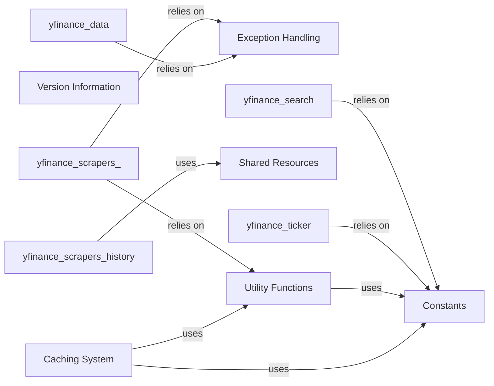

## Component Details

This essential support component provides a suite of common helper functions and a caching mechanism. It handles tasks such as logging, data manipulation (e.g., time zone conversions, DataFrame operations), and caching frequently accessed data (like timezone information or ISIN lookups) to optimize performance and reduce redundant requests. It also defines constants, handles exceptions, and manages shared resources and versioning information.

### Exception Handling
This component is responsible for defining and managing custom exceptions specific to the `yfinance` library. It provides a structured and consistent way to handle various error conditions, such as missing data, invalid input periods, or rate limiting issues, ensuring that the application can gracefully manage and report failures. Its hierarchical structure of exceptions allows for precise error identification and handling.

**Related Classes/Methods**:

- <a href="https://github.com/ranaroussi/yfinance/blob/master/yfinance/exceptions.py#L1-L1" target="_blank" rel="noopener noreferrer">`yfinance.exceptions` (1:1)</a>

### Caching System
This component manages various data caches (timezone, cookies, and ISINs) to optimize performance by storing frequently accessed information. It employs manager classes to initialize and retrieve cache instances, and dedicated cache classes to interact with underlying databases for data storage and retrieval. This reduces the need for repetitive external requests, significantly improving efficiency and reducing reliance on external APIs.

**Related Classes/Methods**:

- <a href="https://github.com/ranaroussi/yfinance/blob/master/yfinance/cache.py#L1-L1" target="_blank" rel="noopener noreferrer">`yfinance.cache` (1:1)</a>

### Utility Functions
This component provides a collection of general-purpose helper functions that support various operations across the `yfinance` library. Its functionalities include a robust logging system, ISIN-related data lookups, data formatting, and a progress bar for long-running operations. These utilities are essential for maintaining code quality, debugging, and enhancing user experience by providing common, reusable functionalities.

**Related Classes/Methods**:

- <a href="https://github.com/ranaroussi/yfinance/blob/master/yfinance/utils.py#L1-L1" target="_blank" rel="noopener noreferrer">`yfinance.utils` (1:1)</a>

### Constants
This component centralizes the definition of various constants used throughout the `yfinance` library. This includes configuration parameters, default values, and other fixed data, ensuring consistency and ease of maintenance by providing a single source of truth for these values.

**Related Classes/Methods**:

- <a href="https://github.com/ranaroussi/yfinance/blob/master/yfinance/const.py#L1-L1" target="_blank" rel="noopener noreferrer">`yfinance.const` (1:1)</a>

### Shared Resources
This component manages shared resources and global state for the `yfinance` library. It provides a centralized location for variables or objects that need to be accessible across different parts of the application, promoting consistency and simplifying resource management.

**Related Classes/Methods**:

- <a href="https://github.com/ranaroussi/yfinance/blob/master/yfinance/shared.py#L1-L1" target="_blank" rel="noopener noreferrer">`yfinance.shared` (1:1)</a>

### Version Information
This component is dedicated to storing and providing the version number of the `yfinance` library. It ensures that the application's version can be easily accessed and managed, which is crucial for debugging, compatibility checks, and release management.

**Related Classes/Methods**:

- <a href="https://github.com/ranaroussi/yfinance/blob/master/yfinance/version.py#L1-L1" target="_blank" rel="noopener noreferrer">`yfinance.version` (1:1)</a>

### [FAQ](https://github.com/CodeBoarding/GeneratedOnBoardings/tree/main?tab=readme-ov-file#faq)