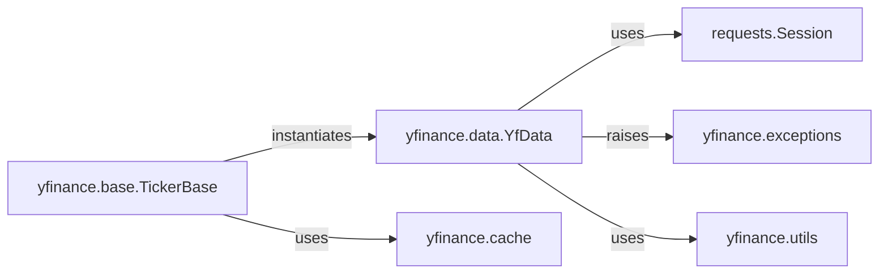

## Component Details

The `Data Acquisition Layer` in `yfinance` is the foundational subsystem responsible for all external network communication with Yahoo Finance. Its primary purpose is to handle HTTP requests, manage sessions, cookies, and authentication mechanisms (like "crumbs") to ensure successful and rate-limited data retrieval. It acts as the sole gateway for fetching raw financial data.

### yfinance.data.YfData
This is the core component of the Data Acquisition Layer. It is solely responsible for initiating and managing HTTP requests to Yahoo Finance endpoints. It handles session management, cookie persistence, and the acquisition of authentication "crumbs" to ensure successful data retrieval. It acts as the direct interface for all raw data fetching from external sources.

**Related Classes/Methods**: _None_

### requests.Session
An external library component (from the `requests` library) that provides persistent HTTP connections. It manages cookies, connection pooling, and allows for stateful interactions with web services. It is fundamental to `YfData`'s ability to maintain session state and efficiently make multiple requests to Yahoo Finance.

**Related Classes/Methods**: _None_

### yfinance.exceptions
This module defines custom exception classes specific to the `yfinance` library. In the context of the Data Acquisition Layer, these exceptions are crucial for signaling various issues encountered during data fetching, such as network errors, missing data, or rate limiting, allowing for robust error handling upstream.

**Related Classes/Methods**: _None_

### yfinance.base.TickerBase
This class serves as an orchestrator and foundational component for ticker-specific operations. Crucially, it initializes and holds an instance of `yfinance.data.YfData`, making it the primary internal consumer that triggers data acquisition. It acts as a facade, coordinating the fetching of various data types by delegating to `YfData`.

**Related Classes/Methods**: _None_

### yfinance.utils
This module provides a collection of utility functions that support various operations across the `yfinance` library. In the context of data acquisition, it may contain helpers for URL construction, response parsing (initial stages before specific scrapers), retry logic, or logging, which are vital for the smooth operation of `YfData`.

**Related Classes/Methods**: _None_

### yfinance.cache
This module implements caching mechanisms to store previously fetched data. Its role in the Data Acquisition Layer is to reduce redundant network requests to Yahoo Finance, improving performance and adhering to rate limits. Before `YfData` attempts to fetch data, `TickerBase` (or a component it orchestrates) might check the cache.

**Related Classes/Methods**: _None_

### [FAQ](https://github.com/CodeBoarding/GeneratedOnBoardings/tree/main?tab=readme-ov-file#faq)