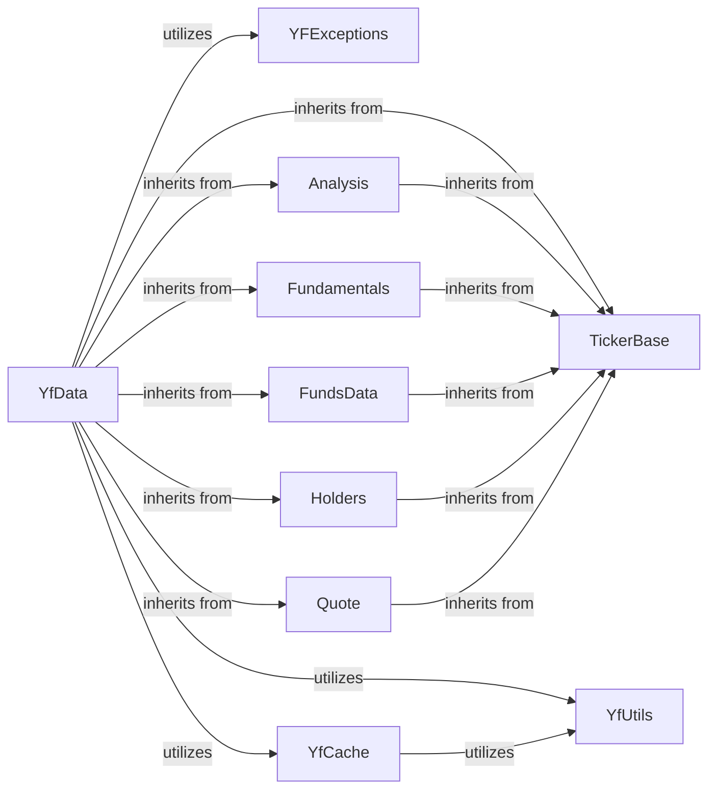

## Component Details

This analysis focuses on the Data Core of the `yfinance` library, specifically `yfinance.data.YfData`, and its fundamental interactions with other key components responsible for data retrieval, session management, authentication, error handling, utility, caching, and specific data parsing logic.

### YfData
This component is the central data provider for the `yfinance` library. It is responsible for the fundamental mechanisms of data retrieval, including session management, proxy handling, authentication (cookies and crumbs), and executing HTTP requests. Crucially, `YfData` acts as a central hub for orchestrating and aggregating data from various scraping modules by inheriting their functionalities (e.g., `Analysis`, `Fundamentals`, `FundsData`, `Holders`, `Quote`), effectively providing a unified interface for accessing diverse financial data.

**Related Classes/Methods**:

- `YfData` (1:1)

### TickerBase
This component serves as a foundational base class for various ticker-related functionalities and data scrapers within the `yfinance` library. It provides common attributes and methods that are inherited by components like `YfData` and individual scraper modules, ensuring consistency, reusability, and a standardized structure across the data retrieval and processing layers.

**Related Classes/Methods**:

- `TickerBase` (1:1)

### YFExceptions
This component provides a structured way to handle various errors that can occur during data retrieval and processing within the `yfinance` library. Its custom exceptions (e.g., `YFDataException`, `YFRateLimitError`) allow for more precise error management and clearer communication of issues like rate limiting or data-specific problems.

**Related Classes/Methods**:

- `YFExceptions` (1:1)

### YfUtils
This component offers common utility functions, most notably for logging. These utilities are extensively used across the `yfinance` library, particularly within the `YfData` component, for debugging, operational insights, and general support tasks.

**Related Classes/Methods**:

- `YfUtils` (1:1)

### YfCache
This component manages the caching of cookies and potentially other session-related data. Its primary purpose is to avoid repetitive authentication steps and improve the efficiency of data retrieval by persisting and reusing session information.

**Related Classes/Methods**:

- `YfCache` (1:1)

### Analysis
Encapsulates the specific logic for scraping and parsing analysis data from Yahoo Finance.

**Related Classes/Methods**:

- <a href="https://github.com/ranaroussi/yfinance/blob/master/yfinance/scrapers/analysis.py#L10-L191" target="_blank" rel="noopener noreferrer">`Analysis` (10:191)</a>

### Fundamentals
Encapsulates the specific logic for scraping and parsing fundamentals data from Yahoo Finance.

**Related Classes/Methods**:

- <a href="https://github.com/ranaroussi/yfinance/blob/master/yfinance/scrapers/fundamentals.py#L10-L42" target="_blank" rel="noopener noreferrer">`Fundamentals` (10:42)</a>

### FundsData
Encapsulates the specific logic for scraping and parsing funds data from Yahoo Finance.

**Related Classes/Methods**:

- <a href="https://github.com/ranaroussi/yfinance/blob/master/doc/source/reference/examples/funds_data.py#L1-L1" target="_blank" rel="noopener noreferrer">`FundsData` (1:1)</a>

### Holders
Encapsulates the specific logic for scraping and parsing holders data from Yahoo Finance.

**Related Classes/Methods**:

- <a href="https://github.com/ranaroussi/yfinance/blob/master/yfinance/scrapers/holders.py#L11-L239" target="_blank" rel="noopener noreferrer">`Holders` (11:239)</a>

### Quote
Encapsulates the specific logic for scraping and parsing quote data from Yahoo Finance.

**Related Classes/Methods**:

- <a href="https://github.com/ranaroussi/yfinance/blob/master/yfinance/scrapers/quote.py#L487-L774" target="_blank" rel="noopener noreferrer">`Quote` (487:774)</a>

### [FAQ](https://github.com/CodeBoarding/GeneratedOnBoardings/tree/main?tab=readme-ov-file#faq)