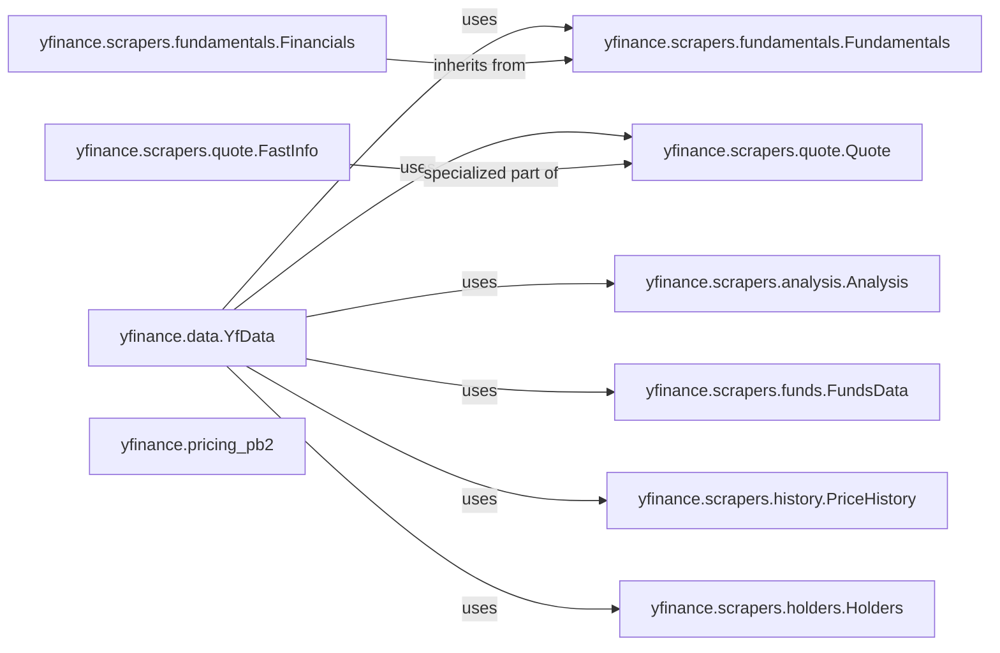

## Component Details

The `Data Processing & Structuring` component in `yfinance` is primarily responsible for transforming raw HTML or JSON data into structured, usable formats, mainly Pandas DataFrames. This is achieved through a collection of specialized scraper modules, each designed to parse specific types of financial data. The `yfinance.data.YfData` class acts as a central aggregator, providing a unified interface to access this structured data. Additionally, `yfinance.pricing_pb2` defines the protocol buffer structures for pricing data, crucial for real-time data handling.

### yfinance.scrapers.analysis.Analysis
This component is dedicated to parsing and structuring analyst recommendation data from raw responses. It extracts insights related to analyst ratings, target prices, and consensus recommendations.

**Related Classes/Methods**:

- <a href="https://github.com/ranaroussi/yfinance/blob/master/yfinance/scrapers/analysis.py#L10-L191" target="_blank" rel="noopener noreferrer">`yfinance.scrapers.analysis.Analysis` (10:191)</a>

### yfinance.scrapers.fundamentals.Fundamentals
Manages the extraction and organization of a company's core financial statements, including income statements, balance sheets, and cash flow statements. It provides a foundational view of a company's financial health.

**Related Classes/Methods**:

- <a href="https://github.com/ranaroussi/yfinance/blob/master/yfinance/scrapers/fundamentals.py#L10-L42" target="_blank" rel="noopener noreferrer">`yfinance.scrapers.fundamentals.Fundamentals` (10:42)</a>

### yfinance.scrapers.fundamentals.Financials
Inheriting from `Fundamentals`, this component likely provides more specific or refined functionalities for handling financial data, potentially focusing on specific aspects or formats of financial reporting.

**Related Classes/Methods**:

- <a href="https://github.com/ranaroussi/yfinance/blob/master/yfinance/scrapers/fundamentals.py#L45-L169" target="_blank" rel="noopener noreferrer">`yfinance.scrapers.fundamentals.Financials` (45:169)</a>

### yfinance.scrapers.funds.FundsData
This component is responsible for processing and structuring data related to mutual funds and Exchange Traded Funds (ETFs), including their holdings, performance, and other relevant fund-specific metrics.

**Related Classes/Methods**:

- <a href="https://github.com/ranaroussi/yfinance/blob/master/yfinance/scrapers/funds.py#L11-L334" target="_blank" rel="noopener noreferrer">`yfinance.scrapers.funds.FundsData` (11:334)</a>

### yfinance.scrapers.history.PriceHistory
Specializes in parsing and structuring historical price and volume data for securities. This includes open, high, low, close prices, and trading volumes over various periods.

**Related Classes/Methods**:

- <a href="https://github.com/ranaroussi/yfinance/blob/master/yfinance/scrapers/history.py#L15-L2937" target="_blank" rel="noopener noreferrer">`yfinance.scrapers.history.PriceHistory` (15:2937)</a>

### yfinance.scrapers.holders.Holders
Extracts and organizes information about major shareholders and institutional holders of a company's stock, providing insights into ownership structure.

**Related Classes/Methods**:

- <a href="https://github.com/ranaroussi/yfinance/blob/master/yfinance/scrapers/holders.py#L11-L239" target="_blank" rel="noopener noreferrer">`yfinance.scrapers.holders.Holders` (11:239)</a>

### yfinance.scrapers.quote.Quote
Focuses on parsing and structuring real-time and summary quote data for tickers, including current prices, bid/ask information, and daily trading statistics.

**Related Classes/Methods**:

- <a href="https://github.com/ranaroussi/yfinance/blob/master/yfinance/scrapers/quote.py#L487-L774" target="_blank" rel="noopener noreferrer">`yfinance.scrapers.quote.Quote` (487:774)</a>

### yfinance.scrapers.quote.FastInfo
This component, also within the `quote` module, likely provides a more optimized or streamlined method for retrieving essential quote information, potentially for quick lookups.

**Related Classes/Methods**:

- <a href="https://github.com/ranaroussi/yfinance/blob/master/yfinance/scrapers/quote.py#L25-L484" target="_blank" rel="noopener noreferrer">`yfinance.scrapers.quote.FastInfo` (25:484)</a>

### yfinance.data.YfData
Acts as a central aggregator or facade, providing a unified interface to access and retrieve structured data from various scraper modules. This class inherits from multiple scraper classes, demonstrating its role in consolidating data access and simplifying the user experience.

**Related Classes/Methods**:

- <a href="https://github.com/ranaroussi/yfinance/blob/master/yfinance/data.py#L61-L433" target="_blank" rel="noopener noreferrer">`yfinance.data.YfData` (61:433)</a>

### yfinance.pricing_pb2
Defines the protocol buffer messages used for structuring pricing data. This is particularly relevant for efficient data transmission and deserialization, especially in scenarios involving real-time data streams.

**Related Classes/Methods**:

- <a href="https://github.com/ranaroussi/yfinance/blob/master/yfinance/pricing_pb2.py#L0-L0" target="_blank" rel="noopener noreferrer">`yfinance.pricing_pb2` (0:0)</a>

### [FAQ](https://github.com/CodeBoarding/GeneratedOnBoardings/tree/main?tab=readme-ov-file#faq)